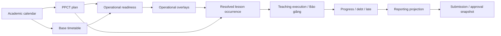
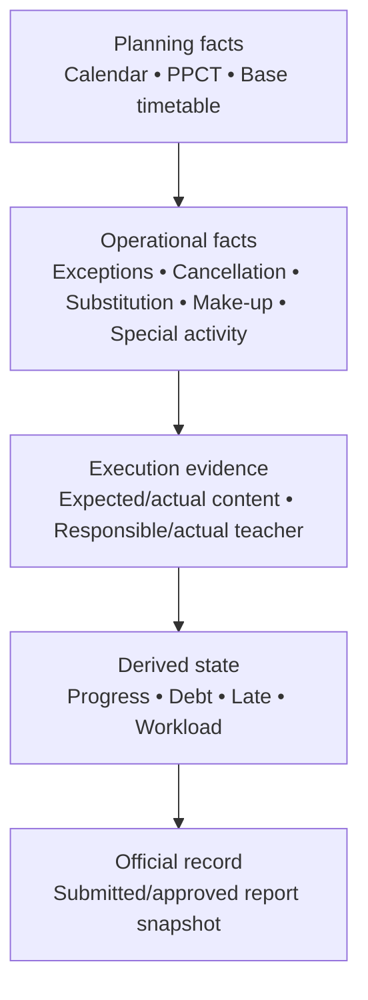

# Core Backend Roadmap

**Status:** Planning guide after ADR-029 established the LOCAL-FC-05A2 PPCT control plane and lifecycle. This document is not an accepted requirements source and does not authorize implementation.

## Purpose

The remaining backend must be delivered as one dependency chain, not as independent screens:

An upstream plan is never rewritten to represent a downstream fact. Later facts overlay, fulfill, reverse or supersede earlier facts while retaining their original identity.

## Completed backend foundation

The repository currently contains:

1. Identity, server-side session, capability/scope authorization and audit.
2. AcademicYear, immutable AcademicCalendarVersion aggregates, business weeks, split segments, reserve weeks, interruptions and year-scoped classes.
3. Historical TeachingAssignment responsibility by AcademicYear + class + subject + inclusive civil date.
4. AcademicYear-owned immutable time-slot revisions and real wall-clock collision semantics.
5. AcademicYear-owned TimetableVersion history, normalized normal TimetableEntry rows, DRAFT/validation, approval/activation, supersession and civil-date historical resolution.
6. Timetable XLSX import through LOCAL-FC-04B3D1: immutable profile revisions, typed aliases, bounded parsing, canonical preview, server-side confirmation, semantic/request replay, imported-DRAFT protection and adversarial workbook tests.

The accepted timetable meaning remains deliberately partial: `VALIDATED` and `ACTIVE` prove only the implemented normal-base checks. They do not prove timetable completeness, PPCT association or special-activity collision readiness.

## Remaining core sequence

LOCAL-FC-05A0 is merged. LOCAL-FC-05A0D closed the seven PPCT architecture prerequisites and ADR-027 is Accepted. LOCAL-FC-05A1 established the six-model persistence foundation through ADR-028. LOCAL-FC-05A2 now establishes the subject-authorized PPCT control plane, lifecycle commands and exact historical resolution through ADR-029. The sequence below remains planning guidance subject to each slice's own authorization and gate.

1. **05A1 — PPCT persistence foundation (established by ADR-028).** The shared `AcademicYear + Subject + Grade` master, immutable version/item history, explicit lineage and date-effective exact-version class association now have database-enforced structural foundations. No API, lifecycle command, capability runtime or import is implied.
2. **05A2 — PPCT control plane and lifecycle (established by ADR-029).** Transactional lifecycle commands, published immutability, correction/supersession, class binding, historical reads and `PPCT_MANAGE` authorization are available. No import, progress, execution, reporting or UI is implied.
3. **PPCT import, if later authorized.** Separate contract/security audit after authoritative workbook/workflow evidence; do not encode it in 05A1 or assume timetable-import formats or identifiers apply.
4. **Timetable operational readiness (next core dependency).** A forward-only readiness assessment over timetable + PPCT + special-activity dependencies; never reinterpret old lifecycle states.
5. **Operational overlays.** CalendarException/local suppression, cancellation, substitution and make-up provenance as separate aggregates/events.
6. **Special-activity minimum core.** Occupancy, participant scope and multi-teacher staffing sufficient for collision, execution and reporting.
7. **Resolved lesson occurrence.** Deterministic read model over historical calendar, timetable, PPCT and overlays.
8. **Teaching execution / Báo giảng.** Immutable evidence of what occurred, expected versus actual content and responsible versus actual teacher.
9. **Progress, debt and late.** Reproducible projections from historical facts; make-up fulfills an original obligation exactly once.
10. **Reporting.** Weekly, monthly, semester, custom-range and annual projections as supported by authoritative rules.
11. **Submission and approval.** Immutable submitted/approved snapshots or immutable reference manifests with explicit capability/scope checks and no self-approval.
12. **Cross-domain closure.** Concurrency, idempotency, correction, replay, historical drift and performance validation across the full chain.
13. **CORE BACKEND FREEZE.** Contracts, state transitions, precedence, source references and capability matrix are accepted and regression-covered.
14. **UI afterward.** Product UI consumes frozen backend contracts and does not invent PPCT, debt, occurrence, approval or correction semantics.

## Layering rule

Dependencies point downward. A lower layer may reference immutable upstream identities and snapshots; it must not update an upstream historical row to make current reporting convenient.

## Planning qualifiers

- Future task IDs, ordering refinements and estimates are planning guidance, not accepted requirements.
- A slice may be split after its architecture audit, but no dependency may be skipped merely to deliver UI sooner.
- No UI business semantics are permitted before the corresponding backend contracts are frozen.
- No “God aggregate” owns PPCT, timetable, operational events, execution and reporting together.
