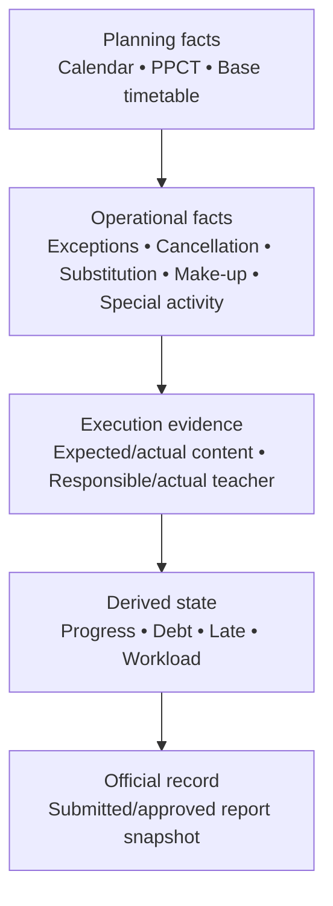

# Core Backend Roadmap

**Status:** Planning guide after LOCAL-FC-05D2 closed the Special Activity minimum core, LOCAL-FC-05E0 closed/green through PR #51 and CI #205 PASS, LOCAL-FC-05E1 closed/green through PR #52 with PR CI #208 and post-merge CI #209 PASS at canonical main `92ea9133748f0864ba1d600b76a23d1d18e9e0e3`, and LOCAL-FC-05E2 implemented its architecture closure on the docs branch awaiting independent GitHub review. This document is not an accepted requirements source and does not authorize implementation.

## Purpose

LOCAL-FC-05D2 is **CLOSED / GREEN**. It implements the SpecialActivity runtime slice with `CANONICAL_CLASS_TEACHER_TIME_V1`; SpecialActivity is assessed for class/teacher interval collisions and Room remains not assessed.

The remaining backend must be delivered as one dependency chain, not as independent screens:

```mermaid
flowchart LR
  CAL["Academic calendar"] --> PPCT["PPCT plan"]
  CAL --> TKB["Base timetable"]
  PPCT --> READY["Operational readiness"]
  TKB --> READY
  READY --> OVERLAY["Operational overlays"]
  OVERLAY --> OCC["05E1 structural resolved occurrence"]
  PPCT --> OCC
  OCC --> ALLOC_ARCH["05E2 allocation architecture closure"]
  ALLOC_ARCH --> ALLOC["05E2B deterministic allocation read model"]
  ALLOC --> EXEC["Teaching execution / Báo giảng"]
  EXEC --> PROG["Progress / debt / late"]
  PROG --> REPORT["Reporting projection"]
  REPORT --> SNAP["Submission / approval snapshot"]
```

An upstream plan is never rewritten to represent a downstream fact. Later facts overlay, fulfill, reverse or supersede earlier facts while retaining their original identity.

## Completed backend foundation

The repository currently contains:

1. Identity, server-side session, capability/scope authorization and audit.
2. AcademicYear, immutable AcademicCalendarVersion aggregates, business weeks, split segments, reserve weeks, interruptions and year-scoped classes.
3. Historical TeachingAssignment responsibility by AcademicYear + class + subject + inclusive civil date.
4. AcademicYear-owned immutable time-slot revisions and real wall-clock collision semantics.
5. AcademicYear-owned TimetableVersion history, normalized normal TimetableEntry rows, DRAFT/validation, approval/activation, supersession and civil-date historical resolution.
6. Timetable XLSX import through LOCAL-FC-04B3D1: immutable profile revisions, typed aliases, bounded parsing, canonical preview, server-side confirmation, semantic/request replay, imported-DRAFT protection and adversarial workbook tests.
7. Bounded deterministic `NORMAL_BASE_PPCT_V1` readiness over retained normal-base evidence and exact date-effective PPCT binding, with all unavailable operational dimensions explicitly `NOT_ASSESSED`.

The accepted timetable meaning remains deliberately partial: `VALIDATED` and `ACTIVE` prove only the implemented normal-base checks. They do not prove timetable completeness, PPCT association or special-activity collision readiness.

## Remaining core sequence

LOCAL-FC-05A0 is merged. LOCAL-FC-05A0D closed the seven PPCT architecture prerequisites and ADR-027 is Accepted. LOCAL-FC-05A1 established the six-model persistence foundation through ADR-028. LOCAL-FC-05A2 established the subject-authorized PPCT control plane, lifecycle commands and exact historical resolution through ADR-029. LOCAL-FC-05B1 established bounded normal-base readiness through ADR-030. LOCAL-FC-05C0D closed R1-R22 through ADR-031, LOCAL-FC-05C1 established the three-family persistence foundation through ADR-032, and LOCAL-FC-05C2A established the bounded `CalendarException` plus `OperationalLessonDisposition` control plane through ADR-033. LOCAL-FC-05D0D closed Special Activity architecture through ADR-034, LOCAL-FC-05D1 established its persistence foundation through ADR-035, and LOCAL-FC-05D2 is CLOSED / GREEN after its runtime control plane. LOCAL-FC-05E0D and ADR-036 now close only the structural resolved-occurrence architecture. The sequence below remains planning guidance subject to each slice's own authorization and gate; the applicable ADR/decision closure remains authoritative.

1. **05A1 — PPCT persistence foundation (established by ADR-028).** The shared `AcademicYear + Subject + Grade` master, immutable version/item history, explicit lineage and date-effective exact-version class association now have database-enforced structural foundations. No API, lifecycle command, capability runtime or import is implied.
2. **05A2 — PPCT control plane and lifecycle (established by ADR-029).** Transactional lifecycle commands, published immutability, correction/supersession, class binding, historical reads and `PPCT_MANAGE` authorization are available. No import, progress, execution, reporting or UI is implied.
3. **PPCT import, if later authorized.** Separate contract/security audit after authoritative workbook/workflow evidence; do not encode it in 05A1 or assume timetable-import formats or identifiers apply.
4. **Bounded timetable readiness foundation (established by ADR-030).** The first pure read profile assesses retained normal-base timetable evidence plus exact PPCT association binding only. It does not assess capacity, overlays, special activities or full operational readiness.
5. **05C1 — operational-overlay persistence foundation (established by ADR-032).** The three ADR-031 aggregate families now have lifecycle/source/reversal history, exact composite provenance, idempotency support and database invariants. No API, capability runtime, resolved-occurrence execution, debt/reporting, move/swap or Special Activity semantics are implied.
6. **05C2A — bounded operational-overlay control plane (established by ADR-033).** `CalendarException` and `OperationalLessonDisposition` now have capability-controlled create/reverse/read, server-derived source, idempotency/CAS and bounded pre-Special-Activity collision checks. Make-up runtime is deferred until an authoritative exact incomplete-obligation proof source exists. Special Activity, resolved occurrence, execution, progress/debt, reporting/snapshots and UI business semantics remain absent.
7. **05D1 — Special Activity Persistence Foundation (established by ADR-035).** The ADR-034 root, exact-slot, frozen-class-target and roleless-staffing persistence direction now has retained provenance and database invariants. No runtime, execution, PPCT/progress/reporting, Room or UI is implied.
8. **05D2 — Special Activity runtime control plane (CLOSED / GREEN).** Capability-controlled create/read/reverse, frozen class/staff provenance, idempotency/CAS and canonical class/teacher/time collision behavior are established. Room remains `NOT_ASSESSED`.
9. **05E0 — Resolved Lesson Occurrence Architecture (closed by 05E0D/ADR-036).** Architecture/decision closure only; no runtime, persistence or allocation algorithm.
10. **05E1 — Structural Resolved Lesson Occurrence Read Model (CLOSED / GREEN).** Derived-only and schema-free internal `RepeatableRead` composition of normal, make-up and Special Activity families, normal suppression evidence, exact PPCT association/version/plan provenance and fail-closed blockers. PR #52 / PR CI #208 / post-merge CI #209 passed. `PPCT_ITEM_ALLOCATION = NOT_ASSESSED` remains explicit and unchanged.
11. **05E2 — PPCT Occurrence Allocation Architecture Closure (implemented on docs branch; awaiting independent GitHub review).** ADR-037 closes deterministic class-subject replay, exact-version stable UUID, split/merge, SpecialActivity suppression, exhaustion and distribution-obligation provenance. It adds no runtime or persistence and is not CLOSED / GREEN before merge and post-merge CI.
12. **05E2B — Deterministic PPCT Allocation Read Model.** Separately authorized implementation of `PPCT_OCCURRENCE_ALLOCATION_V1`; internal, schema-free and fail-closed under one bounded `RepeatableRead` replay.
13. **Teaching execution / Báo giảng.** Immutable evidence of what occurred, expected versus actual content and responsible versus actual teacher, only after 05E2B.
14. **Progress, debt and late.** Reproducible projections from historical facts; make-up fulfills an original obligation exactly once.
15. **Reporting.** Weekly, monthly, semester, custom-range and annual projections as supported by authoritative rules.
16. **Submission and approval.** Immutable submitted/approved snapshots or immutable reference manifests with explicit capability/scope checks and no self-approval.
17. **Cross-domain closure.** Concurrency, idempotency, correction, replay, historical drift and performance validation across the full chain.
18. **CORE BACKEND FREEZE.** Contracts, state transitions, precedence, source references and capability matrix are accepted and regression-covered.
19. **UI business completion afterward.** Product UI consumes frozen backend contracts and does not invent PPCT, debt, occurrence, approval or correction semantics.

## Layering rule

Dependencies point downward. A lower layer may reference immutable upstream identities and snapshots; it must not update an upstream historical row to make current reporting convenient.

## Planning qualifiers

- Future task IDs, ordering refinements and estimates are planning guidance, not accepted requirements.
- A slice may be split after its architecture audit, but no dependency may be skipped merely to deliver UI sooner.
- No UI business semantics are permitted before the corresponding backend contracts are frozen.
- No “God aggregate” owns PPCT, timetable, operational events, execution and reporting together.
