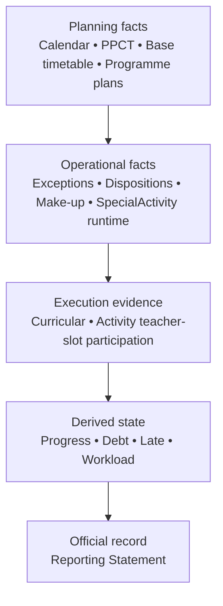

# Core Backend / Pre-Pilot Roadmap

## Status

**Current planning guide for the pre-pilot realignment.**

This document is not the canonical task-status source. Exact current state and dependencies are maintained in:

- `docs/governance/CURRENT-PROJECT-STATUS.md`
- `docs/governance/PRE-PILOT-TASK-REGISTER.md`
- `docs/governance/PRE-PILOT-TRACEABILITY-MATRIX.md`

The old per-slice 05E/05F/05G/05H chronology is retained in Git history, ADRs and phase reports; it is no longer duplicated here as mutable current status.

## Current architecture fact

The repository already contains the core chain:

```text
Calendar / Classes / Time Slots
          ↓
TeachingAssignment
          ↓
Timetable + PPCT
          ↓
Operational Overlays + SpecialActivity runtime
          ↓
PPCT Occurrence Allocation
          ↓
Teaching Execution Evidence
          ↓
Progress / Debt / Late
          ↓
Reporting Projection / Personal Reporting
          ↓
Reporting Statement
```

The pre-pilot issue is therefore **not “finish the missing core backend from scratch.”** It is to restore/re-enter product requirements that were previously minimum-core/deferred and to connect real school data/go-live/production constraints without weakening retained-history invariants.

## Layering rule



A downstream layer may reference exact retained upstream identities but must not rewrite upstream historical meaning.

## Foundations to preserve

Do not rebuild without separate evidence-backed authority:

1. Identity/session/capability/audit.
2. Academic calendar/business-week history.
3. TeachingAssignment date-effective history.
4. TimeSlotDefinition revisions and real-time collision.
5. TimetableVersion/TimetableEntry retained history.
6. Generic timetable import profile/alias/canonical preview foundation.
7. PPCT stable identity/version/revision/lineage/class association.
8. Operational overlays.
9. Existing SpecialActivity exact-slot/frozen-class/staffing/collision runtime primitive.
10. CurricularTeachingExecution and SpecialActivityParticipationExecution.
11. Proof-based progress/debt/late.
12. Reporting/Personal Reporting/Reporting Statement foundations.
13. Hardened Windows production deployment control plane.

## Pre-pilot sequence

### P0 — Product/spec realignment and governance

Goal:

- establish one product baseline;
- establish cross-domain traceability;
- register every planned/deferred item;
- make post-merge documentation synchronization mandatory;
- remove stale current-status claims.

No runtime/schema/production mutation.

### P1 — Business foundations

1. **HomeroomAssignment** — date-effective retained GVCN responsibility required for HĐTN `CLASS`.
2. **Business Configuration Control Plane** — typed/versioned business policy, explicitly separated from secrets/technical env.
3. **Delayed go-live operational-start policy** — explicit start authority without inventing historical debt.

### P2 — Real school data ingestion

1. PPCT authoritative workbook audit.
2. PPCT native importer.
3. Đam San native TKB workbook audit.
4. Native TKB adapter with class/teacher peer evidence and fail-closed mismatch.
5. Morning/afternoon selective update with explicit carry-forward into one coherent canonical timetable version.

### P3 — Historical go-live continuity

1. Pre-operational historical execution/reconciliation architecture.
2. Controlled historical evidence ingestion/confirmation.
3. Preserve current invariant: missing execution alone does not prove debt.
4. Public make-up runtime remains a separate trigger-based re-entry if required.

### P4 — GDĐP / HĐTN programmes and workload

1. Programme/version/item/occurrence architecture.
2. GDĐP `AcademicYear + Grade` planning.
3. HĐTN `CLASS / GRADE / SCHOOL_WIDE` planning.
4. Date-effective homeroom resolution for class activities.
5. Exact per-slot teacher assignment.
6. Programme coordinator authorization.
7. Deterministic bridge into existing SpecialActivity runtime primitive.
8. Confirmed activity teacher-slot workload/reporting aggregation.
9. WorkloadAdjustmentRule re-entry when official adjusted workload is in pilot scope.

### P5 — Pilot product closure

1. Product Owner chooses `CORE PILOT` or `FULL BUSINESS PILOT`.
2. Cross-domain regression/business freeze for the chosen claim.
3. Installable PWA baseline with safe caching/update behavior.
4. Dedicated Báo giảng Telegram bot/linking/notification lifecycle.

### P6 — Production readiness and controlled pilot

1. Repo-side Báo giảng first-cert HTTP-01/Nginx/TLS authority.
2. Passive VPS neighbour discovery and exact readonly preflight.
3. Controlled root/ACL/task/env/Nginx/database bootstrap.
4. Exact reviewed commit deploy + migration/rollback/health evidence.
5. TLS monitor multi-certificate extension after separate Báo giảng certificate exists.
6. Real teacher pilot verification.

## Dependency principle

The exact dependency graph is authoritative only in `PRE-PILOT-TASK-REGISTER.md`. At a high level:

```text
P0
├── P1
├── P2 audits
└── P6 TLS repo authority

P1 + P2
   ↓
P3

P1 Homeroom + P0
   ↓
P4

Chosen P1-P4 scope
   ↓
P5 freeze

P5 + P6 evidence
   ↓
Production pilot
```

## Deferred-work rule

There is no untracked “later” queue.

Every intentionally postponed area must be either:

- `DEFERRED_WITH_TRIGGER` in the task register; or
- explicit `NON_PILOT`/`CANCELLED` Product Owner scope.

Room/Location, arbitrary student rosters, active AI integration, managed activity-category catalogue and other non-pilot items remain visible in the register with re-entry triggers.

## Major-task closure rule

A major task is not `CLOSED` at merge. It becomes `MERGED_AWAITING_DOC_SYNC` until:

- exact merge/main SHA is known;
- authoritative post-merge CI is successful when applicable;
- independent GitHub review evidence is complete;
- task register/current status/traceability and applicable summaries are synchronized.

No dependent major task starts before that sync closes.

## UI/product rule

UI must not invent missing programme, go-live, workload, import or authorization semantics. A pilot-critical UI workflow may proceed only after the corresponding backend/product authority is accepted.
