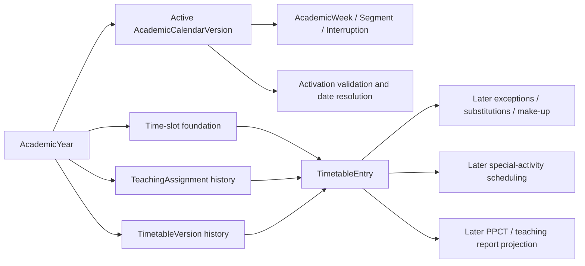

# LOCAL-FC-04 — Timetable Domain Specification

**Status:** Requirements audit; 04A1 persistence resolved by ADR-016, 04A2 timetable persistence by ADR-017, 04B0 time-slot control plane by ADR-018, 04B1 draft/validation by ADR-019, and 04B2 lifecycle/resolution by ADR-020; 04B3A import questions are audited in `LOCAL-FC-04B3-TIMETABLE-IMPORT-CONTRACT-AUDIT.md` and proposed by ADR-021, but remain subject to review/acceptance

**Audit date:** 2026-08-11

**Scope:** Timetable domain only; no schema, API, UI, capability seed, or migration is authorized by this document

Status labels used below:

- **CONFIRMED** — stated by an authoritative source or already enforced by an accepted ADR/domain.
- **INFERRED** — the smallest design conclusion consistent with the authoritative sources; approval is still required.
- **UNRESOLVED** — the sources do not determine one safe answer.

## 1. Source authority and audit method

The audit applied the source order established by [ADR-003, “Thứ tự ưu tiên nguồn yêu cầu”](../decisions/ADR-003-PROTOTYPE-REFERENCE-ONLY.md):

1. [PA-B v1.3 Implementation Addendum](../specifications/PA-B-VPS-PostgreSQL-v1.3-IMPLEMENTATION-ADDENDUM.md), read completely.
2. Current accepted ADRs: [ADR-010](../decisions/ADR-010-ACADEMIC-CALENDAR-AND-CLASS-FOUNDATION.md), [ADR-011](../decisions/ADR-011-ACADEMIC-STRUCTURE-CONTROL-PLANE.md), [ADR-012](../decisions/ADR-012-TEACHING-ASSIGNMENT-FOUNDATION.md), [ADR-013](../decisions/ADR-013-TEACHING-ASSIGNMENT-CONTROL-PLANE.md), [ADR-014](../decisions/ADR-014-TEACHING-ASSIGNMENT-WORKSPACE-READ-MODEL.md), plus ADR-003 and [ADR-008](../decisions/ADR-008-CAPABILITY-AUTHORIZATION-SEMANTICS.md).
3. `PA-B-VPS-PostgreSQL-v1.2-AI-governance.docx`, extracted read-only from OOXML and read completely (1,471 Word paragraphs), especially §§1.2, 2, 3.2, 5–9, 11–12, 14, 16, 18 and Appendices A–D.
4. [Project Context](../PROJECT_CONTEXT.md), current Prisma schema and capability seed, and the merged academic-structure/teaching-assignment API and workspace source.
5. [Prototype](../prototypes/ui-reference-phuong-an-b.html), inspected only after the authoritative sources and used only as a UI/workflow illustration under ADR-003.

The audit searched both Vietnamese and English timetable, slot, period, session, version, activation, staffing, PPCT, exception, substitution, make-up, special-activity and import terms, then read their surrounding sections. This document paraphrases requirements; it does not reproduce the source specification.

No material conflict was found between v1.2, the addendum and ADR-010/012. Some schema-level semantics remain unspecified and are explicitly marked below.

## 2. Confirmed terminology

| Term | Meaning | Classification and source |
|---|---|---|
| Academic year | Business parent for school calendar and academic structures. | **CONFIRMED** — ADR-010, “Decisions”; ADR-011, “Approved contract”. |
| Academic calendar version | Immutable, versioned year calendar with teaching weekdays, business weeks, segments and interruptions. It is not an ISO-week calendar. | **CONFIRMED** — ADR-010, “Calendar foundation” and “Date semantics”. |
| Academic week | School-defined business week; may have multiple segments such as 5a/5b and may include reserve `DP` weeks. | **CONFIRMED** — ADR-010; v1.2 §6 and Appendix B, B6–B7. |
| Timetable version | A retained version of the base timetable, created by an import or controlled authoring workflow and effective from a selected academic week. | **CONFIRMED** — v1.2 §§5.1–5.2, 7.1–7.2, 14.3 and Appendix C (`timetable_versions`). |
| Base timetable | The recurring weekly schedule resolved through the version effective for a business date/week. | **INFERRED** — v1.2 §§5.1, 6.6, 7.1 and 12.1 require weekday/slot rows and date-effective version resolution, but do not name this term formally. |
| Session | Morning, afternoon or evening (`sáng`, `chiều`, `tối`). | **CONFIRMED** — v1.2 §7.4 and Appendix D, “Khung giờ”. |
| Time slot / period | A configured time coordinate with a real wall-clock interval; period number alone is insufficient for collision checks. | **CONFIRMED** — v1.2 §§7.4–7.5 and Appendix D. |
| Teaching assignment | The one canonical responsible teacher for AcademicYear + class + subject + civil date. | **CONFIRMED** — ADR-012, “Core invariant” and “Date semantics”. |
| Calendar exception | A later local cancellation/exception applying at day/session/period and scoped targets; distinct from a calendar interruption. | **CONFIRMED** — ADR-010, “Deferred scope”; v1.2 §6.4. |
| Operational event | Substitution, cancellation or make-up activity layered over a scheduled lesson, rather than an edit to historical base timetable meaning. | **CONFIRMED** for separation — v1.2 §§8–9; exact event models are out of scope. |

All civil dates remain PostgreSQL `DATE`; audit/activation instants remain `TIMESTAMPTZ`; wall-clock slot boundaries should use PostgreSQL `TIME` if approved. This follows ADR-010’s civil-date rule and the v1.2 real-time collision rule.

## 3. Confirmed business requirements

1. **CONFIRMED:** Timetables are versioned; history is retained rather than overwritten. Each upload produces a version. Sources: v1.2 §§5.1–5.2, 7.1–7.2, 14.3 and Appendix C.
2. **CONFIRMED:** A version progresses through `DRAFT`, `VALIDATED`, `APPROVED`, `ACTIVE`, and `SUPERSEDED`. Source: v1.2 §7.1 and Appendix A.
3. **CONFIRMED:** A new timetable becomes effective at the beginning of a selected academic week. A selected civil date is converted to an academic week and the effective date is displayed before activation. Source: v1.2 §7.1.
4. **CONFIRMED:** A row contains an effective week/weekday/time-slot/class/subject/teacher coordinate. Source: v1.2 §5.1.
5. **CONFIRMED:** Exact morning, afternoon and evening period times, self-study and allowed make-up windows are configurable for an academic year. Current example times are configuration, not constants. Source: v1.2 §7.4 and Appendix D.
6. **CONFIRMED:** Collision is evaluated by real time range, not merely equal period labels. Teacher, class, activities and other locked schedule uses participate as applicable. Source: v1.2 §7.5.
7. **CONFIRMED:** Activation/import validation includes missing/inactive teachers, unknown classes/subjects, teacher and class overlaps, malformed slot coordinates, missing PPCT association, staffing changes, and conflicts with locked/special activity time. Source: v1.2 §7.3.
8. **CONFIRMED:** The same imported content is idempotent by checksum and must not duplicate data. Source: v1.2 §§5.2, 7.2, 14.3 and Appendix C.
9. **CONFIRMED:** Timetable resolution for reports and teaching workflows uses the version effective on the historical business date, together with the applicable academic calendar. Source: v1.2 §§6.6, 7.1 and 12.1–12.2.
10. **CONFIRMED:** Calendar interruption pauses timetable execution, expected PPCT progress and debt/late alerts. A local exception cancels selected schedule coordinates without consuming PPCT or creating debt. Source: v1.2 §§6.2–6.4.
11. **CONFIRMED:** GDĐP and HĐTN-HN cannot be reduced to a normal single-class/single-teacher timetable row. A timetable coordinate may exist while staffing/participation is delegated to a special-activity domain. Source: v1.2 §11; ADR-012, “Special activities boundary”.
12. **CONFIRMED:** Authorization is backend capability/scope based; frontend visibility is not authority and `SYSTEM_ADMIN` is not an implicit professional bypass. Sources: ADR-008 and the v1.3 addendum authorization rules.

## 4. Dependency map

- Academic calendar owns whether a civil date is inside a business week, its weekday eligibility, its segment and interruption status.
- Time-slot foundation owns real wall-clock coordinates and stable slot identity.
- TeachingAssignment owns the responsible normal-subject teacher over civil time.
- Timetable owns base weekly placement and period-level collision.
- Later operational/special-activity domains own deviations and multi-participant staffing.
- PPCT/reporting consumes the resolved schedule but owns progress, completion, debt and approval.

## 5. Proposed domain boundaries

### Timetable owns

- Version identity, lifecycle, checksum/source metadata and academic-week effectivity.
- Immutable base schedule entries for weekday + slot + class + subject + responsible teacher evidence.
- Draft validation, comparison and activation/supersession.
- Base class/teacher collision validation.
- Historical resolution of the version effective for a business date.

### Timetable does not own

- Academic-week generation, calendar interruptions or local calendar exceptions.
- Teacher eligibility/coverage or TeachingAssignment history.
- PPCT sequence, lesson title, lesson completion, teaching debt or report approval.
- Substitution, make-up and cancellation transactions.
- Multi-teacher special-activity participation/workload.
- Rooms, because no authoritative room domain exists.

### Non-binding candidate model

This candidate is sufficiently grounded for follow-up design, but remains non-binding until ADR-015 is accepted and the open slot/staffing questions are resolved.

| Concept | Candidate shape | Classification |
|---|---|---|
| `TimeSlotDefinition` | UUID; `academicYearId`; explicit weekday; session; ordinal; revision; display label; `startTime TIME(0)`; `endTime TIME(0)`; active/current-authoring marker and explicit usage flags. Parent deletion `RESTRICT`. | **RESOLVED** by accepted ADR-016 and LOCAL-FC-04A1. |
| `TimetableVersion` | UUID; `academicYearId`; year-local version number/label; lifecycle state; `effectiveAcademicWeekId`; derived/displayed `effectiveDate DATE`; checksum/import reference; creator/validator/approver/activator and `TIMESTAMPTZ` audit instants. | Core identity **CONFIRMED**; exact fields/cardinality **INFERRED**. |
| `TimetableEntry` | UUID; `timetableVersionId`; weekday; `timeSlotId`; class; subject; normal-lesson staffing evidence described in §9. A separate/discriminated special occupancy remains open. Parent/master deletion `RESTRICT`. | Dimensions **CONFIRMED**; physical representation **INFERRED**. |

No candidate requires a database trigger. Constraints and validation are separated in §§8, 10 and 18.

## 6. Timetable version lifecycle

| Question | Finding |
|---|---|
| Is Timetable versioned? | **CONFIRMED.** v1.2 §§5.1–5.2, 7.1–7.2 and Appendix C. |
| Scope to AcademicYear? | **INFERRED.** The version’s effective week and its class/slot configuration are year-bound; Appendix D configures TKB by year. No source states a direct FK explicitly. |
| Scope to AcademicCalendarVersion? | **UNRESOLVED / not recommended as ownership.** Sources require resolution against the effective calendar but do not make calendar version the timetable parent. ADR-012 establishes that calendar replacement must not silently rewrite staffing; the same separation should apply here. |
| Independent identity? | **CONFIRMED conceptually.** `timetable_versions` is a distinct proposed table in v1.2 Appendix C. |
| Multiple versions? | **CONFIRMED.** New uploads create versions and version comparison is a use case. |
| Exactly one active? | **INFERRED only.** `ACTIVE`/`SUPERSEDED` implies one current version, but future approved/effective versions and exact cardinality are not defined. The safe invariant is at most one effective version for any academic year and business date. |
| Retain history? | **CONFIRMED.** Historical data changes by a new version/reversal, and reports use the version effective on each date. v1.2 §§2, 5 and 12. |
| `effectiveFrom`/`effectiveUntil`? | Start at an academic week is **CONFIRMED**. An explicit end field is **UNRESOLVED**; an end may be derived from the next version. |
| Activation instant vs effective date? | Their distinction is **INFERRED and necessary**: approval/activation is an audit instant; business effect begins at the selected academic week. Behavior for future activation is **UNRESOLVED**. |

Proposed transition guardrails:

- Draft content may be replaced while `DRAFT`; every validation result belongs to a specific immutable draft revision or checksum.
- Only a successfully validated version may become `APPROVED`; only approved content may activate.
- Activation is transactional and re-runs all activation invariants against current dependencies.
- Activated entries are immutable. A change creates another version; the prior version remains resolvable.
- Supersession must not erase the prior effective interval.
- Rollback by reactivating an old version versus cloning it into a new version is **UNRESOLVED**. Cloning is safer for audit but is not yet an accepted decision.

## 7. Period / time-slot model

### Source findings

| Question | Finding |
|---|---|
| Morning/afternoon/evening | **CONFIRMED** — v1.2 §7.4. |
| Period numbers | **CONFIRMED** as user-facing coordinates — v1.2 §§7.3–7.5. |
| Start/end wall-clock time | **CONFIRMED and configurable** — v1.2 §§7.4–7.5, Appendix D. |
| Configurable period count/end time | **CONFIRMED** — v1.2 §7.5. |
| Different schedules by weekday/session | **RESOLVED by ADR-016.** Weekday is explicit per slot, so weekday-specific grids are supported. |
| Break periods | **RESOLVED by ADR-016.** A break is a gap between schedulable intervals, not a row. |
| School-wide vs year-specific | **RESOLVED by ADR-016.** Definitions and their immutable revisions belong directly to AcademicYear. |
| Ordinal vs display label | Both are operationally useful but their separation is **INFERRED**, not specified. |

ADR-010 deferred local exceptions until a canonical time-slot and downstream scope model exists. Therefore LOCAL-FC-04 should first establish stable slot identity usable later by `CalendarException`, substitution and make-up models, without implementing those domains.

ADR-016 accepts an AcademicYear-owned slot revision with explicit weekday, session, ordinal, label and a half-open `[startTime, endTime)` interval. It forbids hardcoded period counts, morning-only operation, implicit weekdays, example-time constants, and Monday–Friday assumptions.

### 7.1 04A1 resolution / ADR-016

[ADR-016](../decisions/ADR-016-CANONICAL-TIME-SLOT-FOUNDATION.md) resolves the three former time-slot questions. `TimeSlotDefinition` is an AcademicYear-owned immutable revision with an explicit weekday row, so weekday-specific clock grids are supported. Revisions have no civil business effectivity; `isActive` identifies only the current/selectable revision for new authoring, while future timetable history references an exact revision. Breaks are gaps between half-open schedulable intervals and require no break or fake slot row.

ADR-017 resolves TimetableVersion effectivity, normal-entry representation, staffing provenance/snapshot, rollback and the separate-table special-activity boundary. Completeness, import contract, editing, approval/activation authorization and draft retention remain 04B-or-later questions.

### 7.2 04A2 resolution / ADR-017

[ADR-017](../decisions/ADR-017-TIMETABLE-SCHEMA-FOUNDATION.md) binds normal lessons to exactly one `TimetableEntry` per exact slot revision. `TimetableVersion` is AcademicYear-owned with a nullable all-or-none calendar/week/effective-date target, one `ACTIVE` chain head and non-overlapping inclusive `ACTIVE`/`SUPERSEDED` history. A future-dated active head is valid; civil-date resolution still selects the unique effective interval. `effectiveUntil` is stored as an inclusive bound when superseded, and rollback creates a new version.

Entries prove same-year version, slot/weekday, class and `TeachingAssignment` provenance while storing the immutable `teacherUserId` snapshot. Special-activity coordinates use a future separate domain. Exact-slot class/teacher collisions are database constraints; collision across different slot IDs remains a transactional 04B activation check over real wall-clock intervals. Any earlier **UNRESOLVED**, **INFERRED**, candidate or recommended labels in sections 5–13 for those exact schema choices are superseded by ADR-017; they remain visible only as the audit trail that led to the accepted decision.

### 7.3 04B0 resolution / ADR-018

[ADR-018](../decisions/ADR-018-TIMETABLE-TIME-SLOT-CONTROL-PLANE.md) accepts a separate AcademicYear-owned time-slot management API. It uses explicit `TIMETABLE_MANAGE / SCHOOL_WIDE` authorization and history-preserving create, revise and retire commands. Only active/current slot revisions are selectable for new timetable authoring by policy, while administrative reads keep every exact revision queryable for historical resolution. Timetable draft/entry commands and validation continue in 04B1; approve/activate/supersede/history and lifecycle concurrency in 04B2; Excel import/checksum/mapping/preview in 04B3.

### 7.4 04B1 resolution / ADR-019

[ADR-019](../decisions/ADR-019-TIMETABLE-DRAFT-AND-VALIDATION-CONTROL-PLANE.md) accepts the timetable DRAFT control plane: server-numbered drafts, target derivation from the minimum AcademicWeek segment date, atomic normalized replace-all entries, server-resolved TeachingAssignment teacher snapshots, optimistic `updatedAt` concurrency, and current-scope validation followed by immutable `DRAFT` to `VALIDATED` transition. Validation covers calendar weekdays, current master/slot/teacher state, assignment coverage through the selected calendar end, and exact half-open class/teacher wall-clock collision.

04B1 deliberately defers timetable completeness, PPCT association and special-activity collisions and reports those boundaries explicitly. It does not decide future UI manual/bulk editing. Approval, activation, supersession, historical date resolution and lifecycle concurrency remain 04B2; Excel mapping/import/checksum/idempotency remain 04B3.

### 7.5 04B2 resolution / ADR-020

[ADR-020](../decisions/ADR-020-TIMETABLE-LIFECYCLE-AND-HISTORICAL-RESOLUTION.md) accepts `VALIDATED` → `APPROVED` and `APPROVED` → `ACTIVE` under the existing `TIMETABLE_MANAGE / SCHOOL_WIDE` capability. The same actor may validate, approve and activate; the lifecycle still records each actor and timestamp independently. Exact `expectedUpdatedAt` protects the candidate, while `expectedActiveVersionId` protects the AcademicYear chain head.

Activation is serializable, reruns the shared current normal-base evaluator, and requires the candidate's exact calendar version to be currently active. A valid successor automatically supersedes the predecessor with an inclusive `effectiveUntil` equal to the previous civil date. `ACTIVE` may begin in the future, and historical resolution uses only the inclusive `ACTIVE`/`SUPERSEDED` interval rather than status alone, ISO week, process date or current calendar-active state. Calendar interruptions do not erase the resolved base version.

Completeness, PPCT association and special-activity collisions remain explicit deferred checks. Excel import, template/mapping, preview/comparison and checksum/idempotency remain 04B3.

## 8. Timetable entry identity

The smallest confirmed scheduled coordinate is one version + weekday + time slot + class + subject, with teacher evidence for a normal lesson. Source: v1.2 §5.1.

- Subject is stored directly: **CONFIRMED** by the proposed `timetable_entries` fields.
- A stable slot reference is preferred over embedding period number: **INFERRED** from real-time collision and ADR-010’s deferred slot dependency.
- One entry spanning consecutive periods versus one entry per slot: **UNRESOLVED**. The future schema must not choose until import and reporting semantics are approved.
- A surrogate UUID plus business uniqueness is consistent with current ADRs: **INFERRED**.
- Weekday must be an explicit business weekday value validated against the active calendar; it must not be derived from an ISO week: **CONFIRMED** in principle by ADR-010 and v1.2 §6.

Candidate business key for normal one-slot rows: `(timetableVersionId, weekday, timeSlotId, schoolClassId)`. Teacher collision requires a separate constraint/validation. If multi-slot entries are approved, occupancy must be normalized to individual slot claims even if the authoring record spans a range.

## 9. Teacher resolution semantics

### Alternatives and historical effects

| Alternative | Benefit | Historical risk | Assessment |
|---|---|---|---|
| A. Reference `TeachingAssignment` only | Proves the approved class/subject staffing envelope. | Reading `teacherUserId` dynamically from mutable/split assignment history can change interpretation unless the referenced row is immutable and date coverage is fixed. | Supported by current domain, but not sufficient alone. |
| B. Store teacher snapshot only | Matches v1.2’s direct `teacher_id`; historical row is self-describing. | Can drift from canonical TeachingAssignment and lacks provenance unless activation validates and records it. | Authoritatively supported but needs stronger integrity. |
| C. Store class+subject and resolve dynamically | Minimal row. | A later assignment split/change silently changes historical timetable meaning. | **Rejected**; conflicts with historical preservation. |
| D. Reference assignment and store immutable teacher snapshot | Proves canonical source at activation and preserves the resolved historical teacher. | Denormalization needs equality validation and careful composite integrity. | **Recommended, INFERRED**, pending approval. |

For a normal lesson, the proposed entry records `teachingAssignmentId` and `teacherUserIdSnapshot`. Activation verifies that the assignment belongs to the same AcademicYear/class/subject, covers every civil occurrence in the version’s effective interval that can be validated, and resolves to the snapshot teacher. The snapshot is never rewritten when later staffing changes.

This reconciles v1.2’s explicit `teacher_id` field and teacher-change validation (§§5.1, 7.3) with ADR-012’s canonical responsible-teacher invariant. The exact composite FK strategy and how to validate an open-ended future interval remain **UNRESOLVED**.

Special-activity coordinates may have no normal responsible teacher; they must not weaken the normal-entry invariant or introduce co-teaching into TeachingAssignment.

## 10. Collision rules

All intervals are treated as half-open so sequential `[08:00, 08:45)` and `[08:45, 09:30)` periods do not overlap.

| Resource/situation within the same effective version, weekday and overlapping real-time interval | Rule | Enforcement/classification |
|---|---|---|
| Same class, two normal lessons | Forbidden. | **CONFIRMED** — v1.2 §§7.3, 7.5. DB unique is possible for identical slots; overlapping distinct slots need slot-grid or activation validation. |
| Same teacher, two classes | Forbidden. | **CONFIRMED** — v1.2 §§7.3, 7.5. Same enforcement split. |
| Same class+subject duplicated | Forbidden as a consequence of class occupancy; no extra business rule is needed unless import semantics say otherwise. | **INFERRED.** |
| Same teacher in sequential non-overlapping periods | Allowed. | **CONFIRMED by real-time overlap semantics** — v1.2 §7.5. |
| Same class, different subjects in different non-overlapping periods | Allowed. | **INFERRED** from the real-time collision rule and timetable purpose — v1.2 §§7.1, 7.5. |
| Room | **DEFERRED.** No authoritative room model. | Must not invent `Room`. |
| Special activity/locked school event | Base lesson cannot overlap an applicable locked coordinate. | **CONFIRMED** — v1.2 §§7.3–7.5, 11. Exact scope model deferred. |
| Grade/school/shared activity | Collision applies to every affected participant/class scope. | **CONFIRMED conceptually** — v1.2 §§7.5, 11; canonical scope representation **UNRESOLVED**. |
| GDĐP/HĐTN-HN | Their time coordinates block applicable class/grade/school resources; multi-teacher staffing is external. | **CONFIRMED conceptually** — v1.2 §11. |
| Make-up/substitution | Later operational events check the resolved base schedule and all other occupied coordinates. | **CONFIRMED** — v1.2 §§7.5, 9. |

Real-time collision across different slot IDs cannot be guaranteed by a simple entry `UNIQUE`. Either 04A1 must prohibit overlapping slot definitions for the same applicable calendar coordinate, or entries must carry an immutable interval projection suitable for exclusion. Cross-table joins cannot be expressed by a normal PostgreSQL exclusion constraint. This is an explicit design gate.

## 11. Academic-calendar relationship

The base timetable is a **hybrid**: a weekly recurring pattern whose active version is selected by business academic week and then projected onto eligible civil dates. It is not a row per date and not an ISO-week schedule. **INFERRED** from v1.2 §§6–7 and the `weekday`/`effective_week_id` row design.

- `teachingWeekdays`: activation rejects entry weekdays not supported by the active calendar. **CONFIRMED** in principle from ADR-010; the v1.2 import check for missing weekday is §7.3.
- Interruption: no base lessons execute on interrupted dates; the timetable version itself is not mutated. **CONFIRMED**; v1.2 §6.2.
- Split week 5a/5b: both segments resolve the same business week identity/pattern unless a new timetable version is explicitly effective between permissible business boundaries. No ISO-week increment occurs. **INFERRED** from v1.2 §6.2 and Appendix B B7.
- Reserve `DP` week: it is a valid business week only when the active calendar makes it operational; timetable applicability/completeness rules for DP are **UNRESOLVED**.
- Calendar replacement: activating a calendar version must revalidate timetable effective-week references, eligible weekdays and occurrence coverage. It must not rewrite timetable history. **INFERRED**, consistent with ADR-010 and ADR-012 activation compatibility.

Whether `TimetableVersion` stores an activation-time `academicCalendarVersionId` snapshot in addition to its AcademicYear parent is **UNRESOLVED**. It may aid audit, but must not imply calendar ownership.

### CalendarException boundary

04A1/04A must provide stable slot identity and reusable scope vocabulary, satisfying ADR-010’s dependency. It must not implement CalendarException. A later exception overlays a civil date + optional session/slot + target scope and suppresses execution without editing the base version. Substitution and make-up remain separate operational events.

## 12. TeachingAssignment relationship

- TeachingAssignment remains directly scoped to AcademicYear, with inclusive civil `DATE` bounds and one teacher per year/class/subject/date. **CONFIRMED** — ADR-012.
- Timetable is the owner of period-level teacher collision. **CONFIRMED** — ADR-012, “Collision ownership”.
- Draft/activation validation must reject a normal entry without a compatible TeachingAssignment. **INFERRED** from v1.2 teacher validity/change checks plus ADR-012.
- A later TeachingAssignment change must not rewrite activated entry snapshots. It can affect future version activation and should surface compatibility conflicts. **INFERRED** from the historical rule.
- Calendar activation already validates TeachingAssignment envelopes; timetable activation must independently validate its own dates/coordinates. **CONFIRMED boundary**, exact algorithm **INFERRED**.

Coverage validation over a recurring pattern requires a defined effective interval. If the version has no explicit end, activation can validate from its first week through the end of the currently active calendar or until the next scheduled version. Which interval is normative is **UNRESOLVED**.

## 13. Historical preservation

Activated versions and entries are immutable and retained; correction occurs through a new version. This is **CONFIRMED** at the requirements level by v1.2 §§2, 5, 7 and 12.

A historical query must be able to identify:

1. the AcademicYear and business date;
2. the calendar version that interpreted the date;
3. the timetable version effective for its academic week;
4. the immutable entry and teacher snapshot;
5. later operational overlays, separately;
6. any frozen report/statement snapshot and hash.

Hard delete of referenced master data or activated versions should use `ON DELETE RESTRICT`. Draft disposal policy and retention are **UNRESOLVED**. Reports already frozen as statements must not be silently recalculated after calendar, staffing or timetable changes (v1.2 §12.2).

## 14. Authorization/capability requirements

v1.2 assigns timetable import/check/approve/activation to the conceptual `ADMIN_TKB` responsibility (§3.2 and §7), while the accepted platform uses cumulative capabilities and scopes rather than role switches (ADR-008). ADR-018 accepts `TIMETABLE_MANAGE` with `SCHOOL_WIDE` scope for the time-slot management control plane, bringing the seed catalog to 27 definitions.

The accepted 04B0 boundary uses that distinct professional capability rather than academic-structure or subject-dictionary authority. It does not yet decide separate approval or activation capabilities.

Reasons:

- Timetable lifecycle is a separate professional responsibility from academic master-data and subject dictionary management.
- Reusing `ACADEMIC_STRUCTURE_MANAGE` or `SUBJECT_MANAGE` would grant unrelated mutation authority.
- `SCHOOL_WIDE` matches cross-class/teacher collision and whole-school activation.
- It would conceptually be granted to timetable administrators/BGH delegates through explicit assignments; `SYSTEM_ADMIN` does not bypass it.

ADR-020 resolves the current control-plane policy: approval and activation both require `TIMETABLE_MANAGE / SCHOOL_WIDE`; no distinct capability or mandatory actor inequality applies. Backend checks, not UI state, remain authoritative. A stricter future organizational separation-of-duties policy requires a separate approved change.

## 15. Import/manual-entry requirements

The focused [LOCAL-FC-04B3 import audit](LOCAL-FC-04B3-TIMETABLE-IMPORT-CONTRACT-AUDIT.md) and [ADR-021](../decisions/ADR-021-TIMETABLE-IMPORT-CONTRACT-AND-IDEMPOTENCY.md) now document evidence and propose a contract. ADR-021 remains **Proposed**; the unresolved questions below are not converted into accepted requirements by that proposal.

### Confirmed import workflow

v1.2 §§7.2–7.3 and 14.3 require: upload → select profile/sheet → detect columns → map aliases → validate → compare/preview → approve → activate. Each upload creates a version; checksum makes identical content idempotent. Errors identify invalid/missing teacher, class, subject, slot, duplicates/collisions, PPCT gaps and locked/special conflicts. Aliases are remembered.

- Excel import: **CONFIRMED**.
- Replace whole version rather than mutate active rows: **CONFIRMED**.
- Draft + validation preview + approval + activation: **CONFIRMED**.
- Exact source columns/header names: **UNRESOLVED**. Do not invent a template.
- Manual cell entry or bulk edit: **UNRESOLVED**. The prototype shows upload and activation only and cannot establish a requirement.
- Import row spanning multiple periods: **UNRESOLVED**.
- Error transport format, row/column addressing and partial acceptance: **UNRESOLVED**. Atomic version import is recommended but not yet approved.

## 16. Special-activity boundary

v1.2 §11 confirms that GDĐP/HĐTN-HN may use class, grade or school scope, multiple teachers and separate confirmation/workload rules. ADR-012 explicitly excludes those cases from normal TeachingAssignment.

Recommended boundary (**INFERRED**): a base timetable may hold a generic special-activity schedule coordinate so class/grade/school occupancy is visible, but content, participant teachers, coefficients and confirmation belong to later `SpecialActivity` models. A GDĐP coordinate may intentionally lack a normal responsible teacher. A class HĐTN activity can later resolve its homeroom teacher, while grade/school activities use explicit participant assignments.

Whether normal and special coordinates share `TimetableEntry` with a discriminated kind or use separate tables is **UNRESOLVED**. A single nullable all-purpose row is not recommended because it would weaken normal-lesson integrity. Co-teaching must not be added to TeachingAssignment.

## 17. PPCT/reporting downstream contract

Timetable must expose, for a civil date or reporting interval:

- scheduled class and subject;
- responsible teacher snapshot/provenance for normal lessons;
- weekday, session/slot and real-time interval;
- AcademicYear, business week/segment and interruption/exception applicability;
- effective timetable version identity;
- count of expected scheduled lesson slots after calendar overlays.

This supports v1.2 §§8 and 12: PPCT/reporting selects the correct schedule and versions for each date and can compute expected lessons.

Timetable does **not** own PPCT sequence, lesson title/content, distribution/completion state, lesson debt, substitution outcome, make-up settlement, statement approval or workload coefficients. Those are downstream domains (v1.2 §§8–12). Placeholder special-activity coordinates do not by themselves count teacher workload (§11).

The exact read contract and whether expected count is stored or always projected are **UNRESOLVED** and belong after schema/control-plane approval.

## 18. Error/conflict semantics anticipated

Future APIs should return stable machine codes plus Vietnamese field/row context. Candidate conflict categories, not contracts, are:

| Category | When raised | Validation layer |
|---|---|---|
| `TIMETABLE_SLOT_INVALID` | Unknown/disabled slot, malformed interval or unsupported weekday/session. | DB where possible; draft and activation. |
| `TIMETABLE_CLASS_COLLISION` | Class occupancy overlaps. | DB for identical coordinates; draft/activation for real ranges. |
| `TIMETABLE_TEACHER_COLLISION` | Teacher occupancy overlaps. | Same split. |
| `TIMETABLE_PARENT_MISMATCH` | Year/version/class/slot/assignment parents disagree. | Composite FK where possible; application. |
| `TIMETABLE_ASSIGNMENT_MISSING` | No canonical assignment covers a normal lesson occurrence. | Draft/activation. |
| `TIMETABLE_ASSIGNMENT_CHANGED` | Snapshot no longer matches activation-time assignment. | Activation. |
| `TIMETABLE_CALENDAR_CONFLICT` | Week/weekday/interruption/calendar compatibility fails. | Activation. |
| `TIMETABLE_CONTENT_DUPLICATE` | Same checksum/import is submitted again. | Unique/index + idempotent application response. |
| `TIMETABLE_STATE_CONFLICT` | Mutation/transition is illegal or stale. | Application transaction. |
| `TIMETABLE_ACTIVATION_RACE` | Concurrent activation changed the expected active set. | Transaction/optimistic concurrency. |

Exact names and HTTP mappings are intentionally deferred.

### Prospective PostgreSQL invariant plan

| Mechanism | Candidate use |
|---|---|
| `UNIQUE` | Year-local version number; version + weekday + slot + class; checksum within an agreed import scope. |
| `CHECK` | `startTime < endTime`; valid lifecycle metadata combinations; positive ordinal; normalized weekday/session values. |
| Composite FK | Keep entry class/slot/assignment tied to the same AcademicYear where duplicated parent keys make this enforceable. |
| Partial unique index | At most one version in a precisely defined “effective/current” state per year/effective boundary, only after future-active semantics are settled. |
| GiST exclusion | Potential interval collision if immutable time ranges and resource IDs are stored in the same row. PostgreSQL cannot exclude on a joined slot table. |
| `ON DELETE RESTRICT` | AcademicYear, slots, classes, subjects, assignments, versions and entries once referenced/history-bearing. |

Application validation owns cross-aggregate existence/state/scope rules. Activation validation owns full-version completeness, calendar compatibility, real-range collisions, assignment coverage, special/locked conflicts and current dependency rechecks. No trigger is justified by the current sources.

## 19. Explicit non-scope

- Prisma schema, migrations, seed changes, APIs, frontend and tests.
- CalendarException implementation.
- Substitution, cancellation, period swap, postponement or make-up models.
- PPCT, teaching debt, lesson completion, statements and approvals.
- Special-activity participant/workload implementation.
- Room scheduling.
- Production import templates or file parsers.
- Deployment, VPS or database operations.
- Automatic timetable optimization/generation.

## 20. Open questions / unresolved requirements

ADR-016 resolves the time-slot foundation, ADR-017 resolves the 04A2 version/entry/history schema, and ADR-020 resolves the 04B2 lifecycle policy. The following questions remain for 04B3 or later slices:

1. What completeness rule applies to classes, weekdays, slots and reserve `DP` weeks?
2. What are the official import columns, template versions, row error contract and atomicity rules?
3. What future UI manual/bulk editing requirements apply?
4. What is the retention/deletion policy for abandoned drafts?

Room collision is explicitly **DEFERRED**, not an unresolved invitation to invent a room model.

## 21. Acceptance matrix for future implementation

| Area | Future acceptance evidence |
|---|---|
| Schema — valid/invalid slot | Accept valid session/interval/ordinal; reject reversed, zero-length, unavailable or parent-mismatched slots. |
| Schema — collisions | Reject class and teacher overlap, including different slot labels with overlapping real time; allow exact sequential periods. |
| Schema — parent/year | Reject version, class, slot and assignment cross-year mismatch; restrict deletion of referenced/history rows. |
| Schema — version identity | Enforce agreed year-local identity/checksum/effectivity uniqueness and retain superseded versions. |
| Backend — auth | Deny missing, wrong-scope, disabled and expired capability; allow explicitly scoped timetable manager; no `SYSTEM_ADMIN` bypass. |
| Backend — lifecycle | Create draft, validate entries, preview conflicts, approve, activate atomically and reject illegal/stale transitions. |
| Backend — activation/history | Re-run dependencies, supersede correctly, resolve historical version, implement approved rollback semantics. |
| Backend — concurrency | Concurrent entry mutation/activation cannot produce two effective versions or bypass collision recheck. |
| Calendar — weekdays | Reject unsupported teaching weekday; never use ISO-week derivation. |
| Calendar — interruption | Suppress execution/expectation without mutating base version. |
| Calendar — 5a/5b | Both segments preserve business-week identity and resolve deterministically. |
| Calendar — reserve DP | Apply the approved DP completeness/effectivity policy. |
| Calendar — replacement | Detect incompatibility, preserve old meaning and revalidate new activation. |
| TeachingAssignment — missing/range | Reject missing or non-covering assignment for normal entries. |
| TeachingAssignment — change | Preserve historical teacher snapshot; future activation uses the current canonical assignment. |
| Import | Identical checksum is idempotent; invalid rows return actionable row/field conflicts; no partial active replacement. |
| UI/E2E — future only | Responsive grid/list and mobile rendering; draft/import; conflict presentation; activation confirmation; historical version read. |
| Special activity — future | Schedule coordinates block correct scopes without creating co-teaching or placeholder workload. |
| Reporting — future | Date/range report records the effective calendar/timetable version and stable teacher evidence. |

## 22. Recommended LOCAL-FC-04 decomposition

1. **04A1 — Time-slot foundation:** approve slot version/effectivity, weekday variance, interval integrity and stable identity; schema/migration plus focused invariants. This is required before TimetableVersion schema.
2. **04A2 — Timetable schema foundation:** version/entry/history model, assignment snapshot strategy, parent integrity, indexes and collision representation.
3. **04B0 — Time-slot control plane:** canonical slot management plus `TIMETABLE_MANAGE`.
4. **04B1 — Draft and entry commands:** timetable authoring plus validation engine.
5. **04B2 — Lifecycle (resolved by ADR-020):** approve, activate, supersede, historical resolution and concurrency.
6. **04B3 — Import:** Excel import, template/mapping, preview/comparison, checksum and idempotency.
7. **04C — Timetable management UI:** import/draft comparison, conflict remediation and activation workflow within the approved design system.
8. **04D — Teacher/read-only timetable UI:** effective personal/class timetable and historical/date navigation.
9. **04E — Operational overlays:** only after separate requirements work for CalendarException, substitution, cancellation and make-up.
10. **04F — Special-activity occupancy integration:** after the canonical special-activity scope/staffing model exists.

ADR-016 and ADR-017 are the accepted persistence gates; 04B must preserve their collision and historical semantics.
