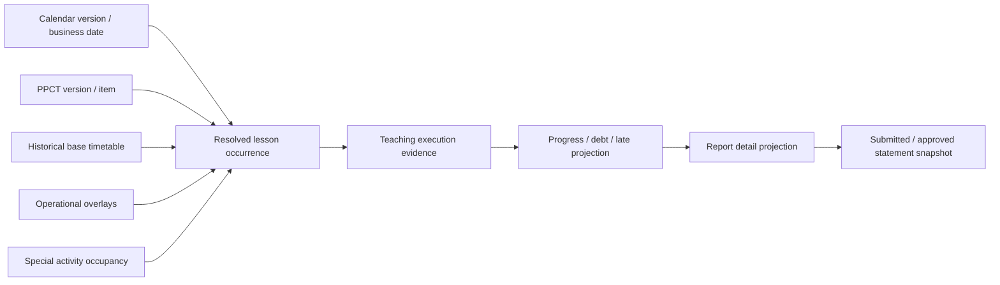

# LOCAL-FC-05A0 — PPCT, Teaching Execution and Reporting Architecture Audit

## 1. Status and scope

**Status:** Architecture/requirements audit. No schema, migration, API, contract, seed, capability, UI or deployment is authorized.

This audit defines the dependency and ownership boundaries required before PPCT, operational events, resolved occurrences, teaching execution, progress/debt or reporting persistence is designed. Classifications are:

- **CONFIRMED:** stated by an authoritative source or fixed by an Accepted ADR/current implementation.
- **INFERRED:** the narrowest architecture consistent with the sources; approval is still required.
- **UNRESOLVED:** no single safe answer is established.

This document preserves the original 05A0 evidence classifications. The later product-owner decisions are recorded explicitly in the 05A0D closure/addendum; after that closure, ADR-027 is **Accepted** and 05A1 is architecture-ready. Nothing in either document changes the accepted meaning of historical timetable `VALIDATED` or `ACTIVE` rows.

## 2. Source authority and method

Priority applied:

1. `docs/specifications/PA-B-VPS-PostgreSQL-v1.3-IMPLEMENTATION-ADDENDUM.md`, read completely.
2. Accepted ADRs: ADR-003, ADR-008, ADR-010 through ADR-014 and ADR-016 through ADR-026. ADR-015 was read but remains Proposed.
3. `docs/specifications/PA-B-VPS-PostgreSQL-v1.2-AI-governance.docx`.
4. Current requirement/governance documents, especially `LOCAL-FC-04-TIMETABLE-DOMAIN-SPEC.md`, `LOCAL-FC-04B3-TIMETABLE-IMPORT-CONTRACT-AUDIT.md` and `PHASE-01-IDENTITY-ACCESS-SPEC.md`.
5. Current schema, seed, contracts and services as implementation evidence only.
6. Prototype only as non-binding presentation evidence under ADR-003.

Repository inspection confirmed no PPCT, CalendarException, operational-event, teaching-execution, teaching-debt, special-activity or statement model currently exists. The current aggregate chain ends at canonical timetable import.

### 2.1 05A0D closure addendum

05A0 was merged through PR #37 / CI #168. Its **INFERRED** and **UNRESOLVED** labels remain an accurate record of what specification v1.2 and the previously Accepted ADRs did or did not say. `LOCAL-FC-05A0D-PPCT-DECISION-CLOSURE.md` adds product-owner architecture authority; it does not falsify that source history.

| Former 05A0 question | 05A0D accepted project decision |
|---|---|
| Aggregate key and class sharing | Logical PPCT plan is exactly `AcademicYear + Subject + Grade`; all matching classes share it; no class-owned master/override. |
| Master plan versus progress | Progress is independent per `AcademicYear + SchoolClass + Subject` stream and resolves an exact version binding. |
| Item identity/cardinality | Immutable item UUID is distinct from sequence; immutable version-local revisions; explicit split/merge lineage; one normal item per teaching-period obligation. |
| Lifecycle/effectivity | `DRAFT → PUBLISHED → SUPERSEDED`; only draft is editable; published/superseded history is immutable; class binding switches prospectively by civil date. |
| Calendar/week relationship | PPCT belongs to AcademicYear, not `AcademicCalendarVersion`; sequence is canonical and expected week placement is downstream projection. |
| Historical association | Non-overlapping class-subject intervals bind exact versions; history pins exact version/item/stream and relevant association/source. |
| PPCT authorization | Future distinct `PPCT_MANAGE`, allowed only at `SUBJECT` and `SCHOOL_WIDE`; no implicit group, role, duty, assignment or admin inference. |
| Import boundary | PPCT import is deferred to a separate evidence-backed architecture/security slice and is excluded from 05A1. |

## 3. Direct v1.2 extraction and completeness evidence

The DOCX was opened read-only as OOXML. `word/document.xml` contains **1,471 paragraphs and 67 tables**. All paragraphs were read in document order, including table paragraphs. Particular review covered §§2, 5–14, 16, 18 and Appendices A–D. Searches included PPCT/phân phối chương trình, báo giảng, tiết dạy, tiến độ, nợ/chậm, bù, dạy thay, nghỉ/hủy/ngoại lệ, TKB/lịch/tuần, submit/approve/report, GDĐP/HĐTN-HN, special activity and workload.

The most relevant direct evidence is:

- v1.2 §2: history is not overwritten; correction uses a new version or reversal; PPCT progress and teacher debt are separate streams.
- §§5.1–5.5: `curriculum_versions/curriculum_entries`, retained versions, transactional writes, idempotency and audit/source provenance.
- §6: business weeks, interruptions and local exceptions; local cancellation consumes no PPCT and creates no debt.
- §§7–9: base timetable, PPCT distribution/completion/debt, substitution, class supervision, cancellation and make-up.
- §11: special activities require class/grade/school scope and multiple participant teachers.
- §12: date-correct Báo giảng and version/hash statement snapshots; submitted sources do not silently rewrite a statement.
- §16: separate PPCT, substitution/make-up, special-activity and statement use-case groups.
- §18: exactly-once debt closure, no double-counted special activity, reproducible statement totals and concurrency tests.
- Appendices A–D: candidate vocabularies, worked scenarios B1–B10, proposed persistence inventory and configuration inputs.

## 4. Current implemented-domain inventory

| Domain | Current fact | Classification/source |
|---|---|---|
| Identity/access | Server session, default-deny capability grants, explicit scope matching; role/title/membership/duty and `SYSTEM_ADMIN` do not imply professional authority. | **CONFIRMED** — ADR-008; current authorization service/seed. |
| Academic calendar | AcademicYear-owned immutable versions; civil `DATE`; business weeks, split segments, reserve weeks and interruptions; no ISO-week inference. | **CONFIRMED** — ADR-010/011; schema/services. |
| Teaching responsibility | One TeachingAssignment for year + class + subject + civil date; inclusive history and explicit change/end. | **CONFIRMED** — ADR-012/013. |
| Time slots | AcademicYear-owned immutable revisions, weekday-specific half-open wall-clock intervals and explicit usages. | **CONFIRMED** — ADR-016/018. |
| Base timetable | Immutable version history and normal entries with assignment provenance + teacher snapshot; date-effective resolution. | **CONFIRMED** — ADR-017/019/020. |
| Timetable import | Canonical XLSX pipeline through adversarial hardening, ending at DRAFT. | **CONFIRMED** — ADR-021–026 and baseline `fb1e635…`. |
| Deferred checks | Timetable completeness, PPCT association and special-activity collisions are explicitly not proven by current `VALIDATED`/`ACTIVE`. | **CONFIRMED** — ADR-019/020. |
| Remaining domains | No current canonical persistence/API for PPCT onward. | **CONFIRMED** — schema/contracts/implementation inspection. |

## 5. Confirmed terminology

| Term | Meaning |
|---|---|
| PPCT position | A curriculum sequence position (`Tiet_PPCT`) with lesson/topic metadata under a PPCT version. **CONFIRMED** — v1.2 §§5.1, 8.1. |
| Distributed | The learning stream has consumed a PPCT position, including a position left as debt after absence/supervision. **CONFIRMED** — §8.2. |
| Completed | The position was taught normally, by a same-subject substitute, or by confirmed make-up. **CONFIRMED** — §§8.2–8.3. |
| Debt | A concrete distributed-but-not-completed PPCT obligation; not only a count. **CONFIRMED** — §§8.2, 9.3. |
| Calendar interruption | A long pause in business-week progression. **CONFIRMED** — §6.3; ADR-010. |
| Local exception | A date/session/slot/scope suppression that does not stop week progression. **CONFIRMED** — §6.4. |
| Responsible teacher | The historical TeachingAssignment/base-timetable teacher for the obligation. **CONFIRMED** — ADR-012/017. |
| Actual teacher | The teacher who performed the occurrence, possibly a substitute. **CONFIRMED concept**, identity model **INFERRED** — §§9.2, 12.1. |
| Resolved lesson occurrence | Deterministic read result for one potential base lesson on one civil date after calendar, PPCT and operational overlays. The name/model is **INFERRED**. |
| Statement | Versioned/hash source snapshot used for submission/approval; later source changes do not silently mutate it. **CONFIRMED** — §12.2. |

## 6. Requirement traceability

| Requirement | Classification | Source |
|---|---|---|
| PPCT has versions and entries, including year, grade, lesson type and effectivity. | **CONFIRMED** | v1.2 §§5.1–5.2, 8.1; Appendix C. |
| PPCT stream and teacher debt remain separate. | **CONFIRMED** | v1.2 §2, §§8.2–8.3, 9.3. |
| Local exception/cancellation consumes no PPCT and creates no debt. | **CONFIRMED** | v1.2 §6.4, §8.3, §9.2; Appendix B B5. |
| Same-subject substitution completes expected PPCT; different-subject supervision distributes but does not complete it. | **CONFIRMED** | v1.2 §§8.3, 9.2; Appendix B B2–B3. |
| Make-up completes the old position and consumes no new position. | **CONFIRMED** | v1.2 §§8.3, 9.3–9.4; Appendix B B4. |
| Báo giảng/report resolves calendar and timetable versions effective on each date. | **CONFIRMED** | v1.2 §§6.6, 12.1; ADR-020. |
| Submitted statement is a version/hash snapshot and does not drift with source changes. | **CONFIRMED** | v1.2 §12.2. |
| Self-approval is prohibited for personal statements, including HT/PHT. | **CONFIRMED** | v1.2 §§3.4, 12.2–12.3; ADR-003; Phase 01 spec §3.1. |
| Special activities are separate from normal one-class/one-teacher entries. | **CONFIRMED** | v1.2 §11; ADR-012/017. |
| Existing timetable lifecycle proves full operational readiness. | **False / prohibited inference** | ADR-019/020 explicitly defer three gates. |

## 7. Domain dependency graph



Planning aggregates are upstream facts. Operational events explain deviations. Execution records evidence reality. Progress/debt and report detail are reproducible projections. A submitted/approved statement is official immutable evidence.

## 8. PPCT findings

### Authoritative facts and owner

- **CONFIRMED:** PPCT is independently versioned (`curriculum_versions` + `curriculum_entries`), includes year, grade, subject, lesson sequence/title/type and effectivity (v1.2 §§5.1–5.2, 8.1; Appendix C).
- **05A0D DECIDED:** the logical aggregate is exactly `AcademicYear + Subject + Grade`; versions own ordered immutable item revisions. Subject, SchoolClass, TimetableEntry, TeachingAssignment, TimetableVersion and AcademicCalendarVersion are not owners.
- **CONFIRMED source / 05A0D DECIDED identity:** sequence identifies business order. It is not technical identity. Each logical item has an immutable UUID; semantically preserved obligations may carry it forward. Split/merge creates new identities with explicit lineage.
- **CONFIRMED historical rule / 05A0D DECIDED lifecycle:** corrections do not overwrite facts. Lifecycle is `DRAFT → PUBLISHED → SUPERSEDED`; published and superseded versions are immutable, and executions retain exact old version/item references.

### Scope and sharing

| Dimension | Finding |
|---|---|
| AcademicYear | **CONFIRMED**. |
| Subject | **CONFIRMED**. |
| Grade | **CONFIRMED**. |
| AcademicCalendarVersion | **05A0D DECIDED:** not ownership or aggregate identity; calendar is a downstream planning/resolution dependency. |
| SchoolClass | **05A0D DECIDED:** not aggregate ownership; progress is class+subject while the master is year+subject+grade. |
| TeachingAssignment | **REJECTED as owner / INFERRED boundary**; responsibility may change without replacing curriculum meaning. |
| SubjectGroup | **05A0D DECIDED:** not owner and does not imply subject authorization. |
| Shared across classes | **05A0D DECIDED:** all classes for the same year+subject+grade share the master; each class has its own consumption stream. |
| Class-specific adjustment | **05A0D DECIDED:** no class master/override in the authorized model; different progress is not a plan variant. |

### Lifecycle, import and week placement

- **05A0D DECIDED:** lifecycle is `DRAFT → PUBLISHED → SUPERSEDED`; only draft is editable and published correction uses a new version. No second approval, delete, unpublish or reactivate workflow is introduced.
- **CONFIRMED anticipation / 05A0D DEFERRED:** PPCT import/profile is anticipated by v1.2, but its format, template, row contract, identity and idempotency remain outside 05A1 and require a separate audit after authoritative evidence exists.
- **05A0D DECIDED:** PPCT is sequential; class-level expected placement is a downstream projection. `AcademicWeek` is not item ownership/identity, and calendar-version changes do not themselves cause PPCT versions.
- Lesson/topic/title may change only in `DRAFT`; `PUBLISHED` and `SUPERSEDED` item revisions are immutable.

## 9. Timetable ↔ PPCT and readiness

“Missing PPCT association” in v1.2 §7.3 is **CONFIRMED** as a blocking future readiness concern. **05A0D DECIDED:** the association uses non-overlapping civil-date intervals for `AcademicYear + SchoolClass + Subject`, selecting an exact PPCT version with matching year, subject and class grade. It binds the shared master and is not a PPCT field on every TimetableEntry.

- **05A0D DECIDED:** normal resolved occurrences require the date-effective exact-version association for their class-subject stream and consume at most one next item.
- **UNRESOLVED:** whether every normal subject lesson must be PPCT-backed and how non-curriculum periods are declared.
- **CONFIRMED:** GDĐP/HĐTN-HN are not forced through normal PPCT/TimetableEntry (§11; ADR-017). Their content-plan relationship is **UNRESOLVED**.

Introduce a separate forward-only `OperationalReadinessAssessment` (derived or retained assessment record; storage deferred) that reports at least:

1. timetable current-scope validation result;
2. PPCT stream association coverage;
3. special-activity collision coverage;
4. explicit deferred/unconfigured dimensions.

It must not mutate `TimetableVersion.status` or retroactively claim older `ACTIVE` rows passed new checks. A future publication/use case may require readiness prospectively for dates after a policy cutover.

## 10. Operational overlays

| Overlay | Owner/target | Execution/PPCT/debt semantics | Correction |
|---|---|---|---|
| CalendarInterruption | CalendarVersion date range; already modeled. | Suppresses week progression and expected occurrences; no PPCT/debt. **CONFIRMED** §6.3. | New calendar version; no rewrite. |
| CalendarException | Future calendar/operations aggregate; civil date + session/slot + class/grade/activity scope. | Suppresses selected occurrences; no PPCT/debt. **CONFIRMED** §6.4. | Append/reverse/supersede; exact vocabulary unresolved. |
| Cancellation by BGH | Operational event targeting a resolved/base obligation. | Suppresses execution; no PPCT/debt. **CONFIRMED** §§8.3, 9.2. | Append reversal/correction; never delete base entry. |
| Same-subject substitution | Operational assignment targeting an expected occurrence. | PPCT distributed+completed; actual teacher changes, responsible teacher does not; workload goes to actual teacher. **CONFIRMED** §§8.3, 9.2. | Superseding/reversal event with audit. |
| Different-subject supervision | Operational assignment. | PPCT distributed, not completed; creates concrete debt; supervisor workload configurable. **CONFIRMED**. | Reversal must unwind derived debt/workload without rewriting source. |
| No replacement | Absence/cancellation operational fact. | Source says absence creates debt in this case, but distinction from BGH cancellation is essential. **CONFIRMED** §9.2. | Append correction. |
| Make-up | Separate event/opportunity linked to one original debt/obligation. | Consumes no new PPCT; completes original position and closes debt after confirmation. **CONFIRMED** §§8.3, 9.4. | Reversal/replacement; exactly-once closure. |
| Move/swap | **UNRESOLVED.** | Do not model until target/provenance and consumption semantics are approved. | — |
| Special activity | Separate aggregate with occupancy and participants. | May suppress/conflict with normal occurrences; PPCT relationship unresolved; workload only after confirmation. **CONFIRMED boundary** §11. | Version/reversal; no base-entry rewrite. |

Every event needs immutable actor/time, exact civil date and slot/interval, target scope, source/base occurrence reference where applicable, status, reason and audit provenance. “Responsible” and “actual” teachers are separate facts.

## 11. Resolved lesson occurrence

The occurrence is an **INFERRED derived read model**, not automatically a stored entity. For one AcademicYear, civil date and requested scope, resolution is deterministic:

1. Resolve the AcademicCalendarVersion whose historical meaning governs the date; locate its AcademicWeek/segment and configured weekday.
2. If outside a segment or inside CalendarInterruption, return no expected base execution.
3. Resolve the TimetableVersion whose inclusive ADR-020 interval contains the date; select matching weekday entries.
4. Attach exact slot revision, class, subject, TeachingAssignment provenance and immutable responsible-teacher snapshot.
5. Apply school/calendar local exceptions and explicit cancellation; a suppression wins over base expectation and consumes no PPCT.
6. Apply special-activity occupancy/conflict. Exact conflict resolution requires policy; never silently keep both.
7. Resolve the date-effective class+subject PPCT stream and expected item, if configured.
8. Apply substitution: responsible teacher remains base evidence; actual teacher becomes assigned substitute.
9. Apply make-up as a new execution opportunity linked to an original obligation, not as a new base timetable row or new PPCT position.
10. Attach immutable execution evidence if reported/confirmed.

Precedence is: calendar eligibility → base timetable → suppressing overlays → occupying special activity → substitution/actual staffing → PPCT expectation → execution evidence. Conflicting active facts at one precedence level are an invariant error, not last-write-wins.

Stored authoritative facts are calendar/timetable/PPCT versions, operational events, activity occupancy/staffing and execution evidence. The occurrence and current progress are derived. Submitted/approved statement detail is immutable evidence.

## 12. Teaching execution / Báo giảng

- **CONFIRMED:** Báo giảng is generated from date-effective TKB, calendar, PPCT and operational changes (§§8.4, 12.1).
- **INFERRED:** a `TeachingExecution` (or equivalently named evidence record) means a lesson was actually taught; a report line is a projection/snapshot over execution, not the sole mutable execution fact.
- The execution owner is the occurrence/obligation, with exact civil date, slot interval, class/subject or special-activity scope, responsible teacher, actual teacher, expected PPCT version/item and actual content evidence.
- **CONFIRMED:** actual content may differ operationally because debt/make-up exists. **UNRESOLVED:** allowed divergence categories, free-text requirements and approval authority.
- **05A0D DECIDED normal cardinality:** one normal occurrence consumes at most one next PPCT item and one class-stream item is completed exactly once. Multi-period topics use multiple ordered items. Contradictory future evidence requires architecture re-entry.
- A substitute's execution records the actual teacher while retaining responsible-teacher/base provenance. A later TeachingAssignment change does not rewrite either.
- **INFERRED:** draft evidence may be corrected; submitted/approved evidence is immutable and correction creates a linked revision/reversal. Exact workflow remains unresolved.
- Historical references must include exact calendar, week/segment, timetable version/entry, slot revision, PPCT version/item, original obligation/event, responsible and actual teacher IDs, and bounded display snapshots required to prevent master-data drift.

## 13. Progress, debt and late

For a class+subject stream at reference civil date `d`:

```text
distributed(d) = distinct PPCT obligations consumed on or before d
completed(d)   = distinct distributed obligations fulfilled by valid execution on or before d
openDebt(d)    = distributed(d) − completed(d), excluding valid reversals
expected(d)    = approved plan expectation through d
                − valid suppressed positions/occurrences
                − interruption effects
late(d)        = max(0, expected(d) − completed(d))
ahead(d)       = max(0, completed(d) − expected(d))  [INFERRED; source does not name it]
```

The measurement unit is distinct PPCT position/obligation, not raw timetable rows or current maximum sequence number. Scope is at least AcademicYear + class + subject + reference date (**CONFIRMED concept**); plan-version and calendar-version references are required for reproducibility (**INFERRED**).

- Interruption: expected does not advance (**CONFIRMED** §6.3).
- Local exception/BGH cancellation: no distribution, completion or debt; expected adjusts (**CONFIRMED** §§6.4, 8.5).
- Supervision/absence: distribution advances, completion does not; debt opens (**CONFIRMED** §§8.3, 9.2).
- Same-subject substitute: distribution and completion advance once (**CONFIRMED**).
- Make-up: no new distribution; original obligation completes once and debt closes (**CONFIRMED**).
- PPCT revision: old executions and open-debt provenance retain old item/version semantics. Future expectation follows the prospective date-effective exact-version association and never rewrites earlier history (**05A0D DECIDED**).
- Timetable revision: expected opportunities resolve historically by date; no retroactive recalculation from current active timetable (**CONFIRMED** ADR-020/§12).

Progress/debt is a deterministic projection over append-only facts. A durable debt row may serve as an indexed workflow aggregate, but it must carry original-obligation identity and be reconcilable from source facts; a mutable counter is prohibited. Storage choice remains **UNRESOLVED** pending concurrency and correction design.

### Make-up provenance and exactly-once consumption

Required invariant:

```text
one original PPCT obligation
  → zero or one active debt
  → zero or one confirmed fulfillment
  → at most one PPCT completion credit
```

A normal or same-subject substitute execution consumes and completes once. Supervision/absence consumes once and opens debt. A confirmed make-up references that original debt/obligation, consumes no new item, completes the original once and closes the debt. Scheduling alone does not close debt (§9.4). Unique provenance plus transactional state transition/idempotency must prevent two make-ups or a retry from closing/crediting the same obligation twice.

**UNRESOLVED:** when an extra make-up without prior debt is a new planned obligation, enrichment lesson or invalid action; it cannot silently consume the next PPCT item.

## 14. Special activities

Minimum core required before occurrence/debt/reporting closure:

- stable activity identity and lifecycle;
- civil-date + exact slot/real-time occupancy;
- participant scope (`CLASS`, `GRADE`, `SCHOOL_WIDE`) with explicit class/grade membership semantics;
- separate participant assignments supporting multiple teachers;
- responsible/actual participation or equivalent assignment/execution evidence;
- collision claims against affected classes, teachers and locked school time;
- confirmation evidence before workload credit;
- source/version/audit and correction/reversal history.

**CONFIRMED:** class HĐTN uses effective homeroom teacher; grade/school HĐTN and GDĐP may use multiple assigned teachers; current example coefficients are configurable; one qualifying coordinator-or-BGH confirmation is enough and extra confirmation must not double count (§11).

**UNRESOLVED:** canonical homeroom domain, grade membership snapshot, PPCT/content-plan relationship, absence/substitution within activities and whether confirmation OR remains the final production policy. These activities must not be forced into normal `TimetableEntry` or `TeachingAssignment`.

## 15. Reporting

- Weekly, multiple-week, monthly, semester, custom/date range and annual views are **CONFIRMED** by §§1.3, 6.6, 12.1 and 12.4.
- Weekly uses business AcademicWeek and can combine 5a/5b; monthly uses civil dates even across segments (**CONFIRMED** §6.6).
- **INFERRED:** ordinary viewing is a derived projection; submission creates a versioned immutable statement over derived detail; approval acts on that statement, not a live query.
- Annual reporting is a derived aggregation or materialized read optimized from immutable execution/activity/adjustment facts; locked output must remain drillable (§12.4, §18.2).

A statement manifest must freeze or immutably reference:

- reporting period definition and timezone/civil-date bounds;
- exact calendar/week/segment identities;
- timetable versions/entries and operational events;
- PPCT versions/items and consumption/fulfillment references;
- TeachingAssignment/base responsible teacher and actual teacher;
- special activities/participants/confirmations;
- progress/debt/workload calculation policy version;
- normalized detail, totals, source hash, statement version and creator/submission instant.

Later display-name/status changes must not drift approved output. Whether detail is fully copied or represented by immutable reference manifest + canonical serialization is **UNRESOLVED**; either must reproduce exact approved content without current-master lookup.

## 16. Submission and approval

Source vocabulary is **CONFIRMED**: `DRAFT`, `SUBMITTED_TO_LEADER`, `LEADER_APPROVED`, `FORWARDED_TO_BGH`, `BGH_CONFIRMED`, `LOCKED`, and returned states (v1.2 §12.2; Appendix A). “Rejected”, “reopened” and generic “approved” are not source-exact replacements.

- Ordinary teachers including HT/PHT submit to their effective subject-group leader; a leader submits their own statement to explicitly capable BGH. No self-approval (**CONFIRMED** §§3.4, 12.2–12.3).
- Subject-group membership helps resolve routing but does not authorize approval (**CONFIRMED** ADR-008/Phase 01 spec).
- **UNRESOLVED:** multiple active memberships, missing leader, acting/delegated leader, multiple approval levels beyond the documented route, correction after `LOCKED`, and whether BGH confirmation and lock require different actors.
- **INFERRED:** returned statements create a new mutable revision from the submitted snapshot; approved/locked snapshots are immutable. Reopen/reversal requires a distinct audited command, never in-place source mutation.
- Every transition records actor, capability/scope decision, from/to state, statement/version/hash, comment/reason, request/idempotency identity and absolute instant.

The ADR-020 same-actor timetable exception is confined to timetable lifecycle. It does not apply to statement approval.

## 17. Authorization capability/scope candidates

Existing scope types are `PERSONAL`, `SUBJECT_GROUP`, `SUBJECT`, `ACTIVITY`, `SCHOOL_WIDE` (contracts/ADR-008). `PPCT_MANAGE` is accepted by 05A0D but is not a seed/runtime change in this task; the other minimum keys remain **INFERRED** downstream proposals:

| Candidate key | Purpose | Allowed scopes | Why not reuse existing capability |
|---|---|---|---|
| `PPCT_MANAGE` | Create/revise/publish/supersede PPCT plans and manage their associations. | `SUBJECT`, `SCHOOL_WIDE` | **05A0D DECIDED.** Distinct professional authority; no `SUBJECT_GROUP` inference and no capability implementation in 05A0D. |
| `TEACHING_EXECUTION_RECORD` | Create/correct own execution/Báo giảng evidence. | `PERSONAL` | `TEACHER_BASE` is broad read/personal foundation and must not silently gain mutation authority. |
| `TEACHING_EXECUTION_REVIEW` | Review/return/approve submitted statements for a professional group. | `SUBJECT_GROUP` | Membership/`SUBJECT_GROUP_LEAD` alone is not sufficient authorization; explicit review authority is required. |
| `TEACHING_REPORT_REVIEW_SCHOOL` | BGH confirmation/lock and school-wide reporting. | `SCHOOL_WIDE` | Existing technical/admin/timetable capabilities do not authorize report approval. |
| `OPERATIONAL_TEACHING_MANAGE` | Create/correct cancellation, substitution and make-up workflow facts. | `SUBJECT_GROUP`, `SCHOOL_WIDE` | `TIMETABLE_MANAGE` owns base schedule and must not gain operational execution mutation implicitly. |
| `SPECIAL_ACTIVITY_MANAGE` | Manage activity occupancy, assignments and confirmation. | `ACTIVITY`, `SCHOOL_WIDE` | Timetable/subject permissions cannot safely authorize multi-scope activity operations. |

`PPCT_MANAGE` scope is closed by 05A0D. Execution/report review scopes remain downstream questions. `SYSTEM_ADMIN`, positionTitle, membership, AdditionalDuty and TeachingAssignment never imply these keys.

## 18. Historical immutability and correction model

| Layer | Editable state | Historical evidence | Correction |
|---|---|---|---|
| Calendar | New draft aggregate only. | Activated versions retained. | New version/reactivation semantics already governed by ADR-011. |
| PPCT | `DRAFT` only. | `PUBLISHED`/`SUPERSEDED` versions and item revisions immutable. | New version/supersession; never rewrite execution references. |
| Timetable | DRAFT only under existing rules. | VALIDATED onward immutable; activated history retained. | New version; no operational overlay in base rows. |
| Operational reality | Pending event if policy permits. | Effective/confirmed event append-only. | Reversal/superseding event. |
| Execution | Draft evidence before submission. | Submitted/approved evidence immutable. | Linked revision/reversal. |
| Progress/debt | Projection, not historical master truth. | Reproducible from facts; optional indexed ledger retained. | Recompute/apply compensating event. |
| Statement | DRAFT revision. | Submitted/approved/locked snapshot immutable. | Returned/new revision or explicit reversal; no in-place rewrite. |

Core invariant: **No downstream operational layer may rewrite historical meaning of an upstream planning layer.** Later facts may overlay or supersede; they cannot mutate calendar/PPCT/timetable history to make present reporting appear simple.

## 19. Concurrency and idempotency implications

- PPCT publish/revise needs an aggregate-head optimistic token plus serializable transition. A later, separately authorized import slice needs its own request idempotency and semantic duplicate identity; 05A1 must not encode them.
- Operational event creation must prevent two active dispositions for one occurrence/obligation at the same precedence level.
- Execution confirmation must be idempotent by command key and unique fulfillment provenance.
- Debt scheduling/confirmation must lock or conditionally claim the same open debt; double-click/retry cannot double close or double credit.
- Statement generation/submission must bind an exact source manifest/hash. Source changes during generation/submission return stale/conflict rather than mixed snapshots.
- Approval transitions use exact statement revision/token and fail closed on stale state or self-approval.
- Audit and any outbox record share the business transaction; failed commands emit no success audit.

Exact retry budgets, key namespaces, canonical serialization and conflict codes are **UNRESOLVED** per future slice.

## 20. Candidate bounded contexts and ownership

| Context | Owns | Must not own |
|---|---|---|
| Curriculum Planning | PPCT plan/version/items and class-stream association. | Timetable placement, teacher execution, debt, report approval. |
| Timetable Planning | Existing base versions/entries/readiness input. | PPCT sequence, cancellation, substitution, execution. |
| Teaching Operations | Exceptions, cancellation, substitution, make-up and activity occupancy coordination. | Base timetable or PPCT mutation. |
| Teaching Execution | Occurrence evidence, actual teacher/content and fulfillment provenance. | Planning lifecycle. |
| Progress Projection | Distributed/completed/debt/late/ahead views and reconciliation. | Mutable counters as sole truth. |
| Reporting Workflow | Period projections, statement snapshots and approval history. | Rewriting source execution/plan facts. |
| Authorization/Audit | Explicit capability decisions and sanitized audit. | Deriving authority from titles/membership/duties. |

## 21. Explicit forbidden couplings

- No PPCT sequence/title fields on `TimetableEntry`.
- No substitution by changing `TimetableEntry.teacherUserId` or TeachingAssignment history.
- No cancellation by deleting/replacing base timetable rows.
- No debt counter as the only source of truth.
- No report regenerated from current active masters as the meaning of an approved historical report.
- No PPCT ownership by TeachingAssignment or report ownership by PPCT.
- No special activity represented as nullable normal timetable fields.
- No authorization by role name, positionTitle, SubjectGroupMembership, AdditionalDuty or `SYSTEM_ADMIN` alone.
- No ISO-week arithmetic and no civil date encoded as a local/UTC midnight instant.
- No UI state machine accepted before backend contracts and correction semantics are frozen.

## 22. Material unresolved questions

05A0D closed the PPCT questions required for 05A1. The remaining material questions are downstream:

1. Operational completeness for active classes, unfilled slots, non-regular/self-study slots and reserve weeks; the source does not require every class to fill every slot.
2. Which normal/non-PPCT lesson types are permitted and how they declare exemption.
3. Conflict precedence when special activity and a normal occurrence both claim the same scope.
4. Period move/swap semantics and whether it is cancellation+new opportunity or its own aggregate.
5. Allowed actual-content divergence/reason vocabulary and execution correction workflow.
6. Extra make-up without an existing debt: new obligation, enrichment or invalid action.
7. Debt persistence choice and correction/reconciliation protocol.
8. Canonical homeroom history and grade/class membership snapshots for special activities.
9. Special-activity PPCT/content-plan relationship and substitution/absence rules.
10. Statement snapshot strategy: copied detail versus immutable reference manifest/canonical serialization.
11. Routing with multiple/no subject-group memberships or leaders, delegation, BGH confirmation/lock separation and post-lock correction.
12. Capability/scope requirements for execution, operations, special activities and report review.
13. Exact downstream API, transaction, idempotency and error contracts.
14. Retention periods and privacy/export requirements for execution and statements.

The PPCT import contract is deliberately deferred, not solved: workbook/template, manual/import workflow, checksum, semantic idempotency and raw-source retention require a separate audit after authoritative evidence exists.

## 23. Recommended slice sequence after 05A0

1. **Completed by 05A0D:** resolve PPCT entry questions and accept ADR-027.
2. **Next separate task:** 05A1 PPCT persistence foundation.
3. 05A2 PPCT control/lifecycle and historical reads.
4. Separate PPCT import contract only if authoritative sample/workflow evidence exists.
5. Timetable operational-readiness contract/cutover.
6. Operational overlay persistence/control plane.
7. Special-activity minimum core.
8. Resolved-occurrence query contract.
9. Teaching execution and exactly-once fulfillment.
10. Progress/debt/late projection and reconciliation.
11. Reporting projection, immutable statement and approval workflow.
12. Cross-domain concurrency/integration/E2E closure, then CORE BACKEND FREEZE.

Estimates and future task identifiers are planning aids only.

## 24. 05A1 entry criteria

### Entry status

**05A1 = READY (architecture entry criteria only).** 05A0D and Accepted ADR-027 close the seven prerequisites. READY does not authorize implementation in 05A0D; 05A1 still requires its own task and branch.

| Entry criterion | 05A0D closure |
|---|---|
| 1. Aggregate owner/key and sharing/class override | D1–D2: exact year+subject+grade shared master; no class-owned plan; independent class progress. |
| 2. Item version-local/cross-version identity and cardinality | D3: immutable UUID, immutable version-local revisions, split/merge lineage and one-period obligation semantics. |
| 3. Lifecycle/publication/correction/effectivity | D4 and D6: `DRAFT → PUBLISHED → SUPERSEDED`, immutable history, successor correction and prospective date-effective binding. |
| 4. Calendar/week relationship and class-stream association | D5–D6: calendar-independent sequence and non-overlapping class-subject exact-version intervals. |
| 5. Minimum historical references | D3, D4 and D6: exact version, item, stream and relevant association/source are retained. |
| 6. Capability and allowed scopes | D7: future `PPCT_MANAGE` at `SUBJECT` or `SCHOOL_WIDE` only. |
| 7. Import boundary | D8: PPCT import excluded from 05A1 and deferred to a separate evidence-backed slice. |

## 25. Deferred/re-entry triggers

- A real approved PPCT workbook/template triggers a separate import audit.
- Evidence of class-specific curricula, multiple programs/tracks/books within one year+subject+grade, or cardinality contradicting D3 reopens the affected decisions.
- A policy requiring a different PPCT publication/approval workflow reopens D4.
- Authorization requirements incompatible with `SUBJECT` / `SCHOOL_WIDE` reopen D7.
- Authoritative policy making week placement part of canonical PPCT meaning reopens D5.
- Approval/delegation policy from BGH reopens downstream reporting routing.
- A canonical HomeroomAssignment or activity-content plan reopens special-activity integration.
- Any request to reinterpret old timetable `ACTIVE` as “ready” requires an explicit forward-cutover ADR and regression plan.
- Any UI task before backend freeze must stop and return to the relevant architecture gate.
