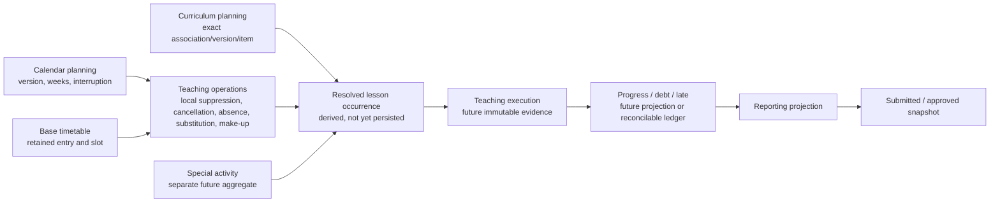

# LOCAL-FC-05C0 — Operational Overlays Architecture Audit

## 1. Status and scope

**Status:** Requirements and architecture audit only. **NOT READY FOR IMPLEMENTATION** until the decision register in section 28 is closed by a later `LOCAL-FC-05C0D` decision task.

**Baseline:** `5e313e91e8b64b63ed352da603292f7b9d0133ce` on `feat/local-fc-05c0-operational-overlays-architecture-audit`.

This audit covers `CalendarException`, authorized cancellation, teacher absence without replacement, same-subject substitution, different-subject supervision, make-up, move/swap candidates, their provenance, correction, conflict, collision, authorization, concurrency and downstream boundaries. It does not implement any domain, schema, migration, API, contract, seed, test or UI.

Classification is exact:

- **CONFIRMED** — explicitly stated by an authoritative source or enforced by an Accepted ADR/current canonical implementation.
- **INFERRED** — the narrowest safe architecture conclusion consistent with the sources, still requiring product-owner approval.
- **UNRESOLVED** — no single safe answer is established. Implementation is unsafe because choosing an answer would create business meaning, authority, history or precedence without approval.

`LOCAL-FC-05B1` remains the bounded `NORMAL_BASE_PPCT_V1` read profile. This audit does not broaden its meaning or modify its contracts.

## 2. Source authority and audit method

Sources were read in repository authority order:

1. `PA-B-VPS-PostgreSQL-v1.3-IMPLEMENTATION-ADDENDUM.md`.
2. `PA-B-VPS-PostgreSQL-v1.2-AI-governance.docx`, extracted read-only in document order, including all paragraphs and 67 tables. Relevant direct evidence is concentrated in sections 2, 5–9, 11–12, 14, 16, 18 and Appendices A–D.
3. Accepted ADR-003, ADR-008, ADR-010, ADR-011, ADR-012, ADR-013, ADR-016, ADR-017, ADR-018, ADR-019, ADR-020, ADR-027, ADR-028, ADR-029 and ADR-030.
4. `LOCAL-FC-04-TIMETABLE-DOMAIN-SPEC.md`, `LOCAL-FC-05A0-PPCT-TEACHING-EXECUTION-REPORTING-ARCHITECTURE-AUDIT.md`, `LOCAL-FC-05A0D-PPCT-DECISION-CLOSURE.md`, `LOCAL-FC-05B0D-TIMETABLE-OPERATIONAL-READINESS-DECISION-CLOSURE.md`, `CORE-BACKEND-ROADMAP.md` and `PROJECT_CONTEXT.md`.
5. Current Prisma schema, contracts, capability seed, authorization evaluator, academic-calendar, time-slot, teaching-assignment, timetable lifecycle/readiness and PPCT association-reader implementation.
6. The prototype only after authoritative sources, and only as non-binding workflow evidence under ADR-003. Its JavaScript, role model and business logic were not used as authority.

PR #11 was not used as baseline, design input, architecture authority or implementation source.

No authoritative contradiction was found. The material gap is deliberate: ADR-010/011 deferred `CalendarException`; ADR-020 deferred overlays; ADR-027 confirms high-level outcomes while leaving overlay persistence, correction, move/swap, final precedence, detailed authority and APIs undecided.

## 3. Current canonical-domain inventory

| Domain | Current canonical evidence | Classification |
|---|---|---|
| Authorization | Explicit capability/scope evaluator; exact scope matching; default deny; `SYSTEM_ADMIN`, role/title, membership, duty, `StaffSubject` and `TeachingAssignment` do not imply another capability. | **CONFIRMED** — ADR-008 and runtime. |
| Academic calendar | `AcademicYear`, immutable `AcademicCalendarVersion`, business weeks/segments and `CalendarInterruption`; civil `DATE`; no ISO-week inference. | **CONFIRMED** — ADR-010/011 and schema/services. |
| Calendar local exception | No model, API, contract or accepted aggregate boundary. | **CONFIRMED absence**; semantics below are partly confirmed, persistence is **UNRESOLVED**. |
| Teaching responsibility | One historical `TeachingAssignment` per year + class + subject + inclusive civil date; changes split history. | **CONFIRMED** — ADR-012/013. |
| Time slots | Exact immutable weekday/wall-clock revisions, half-open intervals and `allowRegularTeaching`, `allowMakeupTeaching`, `allowSelfStudy`. | **CONFIRMED** — ADR-016/018 and implementation. |
| Base timetable | Exact retained `TimetableVersion` and `TimetableEntry`; entry pins slot, class, subject, assignment and responsible teacher. Validation/lifecycle history is immutable after progression. | **CONFIRMED** — ADR-017/019/020 and implementation. |
| PPCT | Shared versioned plan; exact item/revision/lineage; non-overlapping date-effective class association to an exact version. | **CONFIRMED** — ADR-027/028/029 and implementation. |
| Readiness | Pure `NORMAL_BASE_PPCT_V1` read model; overlays and all downstream dimensions are `NOT_ASSESSED`. | **CONFIRMED** — ADR-030 and current contract/service. |
| Operational overlays | No canonical persistence, contract, capability, API or service. | **CONFIRMED absence**. |
| Special activity, resolved occurrence, execution, debt/progress, reporting/snapshot | Not implemented. | **CONFIRMED absence**. |

## 4. Confirmed terminology

| Term | Accepted meaning |
|---|---|
| Base opportunity | A normal lesson projected for a civil date from an exact retained timetable entry and calendar evidence. **CONFIRMED concept**; the persisted `ResolvedLessonOccurrence` does not exist. |
| Calendar interruption | A long pause in academic-week progression. It is not a local exception. **CONFIRMED**. |
| Calendar exception / local suppression | A selected day/session/slot/scope suppression that does not stop the academic-week stream, consumes no PPCT and creates no debt. **CONFIRMED semantics**; aggregate owner and lifecycle are **UNRESOLVED**. |
| Authorized cancellation | An institutional/BGH decision suppressing execution, PPCT consumption and debt for a targeted opportunity. **CONFIRMED outcome**. |
| Absence without replacement | The responsible teacher is absent and nobody teaches/supervises. PPCT is distributed but not completed and a concrete debt results downstream. **CONFIRMED outcome**. |
| Same-subject substitution | A different actual teacher teaches the expected subject. PPCT is distributed and completed; workload belongs to the actual teacher; responsibility history is unchanged. **CONFIRMED outcome**. |
| Different-subject supervision | Another teacher manages the class but does not complete the expected subject. PPCT is distributed, not completed, and debt results downstream. **CONFIRMED outcome**. |
| Make-up | A later opportunity fulfilling one existing obligation/debt; no new PPCT item is consumed and fulfillment is exactly once downstream. **CONFIRMED**. |
| Move/swap | A proposed operational rearrangement of placement. Its source/target, PPCT and correction semantics remain **UNRESOLVED**. |
| Special activity | A separate aggregate with class/grade/school scope, potentially multiple teachers, occupancy and confirmation rules. It is not a normal timetable entry or substitution. **CONFIRMED boundary**. |
| Responsible teacher | Historical planning responsibility retained by `TeachingAssignment` and base entry. **CONFIRMED**. |
| Actual teacher | The person who actually teaches or supervises an operational occurrence. **CONFIRMED concept**; freeze/eligibility fields are not yet decided. |

## 5. Requirement traceability

| Audit question | Direct authority / implementation evidence | Result |
|---|---|---|
| F1 taxonomy and boundaries | v1.2 sections 6, 8–9, 11; ADR-010/027 | Covered in sections 6–12. |
| F2 target/provenance | ADR-017/020/028/029; retained schema | Covered in section 13. |
| F3 exception scope | v1.2 section 6.4; ADR-010 deferral | Covered in section 8. |
| F4 cancellation | v1.2 sections 8.3, 9.2; Appendix B | Covered in section 9. |
| F5 substitution/supervision | v1.2 sections 8.3, 9.1–9.2; ADR-012/017 | Covered in section 10. |
| F6 make-up | v1.2 sections 8.3, 9.3–9.4; ADR-016/027 | Covered in section 11. |
| F7 move/swap | ADR-027 explicit non-decision | Covered in section 12. |
| F8 lifecycle/correction | v1.2 section 2 and 5.5; ADR-027 | Covered in section 15. |
| F9 precedence | ADR-027 proposed precedence plus unclosed activity policy | Covered in section 16. |
| F10 occupancy | v1.2 section 7.5; ADR-016/017 | Covered in section 17. |
| F11 authorization | ADR-008; ADR-018; 05A0 candidate only | Covered in section 18. |
| F12 temporal semantics | ADR-010/012/016/017/020 | Covered in section 14. |
| F13 concurrency | v1.2 section 5.5/18.3; existing CAS/serializable patterns | Covered in section 19. |
| F14 audit/provenance | v1.2 sections 2, 5.5, 17; current audit architecture | Covered in section 20. |
| F15 relation to 05B1 | 05B0D and ADR-030 | Covered in section 21. |
| F16 downstream boundaries | ADR-027 and roadmap layering | Covered in section 22. |
| F17 persistence candidates | No accepted model; source candidates only | Covered in section 23. |
| F18 DB vs application invariants | Accepted schema/control-plane pattern | Covered in section 24. |
| F19 adversarial acceptance | v1.2 section 18 plus retained-history invariants | Covered in section 25. |

## 6. Aggregate and bounded-context map



**CONFIRMED:** Calendar, timetable, teaching assignment and PPCT remain upstream owners of their own history. Operational facts reference them and never rewrite them. Special activity remains separate. Resolved occurrence is a derived contract and is not invented as persistence in 05C0.

**INFERRED:** `Teaching Operations` is the narrow bounded context for cancellation, absence disposition, substitution/supervision and make-up scheduling. Whether `CalendarException` lives inside Calendar, Teaching Operations, or a separate calendar-overlay aggregate is **UNRESOLVED** (R1).

## 7. Overlay taxonomy

| Concept | Separate concept? | Candidate event type? | Classification and safe boundary |
|---|---|---|---|
| `CalendarInterruption` | Yes; existing calendar child. | No new overlay type. | **CONFIRMED**. Long pause, calendar-version owned. |
| `CalendarException` | Yes; distinct from interruption and from absence. | Candidate aggregate/event. | Semantics **CONFIRMED**; owner/lifecycle **UNRESOLVED**. |
| Authorized cancellation | Yes; different consequence from absence. | Candidate operational disposition. | Outcome **CONFIRMED**; physical type **UNRESOLVED**. |
| Absence, no replacement | Yes; cannot be a cancellation boolean. | Candidate absence/disposition event. | Outcome **CONFIRMED**; exact reason/workflow **UNRESOLVED**. |
| Same-subject substitution | Yes. | Candidate substitution assignment. | Outcome **CONFIRMED**; lifecycle/eligibility **UNRESOLVED**. |
| Different-subject supervision | Yes; not same-subject teaching. | Candidate supervision assignment. | Outcome **CONFIRMED**; workload policy is downstream/configurable. |
| Make-up | Yes; separate later opportunity linked to original obligation. | Candidate make-up schedule/event. | Core semantics **CONFIRMED**; scheduling/confirmation boundary **UNRESOLVED**. |
| Move/period swap | Must not be merged into another type without a decision. | Candidate only. | **UNRESOLVED** and hard non-scope. |
| Special activity | Yes; separate aggregate. | Not an operational teaching event subtype. | **CONFIRMED boundary**; minimum core deferred. |

A generic mutable `cancelled` flag or a single mutable “current operational state” row would erase distinctions and history and is rejected.

## 8. CalendarException findings

### 8.1 Targeting dimensions

| Dimension | Classification | Evidence / consequence |
|---|---|---|
| One civil date | **CONFIRMED** | v1.2 section 6.4 says local exception may be a day. |
| Bounded civil-date range | **INFERRED** | The proposed `calendar_exceptions` concept and general event ranges support it, but section 6.4 emphasizes local day/session/period. Multi-date local semantics need R2. |
| Full day | **CONFIRMED** | “Nghỉ một ngày” is explicit. |
| Session | **CONFIRMED** | Morning/afternoon selection is explicit. |
| Exact slot/group of slots | **CONFIRMED concept** | “Nhóm tiết” is explicit; canonical implementation should use exact `TimeSlotDefinition` identities/real intervals, not period numbers. Exact multi-slot representation is **UNRESOLVED**. |
| Class | **CONFIRMED** | Explicit in section 6.4. |
| Grade | **CONFIRMED** | Explicit `khối`. Membership-at-effect-time representation is **UNRESOLVED**. |
| School-wide | **INFERRED** | Institutional day/session cancellation is consistent with BGH examples, but section 6.4’s scope list does not explicitly name school-wide. |
| Activity/group of activities | **CONFIRMED concept** | `nhóm hoạt động` is explicit; exact future activity identity is unavailable. |

### 8.2 Ownership and retained calendar

- `CalendarException` as state embedded in a mutable current calendar row: **REJECTED**. It would either rewrite immutable calendar history or make replacement behavior ambiguous.
- Child state inside the exact immutable `AcademicCalendarVersion`: **INFERRED**, because exception semantics are calendar-like and historical interpretation needs an exact retained calendar.
- Separate bounded aggregate referencing exact `AcademicCalendarVersion`: **INFERRED and recommended narrowest option**, because exceptions need their own correction/audit lifecycle while preserving calendar identity.
- Teaching-operations aggregate referencing only `AcademicYear + date`: **UNRESOLVED and unsafe**. Calendar replacement could change whether the date/weekday/segment is meaningful, and history would rely on a current head.

The event must never use ISO-week arithmetic. Exact calendar replacement behavior is **UNRESOLVED**: the safest candidate is that an exception remains pinned to its retained calendar version and is not silently copied to a successor. Product policy must decide whether operators explicitly recreate/carry it forward (R1–R2).

## 9. Cancellation findings

### 9.1 Two distinct outcomes

| Case | PPCT distributed | PPCT completed | Debt | Classification |
|---|---:|---:|---:|---|
| Authorized institutional/BGH cancellation | No | Not applicable | No | **CONFIRMED**. |
| Responsible teacher absent, no replacement | Yes | No | Yes, concrete downstream obligation | **CONFIRMED**. |

They cannot share one generic `cancelled` flag. Doing so would make deterministic PPCT/debt projection impossible.

### 9.2 Open cancellation design questions

- Reason/type vocabulary beyond the two confirmed semantic categories: **UNRESOLVED**. Free text alone is insufficient for deterministic outcome; an invented exhaustive enum is also unsafe (R5).
- Target identity: must pin the source opportunity described in section 13. **INFERRED**.
- Who may create/confirm: **UNRESOLVED**. v1.2 mentions BGH/tổ trưởng workflow, but no accepted capability/scope mapping exists (R7–R8).
- Confirmation: **UNRESOLVED**. An institutional cancellation likely needs authoritative confirmation; an absence may begin as self-report/request, but neither workflow is accepted.
- Future versus retrospective entry and permitted correction window: **UNRESOLVED** (R6).
- Correction/reversal: physical deletion is rejected; confirmed history must be reversed/superseded. Exact statuses are **UNRESOLVED**.
- Cancellation and substitution on the same opportunity: semantically incompatible; a single active disposition should be enforced. This is **INFERRED**, not yet accepted (R15).
- Occupancy: authorized cancellation suppresses normal lesson execution/occupancy. Whether the freed time immediately becomes eligible for another normal or special event is **UNRESOLVED**; it must not be assumed.

## 10. Substitution and supervision findings

### 10.1 Confirmed semantics

- Same-subject substitution retains the responsible teacher and records a different actual teacher; PPCT is distributed and completed once; actual-teacher workload is downstream. **CONFIRMED**.
- Different-subject supervision retains the expected subject/responsible teacher; the supervisor is actual operational staff, but expected-subject PPCT is not completed and debt results downstream. **CONFIRMED**.
- Neither case mutates `TimetableEntry.teacherUserId` nor `TeachingAssignment`. **CONFIRMED**.

### 10.2 Eligibility and historical proof

| Question | Finding |
|---|---|
| Actual teacher identity | Exact retained `User.id` is required. **CONFIRMED concept**. |
| Responsible teacher | Exact base entry + assignment + stored responsible-teacher snapshot are retained. **CONFIRMED** by current timetable. |
| How “same subject” is established | **UNRESOLVED**. Recommended: compare the event’s exact expected `subjectId` with eligibility evidence valid for the substitute at the event business date, and freeze the decision inputs. |
| Substitute must own a TeachingAssignment | **NOT CONFIRMED and unsafe to require.** TeachingAssignment expresses planning responsibility, not substitute authority. |
| `StaffSubject` eligibility | Current state may validate new scheduling, but current catalog state cannot be historical authority. **INFERRED**: retain the checked subject/date/source identity or a bounded eligibility snapshot. |
| Disabled teacher later | Must not rewrite an old valid event. **CONFIRMED historical principle**. New scheduling should fail if current eligibility is invalid; exact rules remain **UNRESOLVED**. |
| Future/retroactive scheduling | Both are contemplated operationally, but allowed windows and confirmation differ. **UNRESOLVED**. |
| Collision | Must use exact wall-clock interval and all known occupancy claims. **CONFIRMED**; special-activity completeness is deferred. |
| Correction/reversal | No in-place change of confirmed actual teacher; use reversal/superseding event. **INFERRED**. |

Later master-data changes must not reclassify a historical same-subject substitution as supervision or vice versa. The retained event therefore needs exact expected subject, actual teacher and the eligibility decision provenance used at confirmation (R9).

## 11. Make-up findings

### 11.1 Confirmed core

- A make-up fulfills an existing distributed-but-uncompleted obligation/debt.
- It consumes no new PPCT position.
- Scheduling alone does not close debt; confirmed execution closes exactly once downstream.
- The make-up uses a new civil date and a canonical slot whose `allowMakeupTeaching` is true.
- It must pass real wall-clock teacher/class collision checks.

All statements above are **CONFIRMED**, except that the exact persistence link while debt is not yet implemented is addressed below.

### 11.2 Required source provenance before Debt exists

05C may not invent `TeachingDebt`. A candidate make-up source reference must therefore retain an immutable **original obligation descriptor**, classified **INFERRED**:

- original base `TimetableEntry` and exact `TimetableVersion`;
- original civil date and exact slot;
- exact calendar version governing that date;
- class, subject, responsible teacher/assignment provenance;
- exact PPCT association, version and item when the obligation has already been distributed and identified;
- original absence/supervision operational event ID;
- a stable future `originalObligationKey`/source identity that downstream debt can adopt or map without changing meaning.

If exact PPCT item identity is not yet available when scheduling is requested, implementation is unsafe: it cannot prove which obligation will be fulfilled or prevent duplicate closure. The command must remain unavailable rather than store a vague “make up class X/subject Y” row.

### 11.3 Open decisions

- Planned responsible teacher versus actual make-up teacher: both must be distinct historical facts; who may be scheduled is **UNRESOLVED**.
- Same-subject requirement: expected for completing subject content but not stated as an explicit substitute-eligibility rule for make-up; **UNRESOLVED** (R12).
- Confirmation authority and correction/reversal workflow: **UNRESOLVED**.
- Duplicate protection: unique active claim per original obligation plus idempotent confirmation is **INFERRED**; exact key/status is undecided.
- “Extra make-up with no existing debt/obligation”: **UNRESOLVED** by authority and must be rejected in 05C. It could be enrichment/new planning, but it must not consume PPCT or masquerade as make-up without a separate accepted domain decision (R13).

## 12. Move / swap findings

Full authoritative re-audit found no accepted semantics resolving whether move/swap is:

1. its own aggregate pairing source and destination;
2. cancellation plus make-up;
3. cancellation plus a replacement placement;
4. two linked displacement events for a period swap.

Each option changes PPCT distribution timing, occupancy, teacher/class collision, authorization, correction and reporting. ADR-027 explicitly leaves it undecided. Therefore move/swap is **UNRESOLVED** and a hard non-scope for implementation (R14). It must not be emulated by editing base entries or by unlinked cancellation/make-up commands.

## 13. Target identity and source provenance model

### 13.1 Minimum authoritative bundle

For an operational fact targeting a normal source opportunity, the narrowest safe candidate is **INFERRED** and includes:

| Identity | Why retained |
|---|---|
| `academicYearId` | Prevent cross-year targeting and scope drift. |
| exact `timetableVersionId` | Prevent current-head substitution after supersession. |
| exact `timetableEntryId` | Stable base coordinate and source FK. |
| original civil `DATE` | Projects the recurring row to the actual business opportunity. |
| exact `academicCalendarVersionId` | Preserves segment/weekday/interruption interpretation after calendar replacement. |
| exact `timeSlotDefinitionId` | Preserves weekday and wall-clock interval after slot revision. |
| `schoolClassId`, `subjectId` | Explicit target and authorization/collision coordinates. |
| `teachingAssignmentId`, responsible `teacherUserId` | Historical planning provenance; later assignment changes cannot rewrite it. |
| exact PPCT association/version/item, when known and semantically required | Prevent current PPCT head/binding from reinterpreting distribution, supervision or make-up. |
| source event / predecessor identity | Links absence, substitution, make-up, correction or reversal. |

The server must derive and validate this bundle from retained sources; the client must not be trusted to provide internally inconsistent IDs.

### 13.2 Is `timetableEntryId + civilDate` sufficient?

**No, not as the accepted persisted contract.** It is a useful lookup key, and the current entry transitively references version, year, slot, class, subject, assignment and teacher. However, it does not by itself prove in the event row which retained calendar interpreted the date, which PPCT association/item was bound when needed, or which source/eligibility decision was confirmed. Relying only on later joins also makes a future correction or erroneous association change harder to detect and audit.

The additional retained bundle above is **INFERRED**, not yet implementation authority. It deliberately does not create a persisted `ResolvedLessonOccurrence`. Database composite FKs should prove every coordinate that can be proven; the service transaction validates civil-date effectivity and cross-aggregate coherence (R3–R4).

## 14. Temporal semantics

- Business effect dates and bounded event ranges use PostgreSQL `DATE`, parsed as strict Gregorian `YYYY-MM-DD`. **CONFIRMED**.
- Slot boundaries use exact `TIME(0) WITHOUT TIME ZONE` and half-open `[startTime, endTime)` intervals. **CONFIRMED**.
- Creation, confirmation, reversal and audit instants use `TIMESTAMPTZ(3)`. **CONFIRMED**.
- School timezone is relevant only when mapping a civil date + wall-clock slot to an absolute operational instant or comparing cross-day external events. It does not convert stored civil dates or slot times. **CONFIRMED principle**.
- One-date events are the narrow default. Inclusive bounded date ranges are **INFERRED** for CalendarException; operational substitution/cancellation/make-up range commands are **UNRESOLVED** and should not be assumed.
- A multi-date range needs explicit inclusive/exclusive policy. Existing calendar and assignment ranges are inclusive; using inclusive `DATE` bounds is **INFERRED** for consistency (R2).
- Future-dated operational facts are contemplated by scheduling workflows; allowed lead time and confirmation/effect boundary are **UNRESOLVED**.
- Retrospective facts/corrections need creation instant distinct from business effect date and an explicit reason/predecessor. Allowed backdating window is **UNRESOLVED**.
- Superseded timetable/calendar versions remain referenced exactly; current active heads are never substituted. **CONFIRMED**.

## 15. Event lifecycle and correction model

### 15.1 Confirmed guardrails

- Historical business facts are not physically deleted or silently overwritten.
- Base timetable, TeachingAssignment, calendar and PPCT history are not edited to express operations.
- Corrections use a new version, reversal or compensating/superseding fact.
- Business history and general `AuditEvent` logging are separate.

### 15.2 Candidate lifecycle

The safest candidate is **INFERRED**, not accepted:

```text
DRAFT / PLANNED
  -> CONFIRMED / EFFECTIVE (semantic fields immutable)
  -> REVERSED or SUPERSEDED (terminal historical fact)
```

- Before confirmation/effect: exact permitted edits are **UNRESOLVED**. A replace command protected by `expectedUpdatedAt` is safer than generic PATCH.
- After confirmation/effect: semantic mutation is rejected; mistakes create a linked reversal and, if needed, a replacement event. **INFERRED**.
- Correction linkage must retain `predecessorEventId` or `reversesEventId`, actor, reason and instants. **INFERRED**.
- Whether a correction may change event type is **UNRESOLVED**. Recommended: reverse the old event and create a new independently validated type; do not morph it in place.
- Downstream projections must recompute or apply compensating facts after reversal; already submitted/approved snapshots remain unchanged and require their own correction workflow. **CONFIRMED boundary**, exact projection mechanics deferred.

Implementing before R5/R21 would be unsafe because event state, uniqueness and reversal effects determine every downstream PPCT/debt/report result.

## 16. Conflict and precedence matrix

The table evaluates every unordered pair among the required nine concepts. “Same target” means the same source opportunity or overlapping affected occupancy. `CalendarInterruption` suppression of normal opportunity and the confirmed PPCT outcomes are authoritative; final operational command coexistence and special-activity precedence are not.

| Pair | Coexistence / precedence finding | Classification |
|---|---|---|
| Base normal opportunity × CalendarInterruption | Interruption prevents an eligible normal occurrence; base history remains. | **CONFIRMED**. |
| Base × CalendarException | Exception suppresses only its selected scope; base history remains; no PPCT/debt. | **CONFIRMED**. |
| Base × authorized cancellation | Cancellation suppresses execution for the targeted opportunity; no PPCT/debt. | **CONFIRMED**. |
| Base × absence/no replacement | Base obligation remains source; distribution advances, completion does not, debt follows downstream. | **CONFIRMED**. |
| Base × same-subject substitution | Coexist as plan + overlay; actual teacher replaces execution staffing only. | **CONFIRMED**. |
| Base × different-subject supervision | Coexist as plan + overlay; expected subject remains incomplete. | **CONFIRMED**. |
| Base × make-up | Make-up is a separate later opportunity; it may not collide with base teacher/class occupancy. | Core **CONFIRMED**; exact scheduling policy **UNRESOLVED**. |
| Base × special activity | Overlapping applicable occupancy conflicts, but which wins is not accepted. | Conflict concept **CONFIRMED**; precedence **UNRESOLVED**. |
| CalendarInterruption × CalendarException | Both are distinct; an exception inside a fully interrupted date has no normal opportunity. Whether command creation is rejected or retained as redundant evidence is undecided. | **UNRESOLVED**. |
| Interruption × authorized cancellation | No base opportunity exists during interruption; same-target cancellation is redundant. Reject/no-op/retain policy is undecided. | **UNRESOLVED**. |
| Interruption × absence/no replacement | Absence must not create PPCT/debt when no opportunity exists; whether an HR-like absence record may coexist is outside this domain. | Outcome **CONFIRMED**; event coexistence **UNRESOLVED**. |
| Interruption × same-subject substitution | No normal execution opportunity to substitute. Scheduling should fail closed. | **INFERRED**. |
| Interruption × different-subject supervision | No normal expected subject opportunity to supervise. Scheduling should fail closed. | **INFERRED**. |
| Interruption × make-up | A make-up on interrupted/locked time should fail unless a separate policy explicitly permits it. | **INFERRED**, policy **UNRESOLVED**. |
| Interruption × special activity | Academic-week progression is paused, but special activities might have independent policy. | **UNRESOLVED**. |
| CalendarException × authorized cancellation | Same-target suppressors are redundant/conflicting; no source establishes winner. | **UNRESOLVED**. |
| Exception × absence/no replacement | Suppression means no expected execution/debt; recording absence as the operational disposition would contradict that result. | Outcome **INFERRED**; precedence **UNRESOLVED**. |
| Exception × same-subject substitution | A suppressed opportunity should not also be taught as substitution without reversing/superseding suppression. | **INFERRED**. |
| Exception × different-subject supervision | A suppressed opportunity should not also create supervision/debt. | **INFERRED**. |
| Exception × make-up | Exception/locked scope may block make-up occupancy; exact activity-specific scope resolution is undecided. | **UNRESOLVED**. |
| Exception × special activity | An activity-scoped exception may suppress activity; a lesson-scoped exception may not. Exact matching and precedence await Special Activity core. | **UNRESOLVED**. |
| Authorized cancellation × absence/no replacement | Mutually exclusive outcome for one opportunity: no distribution/debt versus distribution/debt. | Distinction **CONFIRMED**; rejection mechanism **INFERRED**. |
| Cancellation × same-subject substitution | Cannot both be effective for one opportunity. | **INFERRED**. |
| Cancellation × different-subject supervision | Cannot both be effective for one opportunity. | **INFERRED**. |
| Cancellation × make-up | A cancelled opportunity creates no debt and cannot be the make-up origin; unrelated existing debt may be made up elsewhere if collision-free. | **CONFIRMED**. |
| Cancellation × special activity | Cancellation may free or reserve occupancy; special-activity takeover/precedence is not accepted. | **UNRESOLVED**. |
| Absence/no replacement × same-subject substitution | “No replacement” and “substituted” are mutually exclusive dispositions for one opportunity. | **CONFIRMED by definitions**. |
| Absence/no replacement × different-subject supervision | “No replacement” and “supervised” are mutually exclusive dispositions. | **CONFIRMED by definitions**. |
| Absence/no replacement × make-up | The absence can create an obligation later fulfilled by make-up; both facts coexist through explicit source linkage. | **CONFIRMED**. |
| Absence/no replacement × special activity | Whether activity replaces the lesson or merely collides is not defined. | **UNRESOLVED**. |
| Same-subject substitution × different-subject supervision | Mutually exclusive effective dispositions for one expected subject opportunity. | **INFERRED**. |
| Same-subject substitution × make-up | Same-subject substitution completes the original, so the same obligation cannot also be made up; unrelated debt is allowed if collision-free. | **CONFIRMED outcome**. |
| Same-subject substitution × special activity | Overlapping teacher/class occupancy conflicts; winner is not defined. | Conflict **CONFIRMED**; precedence **UNRESOLVED**. |
| Different-subject supervision × make-up | Supervision creates the original incomplete obligation; later make-up may fulfill it exactly once. | **CONFIRMED**. |
| Different-subject supervision × special activity | Overlapping occupancy conflicts; winner/relationship is not defined. | **UNRESOLVED**. |
| Make-up × special activity | Teacher/class/time collision must be detected, but special-activity precedence is not defined. | Collision **CONFIRMED**; precedence **UNRESOLVED**. |

Multiple operational events at the same precedence level for one target must never resolve by creation time or last-write-wins. A uniqueness/transactional rule allowing at most one active disposition is **INFERRED** and requires R15. Special-activity precedence remains a hard deferred dimension (R11/R22).

## 17. Occupancy and collision model

Collision uses exact weekday plus retained `TimeSlotDefinition` half-open wall-clock interval. Period ordinal/label alone is forbidden.

| Resource | Required collision evidence | Classification before Special Activity core |
|---|---|---|
| Substitute/supervising teacher | Base timetable occupancy across all exact slot revisions; other active substitution/supervision; make-up schedules. | **CONFIRMED obligation**, implementable for canonical domains. |
| Supervised/substituted class | Base timetable plus other active operational placement. | **CONFIRMED obligation**, implementable for canonical domains. |
| Make-up teacher | Normal timetable, operational assignments and other make-ups; exact slot must allow make-up. | **CONFIRMED obligation**. |
| Make-up class | Normal timetable/self-study policy, operational assignments and other make-ups. | Collision **CONFIRMED**; whether self-study may be displaced is **UNRESOLVED**. |
| CalendarException/locked time | Match exact date/scope/slot or overlapping interval; suppression versus occupancy must be explicit. | Partly implementable only after exception scope model is accepted. |
| Special activity teacher/class/grade/school | Needs canonical activity occupancy and participant scope/membership. | **DEFERRED**; cannot be honestly checked now. |

Before Special Activity exists, a write command cannot claim full collision safety. Options are: (a) defer all affected writes, or (b) permit a narrowly labeled profile that explicitly excludes activity collision. Because an unsafe write could create conflicting facts, the recommended narrowest policy is fail closed for dates/scopes where complete activity occupancy cannot be established; this remains **INFERRED** (R11).

## 18. Authorization audit

### 18.1 Confirmed constraints

- `TIMETABLE_MANAGE` owns base timetable management and must not silently acquire operational-overlay mutation authority merely for implementation convenience.
- Professional authorization remains explicit capability/scope, default-deny and server-resolved. Whether operational overlays require one new dedicated capability, multiple new professional capabilities, or particular capability names and allowed scopes remains **INFERRED / UNRESOLVED** and is closed only by R7–R8 in a later 05C0D decision task.
- No authority is inferred from role/title, `SYSTEM_ADMIN`, `SubjectGroupMembership`, duty, `TeachingAssignment`, `StaffSubject` or frontend state.
- Capability resources are resolved from persisted target data server-side; arbitrary body/query scope IDs are not trusted.
- Default deny and exact scope semantics from ADR-008 apply.

### 18.2 Candidate capability and scopes

`OPERATIONAL_TEACHING_MANAGE` with `SUBJECT_GROUP` and `SCHOOL_WIDE` appeared only as a 05A0 **INFERRED** candidate. It is not accepted and must not be seeded in 05C0.

| Question | Audit finding |
|---|---|
| Distinct capability | **INFERRED and recommended**; exact key is **UNRESOLVED**. |
| `SCHOOL_WIDE` | **INFERRED** for institutional/BGH cancellation and cross-school coordination. |
| `SUBJECT` | **INFERRED** for subject-bound substitution/make-up; may align better with the persisted expected subject than group membership. |
| `SUBJECT_GROUP` | **UNRESOLVED**. No inference to `SUBJECT` exists; group membership and subject coverage are not equivalent. |
| `PERSONAL` | **UNRESOLVED** for teacher self-report/request of absence; it must not imply authority to confirm institutional outcome or assign a substitute. |
| `ACTIVITY` | Not appropriate for normal teaching overlays; future special activity authority remains separate. **INFERRED**. |
| Same capability for CalendarException and substitution/make-up | **UNRESOLVED**. Calendar-wide suppression and subject operations may require different capabilities/scopes. |
| Create versus confirm/approve | **UNRESOLVED**. Same actor permission must not be assumed. |
| Who assigns substitute | v1.2 suggests tổ trưởng/BGH, but accepted runtime authority is absent. **UNRESOLVED**. |

Implementation before R7–R8 is unsafe because it would either overgrant school-wide professional mutation or make authorized workflows impossible.

## 19. Idempotency and concurrency audit

| Safety question | Classification / requirement |
|---|---|
| Request idempotency key | **INFERRED required** for every write/retry-prone confirmation; namespace/fingerprint/retention **UNRESOLVED**. |
| Semantic uniqueness | **INFERRED required**: one active disposition per source opportunity and type/precedence policy; exact partial unique key depends on R3/R5/R15. |
| `expectedUpdatedAt` / CAS | **INFERRED required** for draft edit, confirm, reverse and supersede commands. |
| Stale source identity | **CONFIRMED fail-closed principle**: reject if entry/version/date/calendar/slot/association no longer matches the exact command expectation. |
| Concurrent cancellation and substitution | Must not both confirm. **CONFIRMED safety need**; constraint/lock design **UNRESOLVED**. |
| Two substitutes/supervisors | Must not both become active for one source opportunity. **INFERRED**. |
| Duplicate make-up | Must not schedule/confirm two active fulfillments for one obligation. **CONFIRMED exactly-once need**. |
| Correction racing confirmation | Must use state/CAS claim so only one legal transition commits. **INFERRED**. |
| Isolation | Serializable transactions are the established safe pattern for multi-row lifecycle/uniqueness commands; exact use per command is **INFERRED**. Database uniqueness remains the backstop. |
| Last write wins | **REJECTED**; no authority supports it. |

The transaction must include the business event, linked lifecycle/reversal rows, audit and any future outbox. Failed/stale commands emit no success audit.

## 20. Audit and provenance requirements

### 20.1 Minimum business-event evidence

**INFERRED minimum:** event UUID/type; lifecycle status; exact source bundle from section 13; reason code plus optional bounded note; responsible and actual teacher where applicable; predecessor/reversal/source-obligation links; request/idempotency identity; created/confirmed/reversed actor and instants; business effect date; exact slot/interval; authorization decision reference or normalized capability/scope metadata.

When a same-subject classification or substitute eligibility is confirmed, retain enough immutable evidence to explain the decision after `StaffSubject`, user status or assignment changes. When make-up is involved, retain the original absence/supervision event and exact PPCT obligation identity.

### 20.2 Business history versus AuditEvent

- The operational business event is domain truth used by occurrence/execution/progress projections.
- `AuditEvent` records who attempted/performed which command, authorization outcome, request ID and sanitized metadata.
- Audit logging cannot substitute for a missing business-event lifecycle, and the business row cannot replace authorization-denial audit.
- No grant IDs, credentials, secrets, session hashes or unbounded raw request bodies belong in audit metadata. **CONFIRMED** by current authorization/audit rules.

## 21. Relation to 05B1 readiness

- Adding future overlay persistence does **not** change `NORMAL_BASE_PPCT_V1`. **CONFIRMED** by 05B0D/ADR-030 boundaries.
- `OPERATIONAL_OVERLAYS`, `SUBSTITUTION_CANCELLATION_MAKEUP`, `LOCAL_OPERATIONAL_EXCEPTIONS`, special activity, occurrence/execution and progress/debt/reporting remain `NOT_ASSESSED` in the 05B1 response.
- A later profile is required if the product wants overlay-aware readiness. Its scope, provenance, lifecycle relation and PASS meaning require a new architecture decision.
- Overlays become inputs when resolving dated lesson occurrences; they do not retroactively alter base readiness or timetable lifecycle evidence.
- This audit makes no change to the readiness contract, endpoint, service or tests.

## 22. Downstream boundaries

| Downstream domain | May consume from overlays | Must not be persisted by 05C |
|---|---|---|
| Special Activity | Future collision/precedence and replacement evidence. | Activity lifecycle, participants, confirmation or workload. |
| ResolvedLessonOccurrence | Apply exact active overlay facts to retained base/calendar/PPCT sources. | A new authoritative occurrence table or mutable current state. |
| TeachingExecution / Báo giảng | Expected/responsible versus actual staffing and suppression/make-up source. | Execution confirmation or actual-content evidence. |
| Progress / debt / late | Project distribution/completion/debt consequences and reversal. | PPCT completion counters, mutable debt counters or debt closure state. |
| Reporting | Project dated facts with provenance. | Report totals or cached official numbers. |
| Submission / approval | Freeze exact source references/detail later. | Statement, submission, approval or lock state. |

Operational events may expose immutable source facts for future projection. They must not directly mark PPCT items completed, create mutable report totals, confirm teaching execution, or mutate statement snapshots.

## 23. Non-binding persistence candidates

Every shape below is non-binding and exists only to expose decisions. No Prisma change is authorized.

### 23.1 `CalendarException`

- **Aggregate owner:** separate calendar-overlay aggregate referencing exact `AcademicCalendarVersion` — **INFERRED**.
- **Identity/source FKs:** UUID, academic year/calendar version, inclusive date(s), optional exact slot set/session, typed class/grade/school/activity scope — scope representation **UNRESOLVED**.
- **Lifecycle:** draft/confirmed/reversed with predecessor linkage — **INFERRED**.
- **Constraints:** source/calendar scope FKs and non-empty target; overlapping exception behavior **UNRESOLVED**.
- **ON DELETE:** `RESTRICT` for historical parents — **CONFIRMED pattern**.
- **Intentionally absent:** PPCT counters, debt, timetable mutation, current-head lookup.

### 23.2 `OperationalTeachingEvent`

- **Aggregate owner:** Teaching Operations — **INFERRED**.
- **Possible types:** authorized cancellation, absence/no replacement and perhaps typed disposition envelope. A single “God event” for substitution, make-up, activity and all corrections is **REJECTED**.
- **Identity/source FKs:** section 13 source opportunity plus lifecycle/reversal/reason — **INFERRED**.
- **Risk:** type-specific nullable fields can weaken invariants; whether cancellation and absence share one table is **UNRESOLVED**.
- **Intentionally absent:** PPCT completion/debt/report fields and mutable `currentOutcome` overwrite.

### 23.3 `SubstitutionAssignment`

- **Owner:** Teaching Operations — **INFERRED**.
- **Fields:** source event/opportunity, actual teacher, classification `SAME_SUBJECT` versus `DIFFERENT_SUBJECT_SUPERVISION`, retained eligibility evidence, lifecycle/correction links — classification semantics **CONFIRMED**, shape **INFERRED**.
- **Constraints:** one active assignment/disposition per target; teacher FK `RESTRICT`; exact uniqueness **UNRESOLVED**.
- **Intentionally absent:** TeachingAssignment mutation, PPCT counters and workload totals.

### 23.4 `MakeupTeachingEvent`

- **Owner:** Teaching Operations for scheduling; downstream Execution/Debt owns fulfillment — **INFERRED boundary**.
- **Fields:** exact original obligation descriptor, source operational event, target civil date/slot, planned/actual teacher fields as decided, lifecycle and correction links.
- **Constraints:** `allowMakeupTeaching`, same-year/class/subject/source coherence, one active claim per original obligation, target collision — exact DB shape **UNRESOLVED**.
- **Intentionally absent:** a new PPCT sequence/item, `debtClosed=true`, completion counter or execution confirmation.

Separate correction/reversal linkage may be common infrastructure, but physical inheritance/polymorphism is **UNRESOLVED**. Prefer explicit type tables or tightly constrained subtype rows over one nullable all-purpose ledger unless R3 proves a safe common aggregate.

## 24. Database versus application invariants

| Invariant | Enforcement boundary |
|---|---|
| Exact parent/source identities, same-year composite coordinates | **DATABASE-ENFORCEABLE:** FK/composite FK, `ON DELETE RESTRICT`. |
| UUID identity and predecessor/reversal references | **DATABASE-ENFORCEABLE:** PK/FK plus checks preventing self-link where possible. |
| Valid local lifecycle row shape and actor/timestamp pairs | **DATABASE-ENFORCEABLE:** `CHECK`. |
| One active subtype/disposition for an exact target, after R15 | **DATABASE-ENFORCEABLE:** partial `UNIQUE` where one table/key can express it; otherwise transactional. |
| Non-overlapping effective date ranges for an accepted scope | **DATABASE-ENFORCEABLE:** GiST exclusion when coordinates reside in one row. |
| One active make-up claim/confirmed fulfillment per original key | **DATABASE-ENFORCEABLE:** partial `UNIQUE`, subject to downstream ownership decision. |
| Exact target resolution and date within retained timetable/calendar | **APPLICATION/TRANSACTIONAL**. |
| Substitute eligibility and same-subject proof | **APPLICATION/TRANSACTIONAL**. |
| Authorization and server-resolved scope | **APPLICATION/TRANSACTIONAL**. |
| Cross-table real-time collision | **APPLICATION/TRANSACTIONAL**, with locks/CAS; a normal FK cannot compare joined time ranges. |
| Special-activity collision | **APPLICATION/TRANSACTIONAL and DEFERRED** until activity core exists. |
| Workflow transition, stale token and predecessor legality | **APPLICATION/TRANSACTIONAL**, backed by conditional update/unique constraints. |
| Request idempotency/fingerprint/replay | **APPLICATION/TRANSACTIONAL** plus unique request key. |
| Correction effects on projections/snapshots | **APPLICATION/TRANSACTIONAL / downstream recomputation**. |

No trigger is justified. If a future invariant cannot be safely represented otherwise, a trigger proposal requires a separate demonstrated decision; it is not authorized here.

## 25. Acceptance and adversarial matrix

| Case | Required future result |
|---|---|
| Retained historical timetable target | Resolve exact version/entry/slot; never current head. |
| Timetable superseded after event creation | Event meaning remains unchanged. |
| Retained/inactive old calendar | Exact retained calendar remains interpretable. |
| Current calendar replacement | Does not copy/rebind old event silently. |
| Teacher later disabled | Historical actual/responsible identity remains; new scheduling follows current eligibility policy. |
| TeachingAssignment later changed | Event and base responsible teacher do not drift. |
| Duplicate substitution request replay | Return/replay one semantic result; no duplicate active assignment. |
| Conflicting substitutes | One commits; other receives controlled conflict. |
| Cancellation + substitution race | Cannot both confirm; no last-write-wins. |
| Authorized cancellation vs absence/no replacement | Preserve distinct PPCT/debt outcomes. |
| Make-up slot not allowed | Reject using exact slot flag. |
| Duplicate make-up | Prevent duplicate active claim and exactly-once fulfillment. |
| Make-up without original obligation | Reject pending R13; do not consume new PPCT. |
| Wrong class/subject/year | Reject composite scope/source mismatch. |
| Current-head substitution for retained identity | Reject; require exact historical source. |
| Concurrent create/correct/reverse | CAS/state transition permits only one legal outcome. |
| Stale CAS | Controlled conflict, no partial business/audit success. |
| Request replay with different fingerprint | Conflict; never silently bind to prior result. |
| Wrong capability or wrong scope | Generic 403 plus sanitized denial audit. |
| No grant | Deny. |
| `SYSTEM_ADMIN` only | Deny professional mutation. |
| Role/title/group/duty/assignment/StaffSubject only | Deny authority inference. |
| Historical correction/reversal | Retain predecessor; recompute future projections; do not mutate locked snapshots. |
| Deterministic downstream resolution | Same retained source snapshot and event set yields the same semantic occurrence. |
| Multiple same-precedence events | Reject/flag invariant error; never select newest silently. |
| Special activity unavailable | Do not claim complete collision or precedence coverage. |
| No mutation of base timetable | Diff and DB behavior preserve entries/versions. |
| No premature debt/progress/report persistence | No counters, closure flags, report totals or statement state on overlay rows. |

## 26. Explicit forbidden couplings

1. Editing/deleting `TimetableEntry` to represent cancellation, substitution, make-up or move/swap.
2. Editing/splitting `TeachingAssignment` to represent an actual substitute.
3. Resolving historical events through current timetable, calendar or PPCT heads.
4. Storing PPCT distributed/completed/debt counters on operational-event rows.
5. Treating authorized cancellation and absence/no replacement as one outcome.
6. Consuming a new PPCT item for make-up.
7. Deriving professional authority from role/title, `SYSTEM_ADMIN`, membership, duty, `TeachingAssignment` or `StaffSubject`.
8. Inferring special-activity precedence before its architecture exists.
9. Implementing move/swap without an accepted decision.
10. Treating 05B1 PASS as full operational readiness or altering its contract.
11. Using prototype JavaScript/business logic as authority.
12. Creating one mutable current operational-state row that erases history.
13. Persisting `ResolvedLessonOccurrence` merely to supply an overlay target.
14. Closing debt, confirming execution or updating reports directly from an overlay command.

## 27. Explicit non-scope

- Prisma/schema/migration/seed/capability/API/contract/service/test/UI changes.
- PPCT import, capacity, progress/completion or debt persistence.
- Special Activity minimum core and its precedence.
- Resolved occurrence persistence/materialization.
- TeachingExecution/Báo giảng confirmation and actual-content policy.
- Reporting, statement snapshot, submission, approval or lock.
- Move/swap implementation.
- Room scheduling, attendance/leave/HR records or trip-duty conversion.
- Production access, migration, deployment or remote Git operations.

## 28. Decision register

Every item below requires explicit product-owner/architecture closure before the affected implementation. Recommendations are narrow options, not accepted requirements.

### R1 — CalendarException aggregate ownership

- **Question:** Calendar child, Teaching Operations state, or separate aggregate referencing a retained calendar?
- **Current classification:** **UNRESOLVED**.
- **Evidence:** v1.2 makes it calendar-like; ADR-010/011 explicitly defer it; immutable calendar versions cannot be rewritten.
- **Options:** child of a new calendar version; separate calendar-overlay aggregate; teaching-operation event.
- **Recommendation:** separate aggregate referencing exact `AcademicCalendarVersion`.
- **If unresolved:** replacement/correction can reinterpret history; implementation unsafe.

### R2 — Exception scope and range contract

- **Question:** Exact supported date/range, day/session/slot, class/grade/school/activity scopes and range inclusivity?
- **Current classification:** Confirmed individual dimensions plus **UNRESOLVED** physical/combined contract.
- **Evidence:** v1.2 section 6.4; ADR-016 exact slots.
- **Options:** single-date only; inclusive bounded range; typed scope rows versus polymorphic target.
- **Recommendation:** strict civil date, inclusive optional range only if approved, exact slot IDs, typed scope claims.
- **If unresolved:** overbroad suppression and ambiguous membership/collision.

### R3 — Operational aggregate topology

- **Question:** Which facts share an aggregate/table and which need subtype entities?
- **Current classification:** **UNRESOLVED**.
- **Evidence:** Outcomes are distinct; v1.2 candidate `change_ledger` is non-binding; ADR-027 rejects upstream rewrite.
- **Options:** constrained envelope + subtypes; separate cancellation/absence/substitution/make-up aggregates; generic ledger.
- **Recommendation:** common provenance envelope only if subtype invariants remain database-enforceable; no God event.
- **If unresolved:** nullable fields weaken invariants and corrections.

### R4 — Frozen target/provenance bundle

- **Question:** Which transitive source IDs must also be stored directly, including calendar and PPCT identities?
- **Current classification:** **INFERRED** candidate, approval required.
- **Evidence:** ADR-017/020/029 historical exactness; `entryId + date` does not expose all confirmed decision inputs.
- **Options:** minimal lookup pair; full exact ID bundle; canonical immutable source manifest.
- **Recommendation:** exact ID bundle validated server-side, without persisted occurrence.
- **If unresolved:** current-head drift and weak audit/reversal proof.

### R5 — Lifecycle, reason vocabulary and correction

- **Question:** Draft/planned/confirmed/effective/reversed states, reason codes, editable fields and reversal/supersession rules?
- **Current classification:** no-delete guardrail **CONFIRMED**; exact model **UNRESOLVED**.
- **Evidence:** v1.2 history/reversal principle and ADR-027.
- **Options:** mutable draft then immutable confirm; append-only event + reversal; versioned aggregate.
- **Recommendation:** mutable draft with CAS, immutable confirmed event, explicit reversal/superseding replacement.
- **If unresolved:** downstream projections cannot define truth under correction.

### R6 — Future/retrospective entry and confirmation boundary

- **Question:** Who may backdate, lead-time/backdate windows, and when a scheduled fact becomes effective?
- **Current classification:** **UNRESOLVED**.
- **Evidence:** v1.2 supports scheduling and confirmation but provides no windows.
- **Options:** future-only planning; bounded retrospective correction; separate occurrence and confirmation instants.
- **Recommendation:** explicit business date plus create/confirm instants and reason; no unbounded backdating.
- **If unresolved:** audit, collision and report periods can be changed silently.

### R7 — Capability keys and allowed scopes

- **Question:** Separate exception/operation capabilities; `SUBJECT`, `SUBJECT_GROUP`, `PERSONAL`, `SCHOOL_WIDE` scope matrix?
- **Current classification:** **UNRESOLVED**; distinct professional capability **INFERRED**.
- **Evidence:** ADR-008; `TIMETABLE_MANAGE` boundary; 05A0 proposal was not accepted.
- **Options:** one operational key; separate calendar-exception and teaching-operation keys; subject versus group scope.
- **Recommendation:** separate professional keys if resource owners differ; subject/school scopes where persisted targets prove them.
- **If unresolved:** overgrant or unusable workflow.

### R8 — Create, request, assign and confirm authority

- **Question:** May teachers self-report absence; who assigns substitutes; must confirmation authority differ?
- **Current classification:** **UNRESOLVED**.
- **Evidence:** v1.2 conceptual tổ trưởng/BGH workflow, no accepted capability mapping.
- **Options:** personal request + professional confirm; manager create/confirm; separation of duties.
- **Recommendation:** separate request from authoritative disposition; do not infer self-confirmation.
- **If unresolved:** unauthorized cancellation/debt/workload outcomes.

### R9 — Substitute eligibility and same-subject proof

- **Question:** What valid-at-date evidence establishes eligibility and freezes “same subject”?
- **Current classification:** **UNRESOLVED**.
- **Evidence:** current `StaffSubject` authoring checks; history must not use current catalog state; TeachingAssignment is not substitute authority.
- **Options:** valid `StaffSubject` snapshot/reference; separate eligibility decision; manager override with reason.
- **Recommendation:** exact expected subject plus retained eligibility decision inputs at confirmation.
- **If unresolved:** history changes classification after master-data edits.

### R10 — Cancellation/substitution coexistence and occupancy release

- **Question:** Reject, reverse or supersede conflicting dispositions; does cancellation free occupancy for another event?
- **Current classification:** **UNRESOLVED**.
- **Evidence:** outcomes conflict; source does not define reuse of freed time.
- **Options:** hard mutual exclusion; precedence; explicit replacement linkage.
- **Recommendation:** one active disposition; explicit reversal before replacement; no implicit occupancy reuse.
- **If unresolved:** double execution and inconsistent PPCT/debt.

### R11 — Incomplete collision coverage before Special Activity

- **Question:** Can any overlay write proceed while special-activity occupancy is unavailable?
- **Current classification:** **UNRESOLVED**.
- **Evidence:** v1.2 requires activity collision; current domain lacks activity persistence.
- **Options:** defer writes; fail closed in affected windows; bounded partial validation label.
- **Recommendation:** defer or fail closed, never claim complete collision.
- **If unresolved:** accepted events may already conflict with later canonical activity facts.

### R12 — Make-up teacher and subject eligibility

- **Question:** Must actual make-up teacher be the responsible teacher or same-subject eligible; who confirms?
- **Current classification:** **UNRESOLVED**.
- **Evidence:** make-up fulfills subject obligation; no explicit teacher rule.
- **Options:** responsible only; any same-subject eligible teacher; authorized exception.
- **Recommendation:** same-subject eligibility with retained proof; keep responsible and actual identities separate.
- **If unresolved:** cannot prove completion of expected content/workload.

### R13 — Extra make-up without existing obligation

- **Question:** Invalid, enrichment, or new planned opportunity?
- **Current classification:** **UNRESOLVED**.
- **Evidence:** ADR-027 explicitly leaves it undecided; confirmed make-up consumes no new item.
- **Options:** reject; separate enrichment domain; separately planned PPCT-consuming occurrence.
- **Recommendation:** reject from make-up; architecture re-entry for enrichment/new obligation.
- **If unresolved:** accidental new PPCT consumption and false debt closure.

### R14 — Move/swap semantics

- **Question:** Own aggregate, cancellation+make-up, replacement placement, or paired swap?
- **Current classification:** **UNRESOLVED**.
- **Evidence:** ADR-027 explicit non-decision.
- **Options:** the four listed in section 12.
- **Recommendation:** hard non-scope until real workflow/source evidence exists.
- **If unresolved:** implementation changes PPCT timing and collision without authority.

### R15 — Precedence and multiple active dispositions

- **Question:** Final same-target precedence, coexistence and uniqueness key?
- **Current classification:** confirmed partial outcomes; overall **UNRESOLVED**.
- **Evidence:** ADR-027 provides only proposed ordering and rejects last-created winner.
- **Options:** mutual exclusion state machine; explicit priority; linked supersession.
- **Recommendation:** one active disposition per source opportunity, explicit supersession, invariant error on ambiguity.
- **If unresolved:** deterministic occurrence resolution is impossible.

### R16 — CalendarException versus authorized cancellation boundary

- **Question:** When is an institutional suppression a calendar exception versus an opportunity cancellation?
- **Current classification:** **UNRESOLVED**.
- **Evidence:** both suppress with no PPCT/debt; sources name both but do not define ownership boundary.
- **Options:** scope-based distinction; advance calendar policy versus occurrence-specific decision; one canonical concept.
- **Recommendation:** calendar exception for date/scope policy, cancellation for exact source opportunity, with mutual-exclusion rules.
- **If unresolved:** duplicate suppressors and inconsistent authority.

### R17 — Command idempotency, CAS and isolation

- **Question:** Request-key namespace/fingerprint, semantic keys, CAS fields and transaction isolation per command?
- **Current classification:** safety need **CONFIRMED/INFERRED**; exact contract **UNRESOLVED**.
- **Evidence:** v1.2 idempotency/concurrency and current serializable/CAS patterns.
- **Options:** reusable platform command receipt; domain request table; aggregate tokens plus partial unique constraints.
- **Recommendation:** request key + fingerprint, CAS, serializable state transitions and DB backstops.
- **If unresolved:** retries/races create duplicate or contradictory facts.

### R18 — Minimum authorization-decision provenance

- **Question:** Store only normalized capability/scope in audit or also an immutable decision reference/snapshot on business event?
- **Current classification:** **UNRESOLVED**.
- **Evidence:** ADR-008 audit minimizes sensitive metadata; business history needs explainability.
- **Options:** audit-only link; sanitized snapshot; decision UUID.
- **Recommendation:** sanitized audit decision ID/reference, not grant internals.
- **If unresolved:** weak proof of professional authority or privacy overcollection.

### R19 — Physical persistence decomposition

- **Question:** Separate tables versus constrained envelope/subtypes and shared reversal infrastructure?
- **Current classification:** **UNRESOLVED**.
- **Evidence:** candidate shapes in section 23; no accepted schema.
- **Options:** fully separate; envelope + subtype; ledger with strong checks.
- **Recommendation:** choose only after R1–R17, prioritizing enforceable invariants.
- **If unresolved:** schema would prematurely freeze undecided semantics.

### R20 — Range-event semantics

- **Question:** Which event types may span dates/slots and how partial reversal works?
- **Current classification:** **UNRESOLVED**.
- **Evidence:** calendar ranges exist upstream; operational examples are mostly opportunity-specific.
- **Options:** expand to atomic per-opportunity facts; range aggregate with derived claims; single-date only.
- **Recommendation:** atomic source-opportunity facts for teaching dispositions; bounded range only for accepted calendar policy.
- **If unresolved:** partial collision/correction cannot be deterministic.

### R21 — Downstream reversal effects

- **Question:** Recompute projections, append compensating fulfillment/debt facts, and handle already submitted snapshots how?
- **Current classification:** boundary **CONFIRMED**, mechanics **UNRESOLVED**.
- **Evidence:** ADR-027 progress is reproducible; statements are immutable.
- **Options:** pure recomputation; reconciled ledger; compensating projection events.
- **Recommendation:** source reversal plus deterministic recomputation/reconciliation; never mutate locked snapshots.
- **If unresolved:** corrections can double count or rewrite official history.

### R22 — Special-activity precedence re-entry

- **Question:** Which activity scopes occupy/suppress normal lessons and how confirmed activity interacts with operations?
- **Current classification:** **UNRESOLVED** and deferred.
- **Evidence:** v1.2 section 11; ADR-017/027 separate aggregate and explicit open precedence.
- **Options:** activity priority; explicit replacement; conflict requiring operator resolution.
- **Recommendation:** decide only with Special Activity minimum core and participant-scope evidence.
- **If unresolved:** no full occurrence or collision resolver may be implemented.
