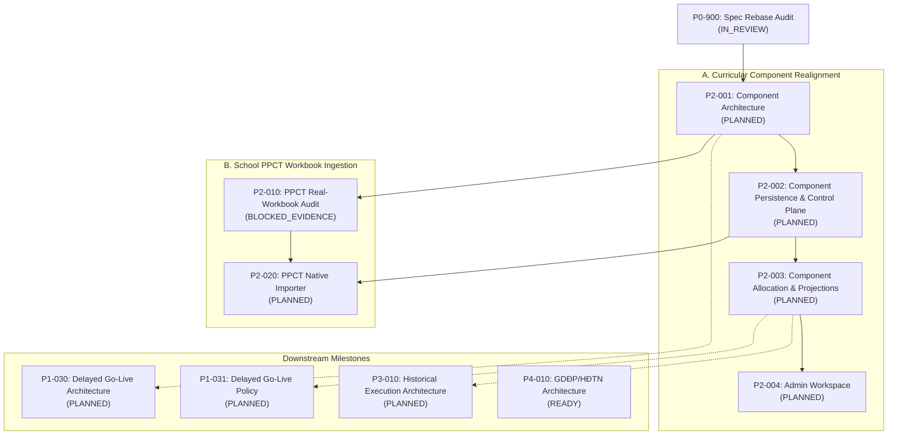

# P0-900 — Authoritative Specification Rebase Audit: PPCT Curricular Component Product-Authority Realignment

## 1. Status and Task Identity

- **Task ID:** `P0-900`
- **Task Name:** Authoritative specification rebase audit: PPCT curricular component product-authority realignment
- **Task Status on Branch:** `IN_REVIEW`
- **Assigned Tool:** ANTIGRAVITY IDE
- **Repository:** `hvtnguyenson-code/baogiang-damsan`
- **Dedicated Branch:** `docs/p0-900-ppct-curricular-component-rebase`
- **Scope:** Major documentation, governance, and architecture-rebase audit only. Zero runtime, schema, migration, API, contract, UI, or deployment changes.

## 2. Exact Trigger and Date

- **Trigger Date:** 2026-09-08
- **Trigger Cause:** Explicit Product Owner authority recorded on 2026-09-08.
- **Trigger Nature:** P0-900 was originally registered in `PRE-PILOT-TASK-REGISTER.md` as `DEFERRED_WITH_TRIGGER` under Traceability Row `T42`. The re-entry trigger has fired because explicit Product Owner directions received on 2026-09-08 directly contradict the previously accepted assumption that a class-subject PPCT stream consists of a single, undifferentiated progression.

## 3. Exact Starting Main

- **Authoritative Expected Starting Canonical `origin/main` SHA:** `bdcfecbc92d9f129247ec40c7128bc6adc6ef8cf`
- **Local Branch Head at Task Start:** `bdcfecbc92d9f129247ec40c7128bc6adc6ef8cf`
- **Initial Divergence:** `0 0` (clean branch directly from reviewed canonical `origin/main`).

## 4. Source Fingerprint Verification

The repository authoritative specification blobs were verified directly against current `origin/main` at task start:

| Specification Document | Pinned P0 Git Blob Hash | Observed `origin/main` Blob Hash | Verification Status |
|---|---|---|---|
| `docs/specifications/PA-B-VPS-PostgreSQL-v1.2-AI-governance.docx` | `c2c61a4e8acb9fde0e5fc5232467662048fd3380` | `c2c61a4e8acb9fde0e5fc5232467662048fd3380` | **MATCH / UNCHANGED** |
| `docs/specifications/PA-B-VPS-PostgreSQL-v1.3-IMPLEMENTATION-ADDENDUM.md` | `5876af5920d12ea6fcecf42d1b8a392cc4825f16` | `5876af5920d12ea6fcecf42d1b8a392cc4825f16` | **MATCH / UNCHANGED** |

### Confirmation of Trigger Source
Both authoritative source blobs remain completely unchanged. Task `P0-900` fired **ONLY** because of new explicit Product Owner authority recorded on 2026-09-08.

As established by `PRE-PILOT-PRODUCT-BASELINE.md` §2.1, because the authoritative specification fingerprints are unchanged, no new binary OOXML extraction or re-interpretation of the v1.2 DOCX is required or authorized. The reviewed canonical direct-source audits (including `LOCAL-FC-05A0-PPCT-TEACHING-EXECUTION-REPORTING-ARCHITECTURE-AUDIT.md`) remain valid historical source evidence for the v1.2 baseline.

## 5. Source-Priority Rule

All future architecture, governance, and implementation tasks must read authorities in the strict order established by `ADR-044` and `PRE-PILOT-PRODUCT-BASELINE.md`:

1. `PA-B-VPS-PostgreSQL-v1.3-IMPLEMENTATION-ADDENDUM.md` for environment, hosting, and delivery constraints;
2. `PRE-PILOT-PRODUCT-BASELINE.md`, `PRE-PILOT-TRACEABILITY-MATRIX.md`, and this `P0-900` audit for authoritative product semantics;
3. Accepted ADRs that are not marked for re-entry or supersession;
4. `PA-B-VPS-PostgreSQL-v1.2-AI-governance.docx` and reviewed source audits;
5. Current implementation as evidence of what exists, never as proof of product completeness;
6. Prototype material for visual reference only.

## 6. Authoritative Product Owner Decisions (2026-09-08)

The following clauses constitute **NEW PRODUCT AUTHORITY** dated 2026-09-08:

### A. Curricular Components
A normal curricular Subject curriculum may contain two distinct components:
1. `CORE` (Kiến thức cốt lõi / cơ bản);
2. `SPECIALIZED_STUDY` (Chuyên đề học tập của chính môn học đó).

`SPECIALIZED_STUDY` represents the specialized study module of the subject itself (e.g., Chuyên đề học tập môn Toán, Ngữ văn, Lịch sử, Địa lí).
It is **NOT**:
- Another distinct `Subject` entity in the catalog;
- A `SpecialActivity` (Hoạt động đặc biệt);
- Giáo dục địa phương (`GDĐP`);
- Hoạt động trải nghiệm, hướng nghiệp (`HĐTN-HN`);
- An arbitrary free-text lesson type.

### B. Teaching Responsibility
For any given class and subject (`SchoolClass + Subject`), the assigned teacher is responsible for teaching **both** `CORE` and `SPECIALIZED_STUDY`.
Therefore, the existing `TeachingAssignment` domain model remains strictly class-subject-teacher based (`AcademicYear + SchoolClass + Subject + User`).
No requirement for component-specific teacher assignment is introduced. `TeachingAssignment` remains entirely free of curricular component attributes.

### C. Timetable Boundary
`SPECIALIZED_STUDY` is **not** permanently bound to any fixed physical timetable slot in the weekly schedule.
The native timetable (TKB) assigns periods to the general class-subject stream (e.g., "Toán").
Therefore:
- `TimetableEntry` must **NOT** carry any curricular component field or label;
- The native TKB workbook parser, canonical import pipeline, and semantic checksum contracts remain strictly component-free.

### D. Class-Subject Applicability
Different classes may enable specialized study for different subjects based on their academic orientation/track.
For example:
- Class 10A1 may enable specialized study for Toán, Ngữ văn, and Tiếng Anh;
- Class 10A2 may enable specialized study for Toán, Vật lí, and Hóa học;
- Another class may have no specialized study enabled for certain subjects.

**Invariants:**
- Applicability is authoritative business data configured and managed by an authorized business administrator.
- Applicability must **NEVER** be inferred from timetable period counts, subject code spelling, assigned teacher, `lessonType`, class name, or heuristics.
- `CORE` is universally applicable to all ordinary curricular class-subject streams.
- `SPECIALIZED_STUDY` is applicable **only** where explicitly enabled by authoritative configuration.
- For a class-subject stream where specialized study is not enabled, specialized PPCT items are `NOT_APPLICABLE` (they are not skipped, not missing, not late, and never generate progress debt).

### E. Weekly Routing Rule
For every class-subject stream where `SPECIALIZED_STUDY` is explicitly enabled:
- Within each `AcademicWeek`, exactly **ONE** normal timetable opportunity of that subject is designated as the specialized opportunity: **the chronologically LAST canonical timetable opportunity for that class-subject in that AcademicWeek**.
- All earlier normal timetable opportunities of that same class-subject in that AcademicWeek are designated as `CORE`.

**Planning vs. Operational Invariant:**
- This is a deterministic planning classification.
- Operational outcomes and disruptions must **NOT** dynamically reclassify or shift the planned component type of an opportunity.
- Examples of non-reclassifying operational outcomes include:
  - Calendar interruptions / holidays;
  - Local `CalendarException` instances;
  - Authorized cancellations (`AUTHORIZED_CANCELLATION`);
  - `SpecialActivity` suppressions;
  - Teacher absences (`ABSENCE_NO_REPLACEMENT`);
  - Substitutions (`SAME_SUBJECT_SUBSTITUTION` / `DIFFERENT_SUBJECT_SUPERVISION`).
- If the planned chronologically last opportunity in a week is suppressed, cancelled, or not taught, it remains the specialized opportunity for classification purposes. An earlier `CORE` opportunity must **NEVER** be promoted to specialized merely because the specialized opportunity was suppressed or cancelled.
- Exact capacity, boundary, and edge-case behavior for atypical weeks (e.g., weeks with zero or one opportunity, holiday truncations, mid-week timetable version cutovers) is an architectural problem assigned to `P2-001` and must not be guessed prematurely.

### F. Independent Progression
`CORE` and `SPECIALIZED_STUDY` maintain completely independent PPCT progression cursors and coverage universes within the class-subject stream:
- An omitted, cancelled, or non-consuming `CORE` opportunity does not advance or affect the `SPECIALIZED_STUDY` cursor;
- An omitted, cancelled, or non-consuming specialized opportunity does not cause the next `CORE` opportunity to consume a specialized PPCT item;
- A make-up teaching session continues to fulfill the exact historical original obligation that was missed and consumes no new PPCT item, retaining the component identity of that original obligation.

### G. Reporting Aggregation
- Normal curricular reporting and statistics remain aggregated at the `SchoolClass + Subject` and `Teacher` level;
- `CORE` and `SPECIALIZED_STUDY` taught period counts are combined together in ordinary curricular reporting totals;
- No separate official high-level aggregate report is required for the two components in pre-pilot v1;
- However, item-level execution detail, provenance, and audit logs must retain sufficient fidelity to unambiguously distinguish whether an executed or allocated lesson was `CORE` or `SPECIALIZED_STUDY`;
- `GDĐP` and `HĐTN-HN` remain entirely separate programme/activity reporting domains.

### H. PPCT Source Direction
- Preferred future school PPCT source direction: a single Excel workbook representing one subject/grade PPCT package containing:
  - One `CORE` PPCT sheet;
  - One `Chuyên đề học tập` (`SPECIALIZED_STUDY`) sheet.
- A two-file ingestion source is recognized as operationally possible but is **not** the preferred school pattern for v1.
- **IMPORTANT:** This is source-direction guidance only, **NOT** an approved exact workbook parsing contract.
- Task `P2-010` remains `BLOCKED_EVIDENCE` until the actual authoritative school PPCT workbook/template is supplied and audited.
- No agent may invent sheet spellings, column structures, header offsets, merged-cell rules, formulas, aliases, checksums, or error codes prior to P2-010 evidence closure.

## 7. Current Schema and Runtime Evidence

Direct inspection of current repository code reveals the exact technical reality of the starting baseline:

### Schema (`prisma/schema.prisma`)
- `PpctPlan`: Keyed by `(academicYearId, subjectId, grade)`. Represents a single shared master curriculum for the entire grade.
- `PpctVersion`: Lifecycle states `DRAFT`, `PUBLISHED`, `SUPERSEDED`. Partial unique index ensures at most one `PUBLISHED` head per plan.
- `PpctItem`: Immutable UUID for a curricular obligation. Does not have a `component` field.
- `PpctItemRevision`: Carries `title`, `lessonType`, and `sequence`. Has unique constraint `@@unique([versionId, sequence])` and `@@unique([versionId, itemId])`. Sequence is currently assumed to be an integer unique across the entire version.
- `PpctClassAssociation`: Binds `(academicYearId, classId, subjectId)` to an exact `PpctVersion` over an inclusive civil date range via a GiST exclusion constraint. Does **not** record whether specialized study is enabled for that class-subject.

### Runtime Modules
- `apps/api/src/ppct/`: Enforces draft replacement, version transitions, single published head, and date-effective class associations. Assumes all items in a version form a single contiguous sequence list.
- `apps/api/src/resolved-occurrences/`: Resolves structural timetable opportunities (`RESOLVED_LESSON_OCCURRENCE_STRUCTURAL_V1`) without assigning PPCT components.
- `apps/api/src/ppct-occurrence-allocation/`: `PPCT_OCCURRENCE_ALLOCATION_V1` replays normal opportunities chronologically for an `(academicYearId, classId, subjectId)` stream. Consumes the lowest-sequence unallocated item across the entire version. Does not know about weekly grouping, last-opportunity rules, or component separation.
- `apps/api/src/teaching-executions/`: Records `CurricularTeachingExecution` pinned to an exact allocated direct obligation (`ppctRevisionId`).
- `apps/api/src/progress-debt/`: Evaluates progress, proven open debt, and unconfirmed gaps based on the single stream of direct obligations from allocation.
- `apps/api/src/reporting-projection/`: Projects aggregate teaching totals per class-subject and teacher.

## 8. Contradiction Matrix

| Dimension | Previously Accepted Baseline & ADR Assumptions | New Product Owner Authority (2026-09-08) | Contradiction Assessment |
|---|---|---|---|
| **Curricular Structure** | Each subject/grade has one single list of items with unique `sequence` per version (`ADR-027`, `ADR-028`). | A subject may consist of two independent components: `CORE` and `SPECIALIZED_STUDY`. | **CONTRADICTION:** One sequence namespace per version is insufficient if both components coexist in the same plan. |
| **Class Applicability** | Every class associated with a PPCT version consumes all items sequentially (`ADR-027`, `ADR-028`, `ADR-037`). | Only specific classes enable `SPECIALIZED_STUDY`; others take only `CORE`. | **CONTRADICTION:** Association cannot assume uniform consumption of all items by all classes. |
| **Weekly Opportunity Routing** | Every normal opportunity consumes the next lowest-sequence item in the plan (`ADR-037`). | In enabled classes, exactly the chronologically LAST normal opportunity in each week is specialized; earlier ones are CORE. | **CONTRADICTION:** Chronological stream replay without weekly grouping and component routing violates product rules. |
| **Progression Independence** | A single progression cursor and single `DISTRIBUTION_COVERED_ITEMS` universe per class-subject (`ADR-037`). | `CORE` and `SPECIALIZED_STUDY` progress independently; disruptions in one do not shift the other. | **CONTRADICTION:** Single allocation universe causes cross-component cursor contamination. |
| **Timetable Model** | Timetable entries represent generic subject teaching (`ADR-017`, `ADR-047`). | Specialized study is a routing classification of ordinary subject timetable opportunities, not a separate timetable slot. | **AGREEMENT / COMPATIBLE:** Native TKB and `TimetableEntry` remain component-free. |
| **Teacher Responsibility** | Teaching assignment is per `SchoolClass + Subject` (`ADR-012`). | The same teacher teaches both CORE and SPECIALIZED_STUDY for that class-subject. | **AGREEMENT / COMPATIBLE:** `TeachingAssignment` remains unchanged and component-free. |
| **Reporting Aggregation** | Curricular reports aggregate by class-subject and teacher (`ADR-041`). | CORE and SPECIALIZED_STUDY are combined in standard curricular totals. | **AGREEMENT / COMPATIBLE:** Ordinary reporting totals remain aggregated at class-subject level. |

## 9. Architecture Impact Classification (KEEP / RE-ENTRY Matrix)

| Document | Classification | Reopened / Re-entered Clauses | Kept / Authoritative Clauses |
|---|---|---|---|
| **ADR-027** (PPCT Architecture) | **PARTIAL RE-ENTRY** | Reopened: Assumption that a class-subject stream has a single undifferentiated PPCT progression consuming one contiguous sequence list. | **KEEP:** Shared master plan ownership (`AcademicYear + Subject + Grade`); immutable published version history; stable item UUID; execution/reporting layering; no PPCT fields on `TimetableEntry`. |
| **ADR-028** (PPCT Persistence) | **PARTIAL RE-ENTRY** | Reopened: Exactly-six-model physical topology (may need component topology extension); version-wide `sequence` uniqueness (`@@unique([versionId, sequence])`); class association lacks component applicability metadata. | **KEEP:** `PpctPlan` master identity; `PpctVersion` lifecycle; `PpctItem` stable logical UUID; revision/lineage graph principles; historical retention invariants. |
| **ADR-029** (PPCT Control Plane) | **PARTIAL RE-ENTRY** | Reopened: Draft content replacement and class association control plane require component-aware semantics and applicability validation. | **KEEP:** Authorization boundary (`PPCT_MANAGE`); lifecycle state machine (`DRAFT -> PUBLISHED -> SUPERSEDED`); CAS concurrency with `updatedAt`; immutable published history. |
| **ADR-030** (Timetable Readiness) | **PARTIAL RE-ENTRY / EXTENSION REQUIRED** | Reopened / Extended: `NORMAL_BASE_PPCT_V1` profile does not verify specialized applicability configuration or component capacity. | **KEEP:** Deterministic retained readiness pattern; exact source provenance; civil-date evaluation window; isolation from uncommitted operational changes. |
| **ADR-036** (Resolved Occurrences) | **KEEP** | None. Structural occurrence composition is component-agnostic. | **KEEP:** Composition of calendar, base timetable, overlays, and teacher responsibilities; leaving PPCT allocation as `NOT_ASSESSED`. |
| **ADR-037** (PPCT Occurrence Allocation) | **MAJOR RE-ENTRY** | Reopened: Single stream progression assuming exactly one allocation cursor per class-subject; single `DISTRIBUTION_COVERED_ITEMS` universe; lowest sequence across entire version; absence of weekly opportunity classification. | **RETAIN AS CORE-ONLY EVIDENCE:** Replay principles, transactional isolation, and non-drift rules remain conceptually valid, but physical profile cannot authorize multi-component implementation. |
| **ADR-038** (Teaching Execution) | **KEEP WITH PROVENANCE EXTENSION** | Reopened: Needs upstream direct obligation to carry component provenance into execution detail. | **KEEP:** Single `CurricularTeachingExecution` family; exact original vs. actual provenance; no separate component execution entity required. |
| **ADR-039** (Execution Persistence) | **AUDIT / EXPECT KEEP** | None anticipated unless `P2-001` proves exact schema need. | **KEEP:** Persistence topology, audit trails, and execution constraints. |
| **ADR-040** (Progress / Debt / Late) | **PARTIAL RE-ENTRY** | Reopened: Upstream direct obligations must become component-aware internally so progress, gaps, and debts are tracked against the correct component. | **KEEP:** Class-subject aggregate root; missing execution alone is not debt; proof-backed debt taxonomy (`PROVEN_OPEN_DEBT`, `UNCONFIRMED_COMPLETION_GAP`). |
| **ADR-041** (Reporting Projection) | **KEEP WITH COMPONENT DETAIL** | Minor: Detail views must expose component provenance while ordinary totals remain combined. | **KEEP:** Aggregate class-subject and teacher reporting; combined curricular totals; separation from `SpecialActivity` reporting. |
| **ADR-042 / ADR-043** (Statements) | **KEEP** | None. Statement snapshots preserve executed facts regardless of internal component composition. | **KEEP:** Immutable snapshot, approval workflow, and personal reporting projections. |
| **ADR-047** (Native TKB Architecture) | **KEEP** | None. Native TKB does not classify curricular components. | **KEEP:** Four-sheet structure, peer reconciliation, session carry-forward, and component-free `TimetableEntry`. |

## 10. Explicit Protected Boundaries

The following architectural boundaries are strictly protected and must **NOT** be modified or weakened by the component rebase:

1. **TeachingAssignment Stays Component-Free:**
   The assigned teacher teaches both `CORE` and `SPECIALIZED_STUDY` for that class-subject. Teaching responsibility remains at `(AcademicYear, SchoolClass, Subject)`. No component discriminator may be added to `TeachingAssignment`.
2. **TimetableEntry Stays Component-Free:**
   Timetable periods represent subject allocations, not specialized study allocations. No `component` or `lessonType` column may be added to `TimetableEntry`.
3. **Native TKB (P2-030 / P2-040 / P2-050) Stays Closed:**
   The native timetable ingestion pipeline, workbook adapter, peer cross-check, and session carry-forward contracts remain 100% closed, valid, and component-agnostic.
4. **SpecialActivity Remains Completely Separate:**
   `SPECIALIZED_STUDY` is ordinary curricular subject study, **NOT** a `SpecialActivity`. It must not use `SpecialActivity` models, collision rules, or coordinator workflows. GDĐP and HĐTN-HN programme architecture (P4) remains an entirely independent domain.

## 11. Migration and History Preservation Principles

1. **No Retrospective History Rewrite:**
   Existing published PPCT versions, items, revisions, and class associations already stored in the database must not have their historical semantics mutated.
2. **Default Backward Compatibility:**
   In existing historical data, all existing PPCT items and class-subject streams are treated as `CORE` by default unless explicitly re-versioned and re-associated under the new component model.
3. **Lineage Preservation:**
   Historical associations to superseded versions remain intact. Any future schema migration must guarantee that existing `PpctItemRevision` rows continue to resolve unambiguously without data loss.

## 12. New Traceability Rows

The following new rows are formally added to `PRE-PILOT-TRACEABILITY-MATRIX.md`:

### Row T45
- **ID:** `T45`
- **Requirement / Product Fact:** Normal curricular component model and class-subject applicability. A normal curricular subject may contain `CORE` and `SPECIALIZED_STUDY` components under a shared subject/grade PPCT package; the same `TeachingAssignment` covers both; applicability is explicitly configured per class-subject; for non-applicable class-subjects, specialized items are `NOT_APPLICABLE` (not debt/gap); specialized study is strictly curricular, not `SpecialActivity`.
- **Source Evidence:** Product Owner authority recorded 2026-09-08; PA-B v1.2 curricular structure.
- **Later Decision / Current Architecture:** `P0-900` audit; re-enters `ADR-027`, `ADR-028`, `ADR-029`; to be closed by `P2-001` architecture.
- **Current Implementation:** Existing schema and allocator assume single undifferentiated sequence per version and uniform class applicability.
- **Disposition:** `NEW_PRODUCT_AUTHORITY`
- **Closure Path:** `P0-900` records authority -> `P2-001` closes architecture -> `P2-002` persistence/control plane -> `P2-003` allocation runtime -> `P2-004` admin workspace.

### Row T46
- **ID:** `T46`
- **Requirement / Product Fact:** Weekly specialized routing and independent progression. Within each `AcademicWeek`, exactly ONE normal timetable opportunity of an enabled class-subject is specialized (the chronologically LAST canonical opportunity in that week); all earlier opportunities are `CORE`; this is a planning classification independent of operational disruptions/suppressions; `CORE` and `SPECIALIZED_STUDY` have independent PPCT progression cursors; ordinary curricular reporting combines both components; `TimetableEntry` remains component-free.
- **Source Evidence:** Product Owner authority recorded 2026-09-08.
- **Later Decision / Current Architecture:** `P0-900` audit; re-enters `ADR-030`, `ADR-037`, `ADR-040`; to be closed by `P2-001` architecture.
- **Current Implementation:** Existing `PPCT_OCCURRENCE_ALLOCATION_V1` replays single chronological stream without weekly routing or component separation.
- **Disposition:** `NEW_PRODUCT_AUTHORITY`
- **Closure Path:** `P2-001` closes architecture -> `P2-003` allocation and projection runtime -> `P2-004` admin workspace.

### Update to Row T24
- Row `T24` is updated to record the preferred Product Owner source direction: a single workbook containing a `CORE` sheet and a `SPECIALIZED_STUDY` sheet.
- Disposition remains strictly `DEFERRED_WITH_TRIGGER` (`BLOCKED_EVIDENCE`), because the exact workbook contract cannot be approved until actual school workbook evidence is provided.

## 13. New Delivery Graph and Task Dependencies

The delivery graph is reorganized to establish a dedicated, orderly progression for curricular components separate from school workbook ingestion:

### Task Register Mapping
- **`P2-001`**: PPCT curricular-component architecture re-entry. Status: `PLANNED`. Depends on: `P0-900`. Traceability: `T45`, `T46`.
- **`P2-002`**: PPCT component persistence + control-plane realignment. Status: `PLANNED`. Depends on: `P2-001`. Traceability: `T45`, `T46`.
- **`P2-003`**: Component-aware PPCT allocation and curricular projections. Status: `PLANNED`. Depends on: `P2-002`. Traceability: `T45`, `T46`.
- **`P2-004`**: Specialized-study class-subject administration workspace. Status: `PLANNED`. Depends on: `P2-003`. Traceability: `T45`, `T46`.
- **`P2-010`**: PPCT real-workbook contract/security audit. Status: `BLOCKED_EVIDENCE`. Depends on: `P2-001`. Trigger: actual authoritative workbook supplied. Traceability: `T24`, `T45`.
- **`P2-020`**: PPCT native importer. Status: `PLANNED`. Depends on: `P2-002`, `P2-010`. Traceability: `T24`, `T45`.
- **`P1-030`**: Delayed go-live / operational-start architecture. Status: `PLANNED` (moved from `READY` because historical replay relies on component architecture). Depends on: `P1-020`, `P2-001`. Traceability: `T28`, `T30`.
- **`P1-031`**: Operational-start policy implementation. Status: `PLANNED`. Depends on: `P1-021`, `P1-030`, `P2-003`. Traceability: `T28`, `T30`.
- **`P1-032`**: Operational-start admin UI integration. Status: `PLANNED`. Depends on: `P1-022`, `P1-031`. Traceability: `T28`, `T30`.
- **`P3-010`**: Pre-operational historical execution architecture. Status: `PLANNED`. Depends on: `P1-031`, `P2-003`, `P2-020`, `P2-050`. Traceability: `T28`, `T29`, `T30`.
- **`P4-010`**: GDĐP/HĐTN programme architecture closure. Status: **REMAINS READY**. Does not depend on P2 curricular components (separate domain).

## 14. Workbook Direction vs. Blocked P2-010 Evidence

While the Product Owner has indicated that the preferred workbook structure is one Excel workbook containing a `CORE` sheet and a `SPECIALIZED_STUDY` sheet:
- This statement constitutes **source-direction guidance**, not a technical ingestion contract.
- Task `P2-010` remains strictly `BLOCKED_EVIDENCE` until the real school Excel file is provided.
- No parsing logic, column mapping, header detection, or data validation rules may be implemented or assumed until `P2-010` conducts a full binary and structural audit of that evidence.

## 15. Explicit Unresolved Architecture Questions Assigned to P2-001

Task `P0-900` deliberately refrains from guessing or prematurely closing physical and technical implementation details. Task `P2-001` is explicitly chartered to resolve and close the following fifteen architectural decisions:

1. **Physical Location of CurricularComponent:**
   Whether `CurricularComponent` (`CORE`, `SPECIALIZED_STUDY`) is represented as an enum, a separate table, or an attribute, and where it attaches physically in the relational schema.
2. **Attachment Level (Item vs. Revision vs. Separate Structure):**
   Whether the component discriminator is physically stored on `PpctItem`, `PpctItemRevision`, or an intermediate structure (e.g. `PpctComponentPlan`), ensuring stable item component identity cannot drift silently across versions.
3. **Per-Component Sequence Uniqueness:**
   How `sequence` is scoped and constrained in the database (e.g., `(versionId, component, sequence)` vs. global offset vs. independent integer sequences).
4. **Class-Subject Applicability Persistence & Effectivity:**
   The exact schema and temporal model for storing class-subject specialized study applicability (e.g., whether it is an attribute on `PpctClassAssociation`, a separate date-effective `SpecializedStudyApplicability` model, or a policy stream under Business Configuration).
5. **Mid-Year / Mid-Week Applicability Changes:**
   Business rules and system behavior if a class enables or disables specialized study mid-year or mid-week (fail-closed, prospective date boundaries, or immutable academic-year binding).
6. **Canonical Definition of "Last Opportunity":**
   The exact algorithmic definition of the chronologically last canonical timetable opportunity for a class-subject within an `AcademicWeek` (sorting by civil date, real time-slot start, time-slot end, and deterministic tie-breaker).
7. **Behavior for Atypical Weeks:**
   Exact deterministic routing rules when a week deviates from standard schedule:
   - Weeks with zero opportunities (interruption/holiday);
   - Weeks with exactly one opportunity (is it CORE or specialized?);
   - Temporary timetable cutovers mid-week;
   - Partial calendar interruptions suppressing the planned last opportunity.
8. **Specialized Minimum Capacity & Readiness Rules:**
   How the readiness read model (`NORMAL_BASE_PPCT_V1` or extension) evaluates whether an enabled class-subject has sufficient weekly timetable capacity to fulfill specialized study requirements.
9. **Component Exhaustion Semantics:**
   Behavior when a class-subject reaches the end of specialized items before the end of the year, or vice versa (does the opportunity become non-consuming, block, or revert to core?).
10. **Version Transitions and Lineage within Components:**
    Rules for split, merge, and carry-forward across versions: must lineage edges remain strictly intra-component, or can obligations cross component boundaries?
11. **Prohibition or Allowance of Cross-Component Lineage:**
    Whether a lineage edge between a `CORE` predecessor and a `SPECIALIZED_STUDY` successor (or vice versa) is strictly prohibited or requires explicit authorization.
12. **Backward-Compatible Migration of Existing PPCT Data:**
    The exact PostgreSQL data migration strategy for existing rows in `PpctItem` and `PpctItemRevision` without breaking production or existing tests.
13. **Default Semantics for Existing Data:**
    Ensuring existing data defaults to `CORE` without retrospective history rewrites or data corruption.
14. **Component Provenance in Execution, Make-Up, and Report Details:**
    The exact DTO and entity fields required by `CurricularTeachingExecution`, make-up reconciliation, and reporting detail projections to trace component origin.
15. **Concurrency and Transactional Implications:**
    Prisma transaction boundaries, isolation levels, and concurrency tokens required when resolving, replaying, and allocating two independent component cursors within one class-subject stream.

## 16. No Implementation Authorization

This document is an authoritative specification and governance rebase audit.
It authorizes **ZERO** changes to:
- `apps/` (NestJS API, React web);
- `packages/` (contracts, config);
- `prisma/` (schema, migrations);
- `.github/` (CI/CD workflows);
- `deploy/` or `scripts/`;
- Operating processes, Nginx configurations, VPS infrastructure, or databases.

All physical schema modifications, control plane adaptations, and runtime changes remain strictly contingent upon the completion and acceptance of `P2-001` and its subsequent implementation tasks.
