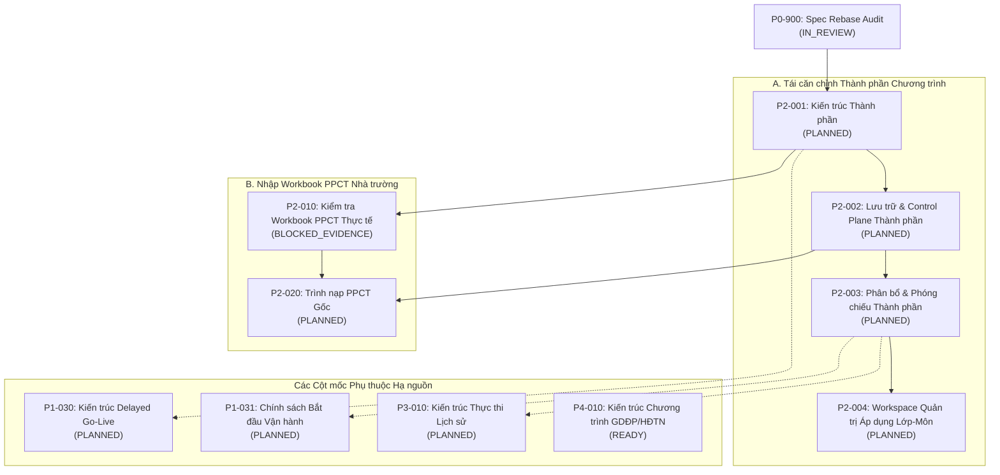

# P0-900 — Kiểm tra và Tái căn chỉnh Đặc tả Thẩm quyền: Phân định Thành phần Chương trình PPCT theo Quyết định của Product Owner

## 1. Trạng thái và Định danh Nhiệm vụ

- **Mã nhiệm vụ (Task ID):** `P0-900`
- **Tên nhiệm vụ:** Kiểm tra và tái căn chỉnh đặc tả thẩm quyền: Phân định thành phần chương trình PPCT theo quyết định của Product Owner
- **Trạng thái trên nhánh:** `IN_REVIEW`
- **Công cụ thực thi:** ANTIGRAVITY IDE
- **Repository:** `hvtnguyenson-code/baogiang-damsan`
- **Nhánh chuyên trách:** `docs/p0-900-ppct-curricular-component-rebase`
- **Phạm vi:** Kiểm tra, tái căn chỉnh tài liệu đặc tả, tài liệu quản trị và kiến trúc tổng thể. Tuyệt đối không thay đổi mã nguồn runtime, schema, migration, API, hợp đồng dữ liệu, giao diện UI, hoặc triển khai deployment.

## 2. Trigger và Ngày Kích hoạt

- **Ngày kích hoạt:** 2026-09-08
- **Nguyên nhân kích hoạt:** Quyết định thẩm quyền bằng văn bản trực tiếp từ Product Owner ghi nhận ngày 2026-09-08.
- **Bản chất trigger:** Nhiệm vụ `P0-900` ban đầu được đăng ký trong `PRE-PILOT-TASK-REGISTER.md` dưới trạng thái `DEFERRED_WITH_TRIGGER` gắn với dòng ma trận truy xuất nguồn gốc `T42`. Trigger tái thẩm tra đã chính thức kích hoạt do các chỉ đạo mới của Product Owner vào ngày 2026-09-08 trực tiếp mâu thuẫn với giả định nền tảng trước đây rằng một luồng PPCT lớp-môn chỉ bao gồm một tiến trình đơn nhất, không phân chia thành phần.

## 3. SHA Main Khởi đầu Chuẩn tắc

- **SHA canonical `origin/main` dự kiến khởi đầu:** `bdcfecbc92d9f129247ec40c7128bc6adc6ef8cf`
- **HEAD nhánh local tại thời điểm bắt đầu:** `bdcfecbc92d9f129247ec40c7128bc6adc6ef8cf`
- **Độ phân kỳ ban đầu:** `0 0` (nhánh chuyên trách tạo trực tiếp từ commit canonical `origin/main` đã được kiểm duyệt).

## 4. Xác minh Dấu vân tay Nguồn (Source Fingerprints)

Các blob tài liệu đặc tả thẩm quyền trong repository đã được kiểm tra trực tiếp đối soát với `origin/main` hiện hành tại thời điểm bắt đầu nhiệm vụ:

| Tài liệu Đặc tả | Git Blob Hash được ghim tại P0 | Blob Hash quan sát được trên `origin/main` | Trạng thái Xác minh |
|---|---|---|---|
| `docs/specifications/PA-B-VPS-PostgreSQL-v1.2-AI-governance.docx` | `c2c61a4e8acb9fde0e5fc5232467662048fd3380` | `c2c61a4e8acb9fde0e5fc5232467662048fd3380` | **KHỚP / KHÔNG THAY ĐỔI** |
| `docs/specifications/PA-B-VPS-PostgreSQL-v1.3-IMPLEMENTATION-ADDENDUM.md` | `5876af5920d12ea6fcecf42d1b8a392cc4825f16` | `5876af5920d12ea6fcecf42d1b8a392cc4825f16` | **KHỚP / KHÔNG THAY ĐỔI** |

### Xác nhận Nguồn Kích hoạt
Cả hai blob tài liệu nguồn thẩm quyền đều không thay đổi. Nhiệm vụ `P0-900` được kích hoạt **DUY NHẤT** bởi quyết định thẩm quyền mới của Product Owner ngày 2026-09-08.

Căn cứ theo `PRE-PILOT-PRODUCT-BASELINE.md` §2.1, do dấu vân tay của các tài liệu đặc tả không thay đổi, việc trích xuất nhị phân OOXML mới hoặc diễn giải lại file DOCX v1.2 là không được phép và không cần thiết. Các tài liệu kiểm tra nguồn trực tiếp chuẩn tắc đã duyệt (bao gồm `LOCAL-FC-05A0-PPCT-TEACHING-EXECUTION-REPORTING-ARCHITECTURE-AUDIT.md`) tiếp tục giữ nguyên giá trị là bằng chứng lịch sử cho baseline v1.2.

## 5. Quy tắc Thứ tự Ưu tiên Nguồn (Source-Priority Rule)

Mọi nhiệm vụ kiến trúc, quản trị và triển khai sau này bắt buộc phải tham chiếu các nguồn thẩm quyền theo đúng thứ tự nghiêm ngặt quy định tại `ADR-044` và `PRE-PILOT-PRODUCT-BASELINE.md`:

1. `PA-B-VPS-PostgreSQL-v1.3-IMPLEMENTATION-ADDENDUM.md` cho các ràng buộc về môi trường, máy chủ và bàn giao;
2. `PRE-PILOT-PRODUCT-BASELINE.md`, `PRE-PILOT-TRACEABILITY-MATRIX.md`, và tài liệu kiểm tra `P0-900` này cho ngữ nghĩa sản phẩm chuẩn tắc;
3. Các ADR đã được chấp thuận mà không bị đánh dấu re-entry hay thay thế;
4. `PA-B-VPS-PostgreSQL-v1.2-AI-governance.docx` và các tài liệu kiểm tra nguồn đã được duyệt;
5. Triển khai hiện tại trong mã nguồn chỉ là bằng chứng chứng minh những gì đang tồn tại, không bao giờ là bằng chứng cho thấy sản phẩm đã hoàn chỉnh;
6. Tài liệu mẫu/prototype chỉ dùng cho mục đích tham khảo trực quan.

## 6. Quyết định Thẩm quyền của Product Owner (2026-09-08)

Các điều khoản dưới đây xác lập **THẨM QUYỀN SẢN PHẨM MỚI (NEW PRODUCT AUTHORITY)** ghi nhận ngày 2026-09-08:

### A. Phân định Thành phần Chương trình (Curricular Components)
Chương trình môn học chính khóa thông thường có thể chứa hai thành phần phân biệt:
1. `CORE` (Kiến thức cốt lõi / cơ bản);
2. `SPECIALIZED_STUDY` (Chuyên đề học tập của chính môn học đó).

`SPECIALIZED_STUDY` đại diện cho cụm chuyên đề học tập của chính môn học (ví dụ: Chuyên đề học tập môn Toán, Ngữ văn, Lịch sử, Địa lí).
Thành phần này **KHÔNG PHẢI LÀ**:
- Một thực thể môn học (`Subject`) riêng biệt trong danh mục môn;
- Một hoạt động đặc biệt (`SpecialActivity`);
- Giáo dục địa phương (`GDĐP`);
- Hoạt động trải nghiệm, hướng nghiệp (`HĐTN-HN`);
- Một loại tiết tự do tùy ý (`lessonType`).

### B. Phân công Giảng dạy (Teaching Responsibility)
Đối với mỗi lớp và môn học cụ thể (`SchoolClass + Subject`), giáo viên được phân công giảng dạy chịu trách nhiệm giảng dạy **cả hai** thành phần `CORE` và `SPECIALIZED_STUDY`.
Do đó, mô hình nghiệp vụ `TeachingAssignment` hiện hữu tiếp tục giữ nguyên ranh giới phân công theo lớp-môn-giáo viên (`AcademicYear + SchoolClass + Subject + User`).
Hệ thống không đặt ra yêu cầu phân công giáo viên riêng biệt theo từng thành phần chương trình. `TeachingAssignment` được bảo toàn hoàn toàn không mang thuộc tính thành phần chương trình.

### C. Ranh giới Thời khóa biểu (Timetable Boundary)
`SPECIALIZED_STUDY` **không** bị gắn cố định vào bất kỳ vị trí tiết cố định nào trên thời khóa biểu hàng tuần.
Thời khóa biểu gốc (TKB) chỉ xếp tiết cho môn học chính khóa nói chung (ví dụ: "Toán").
Do đó:
- `TimetableEntry` **KHÔNG ĐƯỢC** chứa bất kỳ trường hay nhãn thành phần chương trình nào;
- Trình phân tích workbook TKB gốc, luồng nhập dữ liệu chuẩn tắc và checksum ngữ nghĩa của TKB được bảo toàn hoàn toàn không mang khái niệm thành phần chương trình.

### D. Phạm vi Áp dụng theo Lớp - Môn (Class-Subject Applicability)
Các lớp học khác nhau có thể học chuyên đề ở các môn học khác nhau tùy theo tổ hợp môn học hoặc định hướng học tập của lớp đó.
Ví dụ:
- Lớp 10A1 có học chuyên đề các môn Toán, Ngữ văn, Tiếng Anh;
- Lớp 10A2 có học chuyên đề các môn Toán, Vật lí, Hóa học;
- Một số lớp khác có thể không học chuyên đề ở một số môn nhất định.

**Các bất biến nghiệp vụ:**
- Tính áp dụng chuyên đề là dữ liệu cấu hình nghiệp vụ chính thức do quản trị viên có thẩm quyền thiết lập và quản lý.
- Tính áp dụng **TUYỆT ĐỐI KHÔNG** được suy diễn tự động từ số tiết thời khóa biểu, cách viết mã môn học, giáo viên được phân công, `lessonType`, tên lớp hay các thuật toán phỏng đoán.
- `CORE` được áp dụng phổ quát cho toàn bộ các luồng lớp-môn chính khóa thông thường.
- `SPECIALIZED_STUDY` **chỉ** áp dụng khi được cấu hình bật rõ ràng bởi quản trị viên.
- Đối với luồng lớp-môn không áp dụng chuyên đề, các nội dung PPCT chuyên đề có trạng thái `NOT_APPLICABLE` (không bị coi là bỏ sót, không thiếu tiết, không trễ hạn và không bao giờ tạo nợ tiến độ - progress debt).

### E. Quy tắc Định tuyến Cơ hội Dạy học Hàng tuần (Weekly Routing Rule)
Đối với mỗi luồng lớp-môn đã được cấu hình áp dụng `SPECIALIZED_STUDY`:
- Trong mỗi tuần học (`AcademicWeek`), quy tắc chung của Product Owner là: cơ hội dạy học chính khóa chuẩn tắc **CUỐI CÙNG** theo trình tự thời gian trong tuần được chỉ định cho `SPECIALIZED_STUDY`.
- Tất cả các cơ hội dạy học chính khóa chuẩn tắc sớm hơn trong cùng tuần đó được chỉ định cho `CORE`.

**Hành vi tất định cho tuần dị thường (Atypical Weeks):**
- Quy tắc chung trên xác lập định hướng cho tuần bình thường có đầy đủ các cơ hội.
- Tuy nhiên, hành vi tất định chính xác đối với các tuần dị thường thuộc thẩm quyền quyết định kiến trúc của nhiệm vụ `P2-001`, bao gồm:
  - Tuần có 0 cơ hội (toàn bộ tuần rơi vào kỳ nghỉ/gián đoạn);
  - Tuần chỉ có đúng 1 cơ hội dạy học chính khóa chuẩn tắc;
  - Tuần bị cắt ngắn do ngày nghỉ lễ hoặc gián đoạn lịch học;
  - Tuần có sự chuyển giao phiên bản thời khóa biểu giữa tuần.
- Nhiệm vụ `P0-900` **không tự ý suy diễn hoặc chốt trước** kết quả cho các trường hợp dị thường này (không tự ý đặt quy tắc "nếu tuần có 1 cơ hội thì chuyển vào CORE").

**Bất biến giữa Lập kế hoạch và Vận hành (Planning vs. Operational Invariant):**
- Việc định tuyến cơ hội là phân loại lập kế hoạch mang tính tất định.
- Các biến động và kết quả vận hành thực tế **KHÔNG ĐƯỢC** tái phân loại động hoặc làm xê dịch thành phần kế hoạch đã xác lập của cơ hội.
- Các tình huống vận hành không làm thay đổi phân loại kế hoạch bao gồm:
  - Gián đoạn lịch học / ngày nghỉ lễ;
  - Ngoại lệ lịch học (`CalendarException`);
  - Hủy tiết được phê duyệt (`AUTHORIZED_CANCELLATION`);
  - Bị đè/chiếm chỗ bởi hoạt động đặc biệt (`SpecialActivity`);
  - Giáo viên vắng mặt không người dạy thay (`ABSENCE_NO_REPLACEMENT`);
  - Dạy thay / quản lớp (`SAME_SUBJECT_SUBSTITUTION` / `DIFFERENT_SUBJECT_SUPERVISION`).
- Nếu cơ hội cuối cùng theo kế hoạch trong tuần bị hủy, hoãn hoặc không thực hiện, cơ hội đó vẫn giữ nguyên định danh kế hoạch là chuyên đề. Một cơ hội `CORE` trước đó **TUYỆT ĐỐI KHÔNG** được đôn lên thành chuyên đề chỉ vì cơ hội chuyên đề bị gián đoạn hay bị hủy bỏ.

### F. Tiến trình Độc lập (Independent Progression)
`CORE` và `SPECIALIZED_STUDY` duy trì các con trỏ tiến độ PPCT và không gian bao phủ hoàn toàn độc lập trong cùng luồng lớp-môn:
- Một cơ hội `CORE` bị bỏ sót, bị hủy hoặc không tiêu thụ tiết sẽ không làm dịch chuyển hay ảnh hưởng tới con trỏ của `SPECIALIZED_STUDY`;
- Một cơ hội chuyên đề bị bỏ sót, bị hủy hoặc không tiêu thụ tiết sẽ không làm cho cơ hội `CORE` tiếp theo tiêu thụ nội dung chuyên đề;
- Tiết dạy bù tiếp tục thực hiện đúng nghĩa vụ lịch sử ban đầu đã bị lỡ và không tiêu thụ nội dung PPCT mới, đồng thời bảo toàn nguyên vẹn định danh thành phần của nghĩa vụ ban đầu đó.

### G. Tổng hợp Báo cáo (Reporting Aggregation)
- Thống kê và báo cáo chính khóa thông thường tiếp tục được tổng hợp ở cấp độ `SchoolClass + Subject` và `Teacher`;
- Số tiết đã dạy của `CORE` và `SPECIALIZED_STUDY` được cộng gộp chung trong các bảng tổng hợp chính khóa thông thường;
- Trong phạm vi phiên bản pre-pilot v1, không bắt buộc phải tách báo cáo tổng hợp cấp cao riêng biệt cho hai thành phần;
- Tuy nhiên, chi tiết thực hiện ở cấp từng tiết, thông tin nguồn gốc (provenance) và nhật ký kiểm toán phải bảo toàn độ chi tiết cần thiết để phân biệt rõ ràng tiết đã dạy hoặc đã phân bổ là `CORE` hay `SPECIALIZED_STUDY`;
- `GDĐP` và `HĐTN-HN` tiếp tục là các miền báo cáo chương trình/hoạt động hoàn toàn độc lập.

### H. Định hướng Nguồn PPCT và Bao gói Phiên bản (PPCT Source Direction & Packaging)
- Định hướng cấu trúc file PPCT từ nhà trường trong tương lai được ưu tiên: một workbook Excel duy nhất cho mỗi khối-môn chứa hai sheet:
  - Một sheet phân phối chương trình cốt lõi (`CORE`);
  - Một sheet phân phối chương trình chuyên đề (`SPECIALIZED_STUDY`).
- Nhà trường cũng có thể cung cấp hai file độc lập trên thực tế vận hành.
- **Nền tảng giữ lại:** Nền tảng kế hoạch tổng thể dùng chung theo `AcademicYear + Subject + Grade` hiện có là cơ sở vững chắc; `CORE` và `SPECIALIZED_STUDY` thuộc cùng một thực thể môn học logic chứ không phải hai môn học tách rời.
- **Trách nhiệm của P2-001:** Nhiệm vụ `P2-001` phải quyết định chính thức mô hình chu kỳ phiên bản và bao gói (lifecycle / version package): liệu việc ban hành và điều chỉnh của `CORE` và `SPECIALIZED_STUDY` bắt buộc phải đồng thời nguyên tử trong cùng một bản ghi `PpctVersion`, hay áp dụng một cấu trúc bao gói retained topology phù hợp khác.
- `P0-900` không tự ý áp đặt một mô hình phiên bản vật lý khép kín và không tạo mới schema khi chưa có thiết kế kiến trúc từ `P2-001`.
- Nhiệm vụ `P2-010` tiếp tục ở trạng thái `BLOCKED_EVIDENCE` cho tới khi có workbook thực tế từ nhà trường. Tuyệt đối không tự suy diễn tên sheet, cấu trúc cột, tiêu đề hay công thức trước khi `P2-010` hoàn thành kiểm tra.

## 7. Bằng chứng Thực tế trong Schema và Runtime Hiện hành

Kiểm tra trực tiếp mã nguồn repository hiện hữu phản ánh hiện trạng kỹ thuật:

### Schema (`prisma/schema.prisma`)
- `PpctPlan`: Khóa theo `(academicYearId, subjectId, grade)`. Đại diện cho một kế hoạch khung chung cho cả khối lớp.
- `PpctVersion`: Các trạng thái vòng đời `DRAFT`, `PUBLISHED`, `SUPERSEDED`. Chỉ mục duy nhất bảo đảm tối đa một phiên bản `PUBLISHED` cho mỗi kế hoạch.
- `PpctItem`: UUID bất biến cho một nghĩa vụ chương trình. Không có trường `component`.
- `PpctItemRevision`: Chứa `title`, `lessonType`, và `sequence`. Ràng buộc `@@unique([versionId, sequence])` và `@@unique([versionId, itemId])`. Trường `sequence` hiện mặc định là một chuỗi số nguyên duy nhất trên toàn phiên bản.
- `PpctClassAssociation`: Liên kết `(academicYearId, classId, subjectId)` với một `PpctVersion` cụ thể trong khoảng ngày dân sự qua ràng buộc loại trừ GiST. Hiện **chưa** ghi nhận thông tin lớp có học chuyên đề hay không.

### Các Module Runtime
- `apps/api/src/ppct/`: Xử lý thay thế bản nháp, chuyển trạng thái phiên bản, đảm bảo duy nhất một bản phát hành, và liên kết lớp theo ngày. Mặc định toàn bộ nội dung trong một phiên bản là một danh sách số thứ tự liên tục.
- `apps/api/src/resolved-occurrences/`: Phân giải cơ hội thời khóa biểu theo cấu trúc (`RESOLVED_LESSON_OCCURRENCE_STRUCTURAL_V1`) mà không gán thành phần PPCT.
- `apps/api/src/ppct-occurrence-allocation/`: `PPCT_OCCURRENCE_ALLOCATION_V1` duyệt tuần tự các cơ hội theo thời gian cho luồng `(academicYearId, classId, subjectId)`. Tiêu thụ mục PPCT có số thứ tự nhỏ nhất chưa phân bổ trên toàn phiên bản. Chưa có nhận thức về gom nhóm theo tuần, quy tắc cơ hội cuối tuần, hay tách biệt thành phần.
- `apps/api/src/teaching-executions/`: Ghi nhận `CurricularTeachingExecution` gắn với nghĩa vụ trực tiếp đã phân bổ (`ppctRevisionId`).
- `apps/api/src/progress-debt/`: Đánh giá tiến độ, nợ tiến độ xác thực và khoảng trống chưa xác nhận dựa trên luồng nghĩa vụ đơn.
- `apps/api/src/reporting-projection/`: Chiếu số liệu tổng hợp theo lớp-môn và giáo viên.

## 8. Ma trận Mâu thuẫn (Contradiction Matrix)

| Khía cạnh | Giả định Baseline và ADR Hiện hữu | Quyết định Mới của Product Owner (2026-09-08) | Đánh giá Mâu thuẫn |
|---|---|---|---|
| **Cấu trúc Chương trình** | Mỗi khối-môn có một danh sách mục đơn nhất với `sequence` duy nhất trong phiên bản (`ADR-027`, `ADR-028`). | Một môn học có thể bao gồm hai thành phần độc lập: `CORE` và `SPECIALIZED_STUDY`. | **MÂU THUẪN:** Không gian số thứ tự duy nhất trên toàn phiên bản không còn phù hợp khi hai thành phần cùng tồn tại. |
| **Phạm vi Áp dụng Lớp** | Mọi lớp liên kết với phiên bản PPCT đều học tuần tự toàn bộ các bài trong kế hoạch (`ADR-027`, `ADR-028`, `ADR-037`). | Chỉ một số lớp nhất định học `SPECIALIZED_STUDY`; các lớp khác chỉ học `CORE`. | **MÂU THUẪN:** Việc liên kết lớp không thể giả định mọi lớp đều tiêu thụ mọi bài học như nhau. |
| **Định tuyến Cơ hội Tuần** | Mọi cơ hội thông thường đều tiêu thụ bài kế tiếp có `sequence` nhỏ nhất (`ADR-037`). | Với lớp có chuyên đề, cơ hội chuẩn tắc CUỐI CÙNG trong tuần là chuyên đề; các cơ hội trước là CORE. | **MÂU THUẪN:** Luồng duyệt tuần tự không nhóm theo tuần và không phân tuyến thành phần vi phạm quy tắc sản phẩm. |
| **Tính Độc lập Tiến độ** | Một con trỏ tiến độ và một không gian bao phủ `DISTRIBUTION_COVERED_ITEMS` duy nhất cho mỗi lớp-môn (`ADR-037`). | `CORE` và `SPECIALIZED_STUDY` tiến hành độc lập; gián đoạn của thành phần này không làm trôi thành phần kia. | **MÂU THUẪN:** Không gian phân bổ đơn luồng gây xáo trộn con trỏ giữa các thành phần. |
| **Mô hình Thời khóa biểu** | Tiết TKB đại diện cho việc dạy môn học nói chung (`ADR-017`, `ADR-047`). | Chuyên đề là phân loại định tuyến cơ hội dạy học thông thường, không phải một tiết TKB chuyên biệt. | **ĐỒNG THUẬN / TƯƠNG THÍCH:** TKB gốc và `TimetableEntry` tiếp tục không mang trường thành phần. |
| **Phân công Giảng dạy** | Phân công theo `SchoolClass + Subject` (`ADR-012`). | Cùng một giáo viên phụ trách cả CORE và SPECIALIZED_STUDY cho lớp-môn đó. | **ĐỒNG THUẬN / TƯƠNG THÍCH:** `TeachingAssignment` giữ nguyên, không mang trường thành phần. |
| **Tổng hợp Báo cáo** | Báo cáo chính khóa tổng hợp theo lớp-môn và giáo viên (`ADR-041`). | CORE và SPECIALIZED_STUDY được cộng gộp trong số liệu chính khóa thông thường. | **ĐỒNG THUẬN / TƯƠNG THÍCH:** Tổng hợp báo cáo thông thường giữ nguyên ở cấp độ lớp-môn. |

## 9. Phân loại Tác động Kiến trúc (Bảng KEEP / RE-ENTRY)

| Tài liệu | Phân loại | Điều khoản Mở lại / Cần Re-entry | Điều khoản Giữ lại / Chuẩn tắc |
|---|---|---|---|
| **ADR-027** (Kiến trúc PPCT) | **PARTIAL RE-ENTRY** | Mở lại: Giả định luồng lớp-môn chỉ có một tiến trình đơn tuyến tiêu thụ danh sách bài học có số thứ tự liên tục. | **GIỮ LẠI:** Kế hoạch khung theo `AcademicYear + Subject + Grade`; lịch sử phiên bản phát hành bất biến; UUID bài học ổn định; phân tầng thực thi/báo cáo; không đưa trường PPCT vào `TimetableEntry`. |
| **ADR-028** (Lưu trữ PPCT) | **PARTIAL RE-ENTRY** | Mở lại: Cấu trúc vật lý sáu bảng (cần mở rộng theo thành phần); tính duy nhất của `sequence` trên toàn phiên bản (`@@unique([versionId, sequence])`); liên kết lớp thiếu siêu dữ liệu áp dụng chuyên đề. | **GIỮ LẠI:** Định danh kế hoạch `PpctPlan`; vòng đời `PpctVersion`; UUID logic ổn định của `PpctItem`; đồ thị revision/lineage; nguyên tắc bảo toàn dữ liệu lịch sử. |
| **ADR-029** (Control Plane PPCT) | **PARTIAL RE-ENTRY** | Mở lại: Việc thay thế bản nháp và liên kết lớp cần ngữ nghĩa phân định thành phần và kiểm tra tính hợp lệ của cấu hình áp dụng. | **GIỮ LẠI:** Ranh giới phân quyền (`PPCT_MANAGE`); máy trạng thái vòng đời (`DRAFT -> PUBLISHED -> SUPERSEDED`); kiểm soát đồng thời CAS với `updatedAt`; lịch sử phát hành bất biến. |
| **ADR-030** (Mô hình Sẵn sàng TKB) | **PARTIAL RE-ENTRY / CẦN MỞ RỘNG** | Mở lại / Mở rộng: Profile `NORMAL_BASE_PPCT_V1` chưa kiểm tra cấu hình áp dụng chuyên đề và dung lượng tiết theo từng thành phần. | **GIỮ LẠI:** Mô hình đánh giá sẵn sàng tất định; lưu trữ provenance chính xác; cửa sổ đánh giá theo ngày dân sự; cách ly với thay đổi vận hành chưa chốt. |
| **ADR-036** (Phân giải Cơ hội TKB) | **GIỮ NGUYÊN (KEEP)** | Không. Việc hợp thành cơ hội cấu trúc không phụ thuộc vào thành phần chương trình. | **GIỮ LẠI:** Hợp thành lịch, TKB gốc, ngoại lệ vận hành và phân công giáo viên; giữ trạng thái phân bổ PPCT là `NOT_ASSESSED`. |
| **ADR-037** (Phân bổ Tiết PPCT) | **MAJOR RE-ENTRY** | Mở lại: Giả định một con trỏ phân bổ duy nhất cho mỗi lớp-môn; một không gian `DISTRIBUTION_COVERED_ITEMS` đơn; lấy số thứ tự nhỏ nhất toàn phiên bản; thiếu cơ chế gom nhóm và định tuyến tuần. | **LƯU LẠI LÀM BẰNG CHỨNG CHO LUỒNG ĐƠN:** Các nguyên tắc phát lại (replay), cách ly giao dịch và chống trôi lệch vẫn giữ giá trị khái niệm, nhưng profile vật lý không được dùng để hợp thức hóa đa thành phần. |
| **ADR-038** (Thực thi Giảng dạy) | **GIỮ LẠI VÀ MỞ RỘNG NGUỒN GỐC** | Mở lại: Cần nhận thông tin thành phần từ nghĩa vụ trực tiếp thượng nguồn vào chi tiết thực thi. | **GIỮ LẠI:** Nhóm thực thể `CurricularTeachingExecution`; phân biệt rõ nguồn gốc ban đầu và thực tế dạy; không tạo thực thể thực thi riêng biệt cho từng thành phần. |
| **ADR-039** (Lưu trữ Thực thi) | **KIỂM TRA / DỰ KIẾN GIỮ LẠI** | Không phát sinh nhu cầu thay đổi trừ khi `P2-001` chứng minh có yêu cầu schema cụ thể. | **GIỮ LẠI:** Cấu trúc lưu trữ, vết kiểm toán và ràng buộc thực thi. |
| **ADR-040** (Tiến độ / Nợ / Trễ) | **PARTIAL RE-ENTRY** | Mở lại: Nghĩa vụ trực tiếp từ thượng nguồn phải mang thông tin thành phần để tính toán tiến độ, khoảng trống và nợ chính xác theo từng thành phần. | **GIỮ LẠI:** Cụm tổng hợp theo lớp-môn; việc thiếu tiết thực thi đơn thuần không tạo nợ; bảng phân loại nợ dựa trên chứng cứ (`PROVEN_OPEN_DEBT`, `UNCONFIRMED_COMPLETION_GAP`). |
| **ADR-041** (Chiếu Báo cáo) | **GIỮ LẠI VÀ BỔ SUNG CHI TIẾT** | Nhỏ: Bảng xem chi tiết cần hiển thị nguồn gốc thành phần, trong khi số liệu tổng hợp thông thường tiếp tục cộng gộp. | **GIỮ LẠI:** Báo cáo tổng hợp theo lớp-môn và giáo viên; số liệu chính khóa gộp chung; tách biệt với báo cáo `SpecialActivity`. |
| **ADR-042 / ADR-043** (Sổ Báo giảng) | **GIỮ NGUYÊN (KEEP)** | Không. Bản chụp sổ báo giảng lưu giữ các sự kiện thực tế đã diễn ra bất kể cơ cấu thành phần bên trong. | **GIỮ LẠI:** Bản chụp bất biến, quy trình phê duyệt và các góc nhìn báo cáo cá nhân. |
| **ADR-047** (Kiến trúc TKB Gốc) | **GIỮ NGUYÊN (KEEP)** | Không. TKB gốc không phân loại thành phần chương trình. | **GIỮ LẠI:** Cấu trúc bốn sheet, đối soát chéo lớp-giáo viên, kế thừa buổi học và `TimetableEntry` không mang trường thành phần. |

## 10. Ranh giới Kiến trúc Được Bảo vệ Tuyệt đối

Các ranh giới kiến trúc sau đây được bảo vệ nghiêm ngặt và **TUYỆT ĐỐI KHÔNG** được thay đổi hoặc làm suy yếu:

1. **TeachingAssignment Tuyệt đối Không mang Thuộc tính Thành phần:**
   Giáo viên được phân công giảng dạy đảm nhiệm cả `CORE` và `SPECIALIZED_STUDY` cho lớp-môn đó. Trách nhiệm giảng dạy duy trì ở mức `(AcademicYear, SchoolClass, Subject)`. Không thêm bất kỳ trường phân biệt thành phần nào vào `TeachingAssignment`.
2. **TimetableEntry Tuyệt đối Không mang Thuộc tính Thành phần:**
   Các tiết trên thời khóa biểu đại diện cho môn học, không đại diện cho chuyên đề. Tuyệt đối không thêm cột `component` hoặc `lessonType` vào `TimetableEntry`.
3. **Mảng TKB Gốc (P2-030 / P2-040 / P2-050) Tiếp tục Giữ Trạng thái CLOSED:**
   Trình nạp TKB gốc, adapter xử lý workbook, kiểm tra đối soát ngang hàng và kế thừa buổi học đã hoàn thành và hoàn toàn độc lập với khái niệm thành phần chương trình.
4. **SpecialActivity Hoàn toàn Tách biệt:**
   `SPECIALIZED_STUDY` là việc học tập môn học chính khóa thông thường, **KHÔNG PHẢI** là `SpecialActivity`. Không sử dụng mô hình, quy tắc xung đột hay luồng điều phối của `SpecialActivity` cho chuyên đề. Kiến trúc chương trình GDĐP và HĐTN-HN (P4) tiếp tục là một miền hoàn toàn độc lập.

## 11. Nguyên tắc Chuyển đổi và Bảo toàn Lịch sử (Migration & History Preservation)

1. **Tuyệt đối Không Viết lại Lịch sử Quá khứ:**
   Các phiên bản PPCT, bài học, revision và liên kết lớp đã phát hành và lưu trữ trong cơ sở dữ liệu không được phép bị sửa đổi ngữ nghĩa hồi tố chỉ vì sự tiện lợi khi triển khai mô hình mới.
2. **Bảo đảm Tính Tương thích Ngược:**
   Quá trình chuyển đổi dữ liệu phải đảm bảo tính tương thích ngược và bảo toàn chính xác nguồn gốc dữ liệu lịch sử đã lưu trữ.
3. **Quyết định Ngữ nghĩa Ánh xạ Dữ liệu Cũ Thuộc về P2-001:**
   Quy tắc ánh xạ và ngữ nghĩa mặc định cụ thể cho dữ liệu PPCT lịch sử là một quyết định kiến trúc thuộc thẩm quyền của nhiệm vụ `P2-001`. `P0-900` không tự ý ấn định trước rằng toàn bộ dữ liệu lịch sử tự động chuyển thành `CORE`.
4. **P2-002 Chỉ Triển khai Ngữ nghĩa Được P2-001 Chấp thuận:**
   Nhiệm vụ `P2-002` chỉ được phép thực thi việc di chuyển dữ liệu tương thích ngược bảo toàn lịch sử theo đúng ngữ nghĩa được `P2-001` chấp thuận.
5. **Bảo toàn Tính Phả hệ (Lineage Preservation):**
   Các liên kết lịch sử tới các phiên bản đã bị thay thế (`SUPERSEDED`) phải được duy trì nguyên vẹn. Bất kỳ migration schema nào trong tương lai cũng phải đảm bảo các bản ghi `PpctItemRevision` hiện hữu tiếp tục phân giải chính xác và không làm mất mát dữ liệu.

## 12. Các Hàng Ma trận Truy xuất Nguồn gốc Mới (Traceability Rows)

Các dòng sau đây được cập nhật chính thức vào `PRE-PILOT-TRACEABILITY-MATRIX.md`:

### Hàng T45
- **Mã định danh:** `T45`
- **Yêu cầu / Thực tế Sản phẩm:** Mô hình thành phần môn học chính khóa và phạm vi áp dụng theo lớp-môn. Một môn học chính khóa có thể bao gồm thành phần `CORE` và `SPECIALIZED_STUDY` trên nền tảng kế hoạch khung môn học dùng chung; cùng một `TeachingAssignment` phụ trách cả hai; phạm vi áp dụng được quản trị viên cấu hình rõ ràng theo từng lớp-môn; với lớp không học chuyên đề, nội dung chuyên đề có trạng thái `NOT_APPLICABLE` (không phải nợ/thiếu); chuyên đề là môn học chính khóa, không phải `SpecialActivity`; mô hình chu kỳ phiên bản và bao gói cụ thể do `P2-001` xác định.
- **Bằng chứng Nguồn:** Thẩm quyền Product Owner ghi nhận ngày 2026-09-08 (là nguồn xác lập ngữ nghĩa mới của `CORE`/`SPECIALIZED_STUDY` và tính áp dụng theo lớp; PA-B v1.2 chỉ được dẫn chiếu như bối cảnh môn học/PPCT chung, không phải bằng chứng v1.2 đã quy định mô hình thành phần này).
- **Quyết định Sau / Kiến trúc Hiện tại:** Kiểm tra `P0-900`; kích hoạt re-entry cho `ADR-027`, `ADR-028`, `ADR-029`; được chốt bởi kiến trúc `P2-001`.
- **Hiện trạng Triển khai:** Schema và allocator hiện tại mặc định một chuỗi thứ tự đơn duy nhất cho mỗi phiên bản và áp dụng đồng nhất cho mọi lớp.
- **Phân loại (Disposition):** `NEW_PRODUCT_AUTHORITY`
- **Lộ trình Đóng:** Kiểm tra `P0-900` ghi nhận thẩm quyền -> `P2-001` chốt kiến trúc -> `P2-002` persistence/control plane -> `P2-003` runtime phân bổ -> `P2-004` giao diện quản trị áp dụng.

### Hàng T46
- **Mã định danh:** `T46`
- **Yêu cầu / Thực tế Sản phẩm:** Định tuyến cơ hội chuyên đề tuần và tiến trình độc lập. Trong mỗi `AcademicWeek`, cơ hội dạy học chính khóa chuẩn tắc CUỐI CÙNG của lớp có chuyên đề được chỉ định cho `SPECIALIZED_STUDY`; các cơ hội trước đó là `CORE`; đây là phân loại lập kế hoạch độc lập với các biến động vận hành; `CORE` và `SPECIALIZED_STUDY` có con trỏ tiến độ PPCT độc lập; báo cáo chính khóa thông thường gộp chung cả hai thành phần; `TimetableEntry` không mang trường thành phần.
- **Bằng chứng Nguồn:** Thẩm quyền Product Owner ghi nhận ngày 2026-09-08.
- **Quyết định Sau / Kiến trúc Hiện tại:** Kiểm tra `P0-900`; kích hoạt re-entry cho `ADR-030`, `ADR-037`, `ADR-040`; được chốt bởi kiến trúc `P2-001`.
- **Hiện trạng Triển khai:** Module `PPCT_OCCURRENCE_ALLOCATION_V1` hiện duyệt luồng thời gian đơn tuyến mà không gom nhóm theo tuần hay phân tách thành phần.
- **Phân loại (Disposition):** `NEW_PRODUCT_AUTHORITY`
- **Lộ trình Đóng:** `P2-001` chốt kiến trúc -> `P2-003` runtime phân bổ và phóng chiếu -> `P2-004` giao diện quản trị.

### Cập nhật Hàng T24
- Hàng `T24` được cập nhật để ghi nhận định hướng nguồn ưa thích của Product Owner: một workbook duy nhất gồm sheet `CORE` và sheet `SPECIALIZED_STUDY`.
- Trạng thái duy trì nghiêm ngặt `DEFERRED_WITH_TRIGGER` (`BLOCKED_EVIDENCE`), vì hợp đồng phân tích workbook chỉ có thể được phê duyệt khi có file mẫu thực tế từ nhà trường.

## 13. Đồ thị Bàn giao và Phụ thuộc Nhiệm vụ Mới (Delivery Graph)

Đồ thị bàn giao được tổ chức lại để phân định rõ luồng tái căn chỉnh thành phần chương trình độc lập với luồng nhập workbook PPCT từ nhà trường:

### Ánh xạ Sổ đăng ký Nhiệm vụ (Task Register Mapping)
- **`P2-001`**: PPCT curricular-component architecture re-entry. Trạng thái: `PLANNED`. Phụ thuộc: `P0-900`. Truy xuất: `T45`, `T46`.
- **`P2-002`**: PPCT component persistence + control-plane realignment. Trạng thái: `PLANNED`. Phụ thuộc: `P2-001`. Truy xuất: `T45`, `T46`.
- **`P2-003`**: Component-aware PPCT allocation and curricular projections. Trạng thái: `PLANNED`. Phụ thuộc: `P2-002`. Truy xuất: `T45`, `T46`.
- **`P2-004`**: Specialized-study class-subject administration workspace. Trạng thái: `PLANNED`. Phụ thuộc: `P2-003`. Truy xuất: `T45`, `T46`.
- **`P2-010`**: PPCT real-workbook contract/security audit. Trạng thái: `BLOCKED_EVIDENCE`. Phụ thuộc: `P2-001`. Trigger: Cung cấp workbook thực tế từ nhà trường. Truy xuất: `T24`, `T45`.
- **`P2-020`**: PPCT native importer implementation. Trạng thái: `PLANNED`. Phụ thuộc: `P2-002`, `P2-010`. Truy xuất: `T24`, `T45`.
- **`P1-030`**: Delayed go-live / operational-start architecture. Trạng thái: `PLANNED` (chuyển từ `READY` vì việc phát lại lịch sử phụ thuộc vào kiến trúc thành phần). Phụ thuộc: `P1-020`, `P2-001`. Truy xuất: `T28`, `T30`.
- **`P1-031`**: Operational-start policy implementation. Trạng thái: `PLANNED`. Phụ thuộc: `P1-021`, `P1-030`, `P2-003`. Truy xuất: `T28`, `T30`.
- **`P1-032`**: Operational-start admin UI integration. Trạng thái: `PLANNED`. Phụ thuộc: `P1-022`, `P1-031`. Truy xuất: `T28`, `T30`.
- **`P3-010`**: Pre-operational historical execution architecture. Trạng thái: `PLANNED`. Phụ thuộc: `P1-031`, `P2-003`, `P2-020`, `P2-050` (đã đóng). Truy xuất: `T28`, `T29`, `T30`.
- **`P4-010`**: GDĐP/HĐTN programme architecture closure. Trạng thái: **TIẾP TỤC Ở READY**. Không phụ thuộc vào thành phần môn học P2 (miền chương trình độc lập).

## 14. Định hướng Nguồn Workbook so với Bằng chứng Thực tế bị Chặn P2-010

Mặc dù Product Owner đã nêu định hướng cấu trúc workbook mong muốn là một file Excel gồm sheet `CORE` và sheet `SPECIALIZED_STUDY`:
- Phát biểu này cấu thành **hướng dẫn định hướng nguồn**, không phải hợp đồng kỹ thuật cho bộ phân tích.
- Nhiệm vụ `P2-010` duy trì nghiêm ngặt trạng thái `BLOCKED_EVIDENCE` cho tới khi nhận được file Excel thực tế từ nhà trường.
- Tuyệt đối không cài đặt hay giả định bất kỳ logic phân tích, ánh xạ cột, nhận diện tiêu đề hay quy tắc kiểm tra dữ liệu nào trước khi `P2-010` thực hiện kiểm tra cấu trúc và nhị phân toàn diện trên bằng chứng đó.

## 15. Các Câu hỏi Kiến trúc Chưa giải quyết Giao cho P2-001

Nhiệm vụ `P0-900` chủ động không phỏng đoán hay chốt sớm các chi tiết triển khai vật lý và kỹ thuật. Nhiệm vụ `P2-001` được giao trách nhiệm giải quyết và chốt mười lăm quyết định kiến trúc sau:

1. **Vị trí Vật lý của CurricularComponent:**
   Xác định liệu `CurricularComponent` (`CORE`, `SPECIALIZED_STUDY`) được thể hiện dưới dạng enum, bảng riêng hay thuộc tính, và vị trí gắn kết vật lý trong schema quan hệ.
2. **Cấp độ Gắn kết (Item vs. Revision vs. Cấu trúc Trung gian):**
   Xác định thuộc tính thành phần được lưu trữ vật lý trên `PpctItem`, `PpctItemRevision`, hay một cấu trúc trung gian (ví dụ `PpctComponentPlan`), bảo đảm định danh thành phần của bài học không bị trôi lệch qua các phiên bản.
3. **Tính Duy nhất của Sequence theo Thành phần:**
   Cách thức ràng buộc và giới hạn phạm vi của `sequence` trong cơ sở dữ liệu (ví dụ `(versionId, component, sequence)` hay độc lập số nguyên theo từng thành phần).
4. **Lưu trữ và Hiệu lực của Cấu hình Áp dụng Lớp-Môn:**
   Mô hình schema và thời gian lưu trữ tính áp dụng chuyên đề của lớp-môn (ví dụ là trường trên `PpctClassAssociation`, một bảng riêng `SpecializedStudyApplicability` theo ngày hiệu lực, hay một luồng chính sách thuộc Business Configuration).
5. **Thay đổi Cấu hình Áp dụng Giữa năm hoặc Giữa tuần:**
   Quy tắc nghiệp vụ và hành vi hệ thống khi một lớp bật hoặc tắt chuyên đề giữa năm học hoặc giữa tuần (fail-closed, mốc ngày trong tương lai, hay cố định theo năm học).
6. **Định nghĩa Chuẩn tắc của "Cơ hội Cuối cùng trong Tuần":**
   Thuật toán chuẩn tắc xác định cơ hội dạy học cuối cùng theo thời gian trong tuần (`AcademicWeek`) của lớp-môn (sắp xếp theo ngày dân sự, giờ bắt đầu tiết học, giờ kết thúc và cơ chế phân xử hòa tất định).
7. **Hành vi Tất định cho các Tuần Dị thường (Atypical Weeks):**
   Xác lập quy tắc định tuyến tất định khi tuần học lệch khỏi lịch chuẩn:
   - Tuần có 0 cơ hội (toàn bộ tuần nghỉ/gián đoạn);
   - Tuần có đúng 1 cơ hội (phân bổ cho CORE hay chuyên đề?);
   - Chuyển giao phiên bản TKB giữa tuần;
   - Gián đoạn lịch học cắt mất cơ hội cuối tuần theo kế hoạch.
8. **Quy tắc Dung lượng Tiết Tối thiểu và Tính Sẵn sàng:**
   Cách thức mô hình sẵn sàng (`NORMAL_BASE_PPCT_V1` hoặc mở rộng) đánh giá xem lớp-môn có đủ dung lượng tiết trong tuần trên TKB để đáp ứng yêu cầu chuyên đề hay không.
9. **Ngữ nghĩa khi Cạn kiệt Thành phần:**
   Hành vi khi một lớp-môn hoàn thành hết các bài chuyên đề trước khi kết thúc năm học, hoặc ngược lại (cơ hội trở thành không tiêu thụ tiết, chặn lại, hay chuyển sang dạy phần cốt lõi?).
10. **Chuyển dịch Phiên bản và Lineage Nội bộ Thành phần:**
    Quy tắc tách, gộp và chuyển tiếp bài học qua các phiên bản: các cạnh lineage bắt buộc phải nằm trong cùng thành phần, hay có thể vượt ranh giới thành phần?
11. **Quy định Cấm hoặc Cho phép Lineage Vượt Thành phần:**
    Xác định việc liên kết lineage giữa một bài tiền nhiệm `CORE` với một bài kế nhiệm `SPECIALIZED_STUDY` (hoặc ngược lại) bị cấm tuyệt đối hay cần phê duyệt đặc biệt.
12. **Chiến lược Migration Dữ liệu PPCT Hiện hữu Bảo đảm Tương thích Ngược:**
    Chiến lược migration PostgreSQL cho các hàng hiện có trong `PpctItem` và `PpctItemRevision` không làm gián đoạn sản xuất hay phá vỡ các bộ test hiện có.
13. **Xác định Ngữ nghĩa Ánh xạ Dữ liệu Lịch sử:**
    Xác định ngữ nghĩa ánh xạ cụ thể cho dữ liệu PPCT lịch sử hiện hữu mà không viết lại lịch sử hồi tố và không làm sai lệch provenance lưu trữ.
14. **Nguồn gốc Thành phần (Provenance) trong Thực thi, Dạy bù và Chi tiết Báo cáo:**
    Các trường DTO và thực thể cần thiết trong `CurricularTeachingExecution`, đối soát dạy bù và góc nhìn chi tiết báo cáo để truy xuất nguồn gốc thành phần.
15. **Ranh giới Giao dịch và Kiểm soát Đồng thời (Concurrency):**
    Ranh giới giao dịch Prisma, mức độ cô lập (isolation level) và khóa kiểm soát đồng thời cần thiết khi phân giải, phát lại và phân bổ hai con trỏ thành phần độc lập trong cùng một luồng lớp-môn.

## 16. Không Cho phép Triển khai Sớm (No Implementation Authorization)

Tài liệu này là báo cáo kiểm tra và tái căn chỉnh đặc tả thẩm quyền và quản trị.
Tài liệu này **TUYỆT ĐỐI KHÔNG CHO PHÉP** thay đổi đối với:
- `apps/` (NestJS API, React web);
- `packages/` (contracts, config);
- `prisma/` (schema, migrations);
- `.github/` (CI/CD workflows);
- `deploy/` hoặc `scripts/`;
- Tiến trình đang chạy, cấu hình Nginx, hạ tầng VPS, hay cơ sở dữ liệu production.

Mọi thay đổi schema vật lý, điều chỉnh control plane và thay đổi runtime bắt buộc phải đợi hoàn thành và được phê duyệt tại nhiệm vụ `P2-001` cùng các nhiệm vụ triển khai kế tiếp.
